# 2010年全国硕研究学统考试计算机科学与技术学科联考计算机学科专业基础综合试题

# 一、单项选择题（第 $1 { \sim } 4 0$ 题，每题2分，共80分。下列每题给出的四个选项中，只有一个选项最符合试题要求）

1.若元素a,b,c,d,e,f依次进栈，允许进栈、退栈操作交替进行，但不允许连续三次进行退栈操作，则不可能得到的出栈序列是 。

A. dcebfa B.cbdaef C. bcaefd D.afed c b

2．某队列允许在其两端进队操作，但仅允许在端进出队操作。若元素a,b，c，d,e依次入此队列后再进出队操作，则不可能得到的出队序列是 。

A.bacde B. d bace C. dbcae D. e c bad

3.下列线索叉树中（虚线表示线索），符合后序线索树定义的是 。

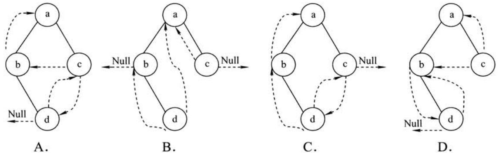

4.在右图所的平衡叉树中，插关键字48后得到棵新平衡叉树。在新平衡叉树中，关键字37所在结点的左、右结点中保存的关键字分别是 。

A.13,48 B.24,48   
C.24,53 D.24,90

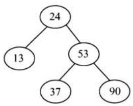

5.在棵度为4的树T中，若有20个度为4的结点，10个度为3的结点，1个度为2的结点，10个度为1的结点，则树T的叶结点个数是 。

A.41 B.82 C.113 D.122

6.对 $_ n$ ( $n \geq 2$ ）个权值均不相同的字符构造成哈夫曼树。下列关于该哈夫曼树的叙述中，错误的是 。

A.该树一定是一棵完全二叉树  
B.树中定没有度为1的结点  
C.树中两个权值最小的结点一定是兄弟结点  
D.树中任叶结点的权值定不于下层任结点的权值

计算机专业基础综合考试真题思路分析

7.若向图 $\mathrm { G } = ( \mathrm { V } , \mathrm { E } )$ 中含有7个顶点，要保证图G在任何情况下都是连通的，则需要的边数最少是 0

A.6 B.15 C.16 D.21

8.对右图进行拓扑排序，可以得到不同的拓扑序列的个数是

A. \$ \$ B. C. 2 D.1

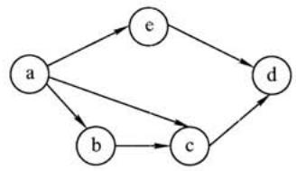

9.已知个长度为16的顺序表L，其元素按关键字有序排列。若采折半查找法查找个L中不存在的元素，则关键字的比较次数最多的是 。

A.4 B.5 C.6 D.7

10.采递归式对顺序表进快速排序。下列关于递归次数的叙述中，正确的是

A.递归次数与初始数据的排列次序无关B.每次划分后，先处理较长的分区可以减少递归次数C.每次划分后，先处理较短的分区可以减少递归次数D．递归次数与每次划分后得到的分区的处理顺序关

11．对组数据（2,12,16,88,5,10）进行排序，若前三趟排序结果如下：第一趟排序结果：2,12,16,5,10,88第二趟排序结果：2,12,5,10,16,88第三趟排序结果：2,5,10,12,16,88则采用的排序方法可能是 。

A.冒泡排序 B.希尔排序 C.归并排序 D.基数排序

12．下列选项中，能缩短程序执时间的措施是 。

[.提CPU时钟频率 II.优化数据通路结

II．对程序进编译优化

A.仅I和ⅡI B.仅I和ⅢI C.仅IⅡ和Ⅲ D.I、II和

13．假定有4个整数8位补码分别表 ${ \mathrm { r } } 1 = { \mathrm { F E H } }$ , ${ \bf r } 2 = { \bf F } 2 { \bf H }$ , $\Gamma 3 = 9 0 \mathrm { H }$ , $\mathrm { r } 4 = \mathrm { F } 8 \mathrm { H }$ ，若将运算结果存放在一个8位寄存器中，则下列运算中会发生溢出的是 。

A. $\mathbf { r } 1 \times \mathbf { r } 2$ i B. $\mathbf { r } 2 \times \mathbf { r } 3$ id: C. $\mathrm { r } 1 \times \mathrm { r } 4$ D. $\boldsymbol { \mathrm { r } } 2 \times \boldsymbol { \mathrm { r } } 4$

14.假定变量i、f和d的数据类型分别为int、float和double（int用补码表示，float和double分别IEEE754单精度和双精度浮点数格式表），已知 $\dot { 1 } = 7 8 5$ , $\mathrm { f } = 1 . 5 6 7 8 \mathrm { e } 3$ , $\mathbf { d } = 1 . 5 \mathrm { e l } 0 0$ 。若在32位机器中执下列关系表达式，则结果为“真”的是 。

1. $\scriptstyle \mathrm { i = = }$ (int)(float)i I.f==(float)(int)f II. $\mathbf { f } = =$ (float)(double)f IV. $( \mathrm { d } { + } \mathrm { f } ) { - } \mathrm { d } { = } { - } \mathrm { f }$

A.仅I和ⅡI B.仅I和 C.仅Ⅱ和I D.仅I和IV

15．假定若 $2 \mathrm { K } \times 4$ 位的芯组成个 $8 \mathrm { K } \times 8$ 位的存储器，则地址OB1FH所在芯的最地址是 。

A.0000H B.0600H C.0700H D.0800H

16.下列有关RAM和ROM的叙述中，正确的是 。

I.RAM是易失性存储器，ROM是易失性存储器II.RAM和ROM都采随机存取式进信息访问

II．RAM和ROM都可作CacheIV.RAM和ROM都需要进行刷新

A.仅I和ⅡI B.仅I和IIC.仅I、Ⅱ和IV D.仅I、I和IV

17．下列命中组合情况中，次访存过程中不可能发的是 。

A．TLB未命中，Cache未命中，Page未命中B.TLB未命中，Cache命中，Page命中C.TLB命中，Cache未命中，Page命中D.TLB命中，Cache命中，Page未命中

18．下列寄存器中，汇编语程序员可见的是 。

A．存储器地址寄存器（MAR） B.程序计数器（PC)C.存储器数据寄存器（MDR） D.指令寄存器（IR）

19．下列选项中，不会引起指令流线阻塞的是 。

A．数据旁路（转发） B.数据相关C.条件转移 D.资源冲突

20．下列选项中的英缩写均为总线标准的是 。

A.PCI、CRT、USB、EISA B.ISA、CPI、VESA、EISAC.ISA、SCSI、RAM、MIPS D.ISA、EISA、PCI、PCI-Express

21．单级中断系统中，中断服务程序内的执顺序是

1.保护现场 II.开中断 II．关中断 IV.保存断点

V.中断事件处理 VI.恢复现场 VII.中断返回

A. $\mathrm { I \to V \to V I \to I I \to V I I }$ B. $_ { \mathrm { I I I \to I \to V \to V I I } }$   
C. $\mathrm { I I I {  } I V {  } V {  } V I {  } V I I }$ D. $\scriptstyle \mathrm { I V \to I \to V \to V I \to V I I }$

22．假定台计算机的显示存储器DRAM芯实现，若要求显示分辨率为 $1 6 0 0 \times 1 2 0 0$ ，颜色深度为24位，帧频为 ${ 8 5 } \mathrm { H z }$ ，显存总带宽的 $5 0 \%$ 来刷新屏幕，则需要的显存总带宽少约为 。

A. 245Mb/s B.979Mb/s C. $1 9 5 8 \mathrm { M b } / \mathrm { s }$ D. 7834Mb/s

23．下列选项中，操作系统提供给应用程序的接口是 。

A.系统调用 B.中断 C.库函数 D.原语

24．下列选项中，导致创建新进程的操作是 。

1.户登录成功 II.设备分配 III．启动程序执A.仅I和ⅡI B.仅Ⅱ和 C.仅I和I D.I、IⅡ和

25．设与某资源关联的信号量初值为3，当前值为1。若 $M$ 表示该资源的可个数， $N$ 表待该资源的进程数，则M、 $N$ 分别是 。

A.0、1 B.1、0 C.1、2 D.2、0

26．下列选项中，降低进程优先级的合理时机是 。

A.进程的时间片用完 B.进程刚完成I/O，进入就绪列队C.进程长期处于就绪列队中 D.进程从就绪状态转为运行状态

计算机专业基础综合考试真题思路分析

27.进程 $\mathrm { P } _ { 0 }$ 和 $\mathrm { P } _ { 1 }$ 的共享变量定义及其初值为：   
boolean flag[2];   
int turn $_ { = 0 }$ ;   
flag[0]=FALSE;flag[1] $\vDash$ FALSE;   
若进程 $\mathrm { \sf P } _ { 0 }$ 和 $\mathrm { P } _ { 1 }$ 访问临界资源的类C伪代码实现如下：   
void PO() //进程P0   
{   
while(TRUE) { flag[0] $=$ TRUE;turn $^ { = 1 }$ ; while(flag[1]&&(turn $\scriptstyle = = 1$ )); 临界区； flag[0] $=$ FALSE; }   
voidP1() //进程P1   
{   
while(TRUE) { flag[1] $=$ TRUE;turn $^ { = 0 }$ ; while(flag[0]&&(turn $\scriptstyle = = 0$ )); 临界区； flag[1] $=$ FALSE; }

则并发执进程 $\mathrm { P } _ { 0 }$ 和 $\mathrm { P } _ { 1 }$ 时产的情形是

A．不能保证进程互斥进入临界区，会出现“饥饿”现象B．不能保证进程互斥进临界区，不会出现“饥饿”现象C．能保证进程互斥进临界区，会出现“饥饿”现象D.能保证进程互斥进入临界区，不会出现“饥饿”现象

28．某基于动态分区存储管理的计算机，其主存容量为55MB（初始为空闲），采用最佳适配（BestFit）算法，分配和释放的顺序为：分配15MB，分配30MB，释放15MB，分配8MB，分配6MB，此时主存中最大空闲分区的大小是

A.7MB B.9MB C.10MB D.15MB

29.某计算机采级页表的分页存储管理式，按字节编址，页为 $2 ^ { 1 0 } \mathrm { { B } }$ ，页表项为2B，逻辑地址结构为

<table><tr><td>页目录号</td><td>页号</td><td>页内偏移量</td></tr></table>

逻辑地址空间大小为 $2 ^ { 1 6 }$ 页，则表整个逻辑地址空间的页录表中包含表项的个数至少是 。

A.64 B.128 C.256 D.512

30．设件索引结点中有7个地址项，其中4个地址项是直接地址索引，2个地址项是级间接地址索引，1个地址项是级间接地址索引，每个地址项为4B。若磁盘索引块和磁盘数据块大小均为256B，则可表示的单个件最大长度是 。

A.33KB B.519KB C.1057KB D.16513KB

31．设置当前作录的主要目的是

A．节省外存空间 B.节省内存空间C.加快文件的检索速度 D.加快文件的读/写速度

32．本地户通过键盘登录系统时，先获得键盘输信息的程序是 。

A.命令解释程序 B.中断处理程序C.系统调用服务程序 D.用户登录程序

33．下列选项中，不属于网络体系结构所描述的内容是. 。

# 2010年全国硕研究学统考试计算机科学与技术学科联考计算机学科专业基础综合试题

A.网络的层次 B.每层使用的协议C.协议的内部实现细节 D.每层必须完成的功能

34.在右图所的采“存储-转发”式的分组交换络中，所有链路的数据传输速率为 $1 0 0 \mathrm { M b / s }$ ，分组为1000B，其中分组头为20B。若主机H1向主机H2发送个为980000B的件，则在不考虑分组拆装时间和传番延迟的情况下，从H1发送开始到H2接收完为，需要的时间少是_ 。

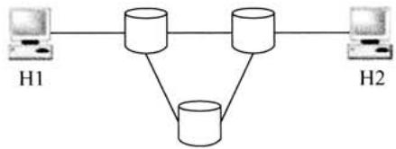

A. 80ms B.80.08ms C. 80.16ms D. $8 0 . 2 4 \mathrm { m s }$

35．某自治系统内采用RIP协议，若该自治系统内的路由器R1收到其邻居路由器R2的距离矢量，距离矢量中包含信息<net1, $1 6 >$ ，则能得出的结论是 _。

A．R2可以经过R1到达net1，跳数为17  
B.R2可以到达net1，跳数为16  
C.R1可以经过R2到达net1，跳数为17  
D.R1不能经过R2到达net1

36.若路由器R因为拥塞丢弃IP分组，则此时R可向发出该IP分组的源主机发送的ICMP报文类型是 。

A.路由重定向 B.目的不可达 C.源点抑制 D.超时

37.某网络的IP地址空间为192.168.5.0/24，采用定长子网划分，子网掩码为255.255.255.248，则该网络中的最大子网个数、每个子网内的最大可分配地址个数分别是 。

A.32,8 B.32,6 C.8,32 D.8,30

38.下列网络设备中，能够抑制播风暴的是 。

1.中继器 II.集线器 II.网桥 IV.路由器 A.仅I和I B.仅II C.仅II和IV D.仅IV

39.主机甲和主机乙之间已建了一个TCP连接，TCP最大段长度为1000B。若主机甲的当前拥塞窗口为4000B，在主机甲向主机乙连续发送两个最大段后，成功收到主机乙发送的第一个段的确认段，确认段中通告的接收窗口大小为2000B，则此时主机甲还可以向主机乙发送的最大字节数是

A.1000 B.2000 C.3000 D.4000

40．如果本地域名服务器缓存，当采递归法解析另络某主机域名时，户主机、本地域名服务器发送的域名请求消息数分别为 。

A.条、条 B.条、多条 C.多条、一条 D.多条、多条

# 二、综合应用题（第 $4 1 { \sim } 4 7$ 题，共70分)

41．（10分）将关键字序列（7,8,30,11,18,9,14）散列存储到散列表中。散列表的存储空间是个下标从0开始的一维数组，散列函数为 $\mathrm { H } ( \mathrm { k e y } ) = \left( \mathrm { k e y } \times 3 \right)$ mod7，处理冲突采用线性探测再散列法，要求装填（载）因为0.7。

1）请画出所构造的散列表。

2）分别计算等概率情况下查找成功和查找不成功的平均查找长度。

42.（13分）设将 $_ n$ $n > 1$ ）个整数存放到维数组R中。试设计个在时间和空间两面都尽可能效的算法。将R中保存的序列循环左移 $p$ ( $0 < p < n$ ）个位置，即将R中的数据由 $( \mathbf { X } _ { 0 } ,$ $\mathbf { X } _ { 1 } , \cdots , \mathbf { X } _ { n - 1 } )$ 变换为 $( \mathrm { X } _ { p } , \mathrm { X } _ { p + 1 } , \cdots , \mathrm { X } _ { n - 1 } , \mathrm { X } _ { 0 } , \mathrm { X } _ { 1 } , \cdots , \mathrm { X } _ { p - 1 } )$ 。要求：

计算机专业基础综合考试真题思路分析

1）给出算法的基本设计思想。

2）根据设计思想，采C、 $\mathrm { C } { + } { + }$ 或Java语描述算法，关键之处给出注释。

3）说明你所设计算法的时间复杂度和空间复杂度。

43．（11分）某计算机字长为16位，主存地址空间为128KB，按字编址。采单字长指令格式，指令各字段定义如下图所。

<table><tr><td rowspan=1 colspan=5>15                   12 11                                   6 5                                     0</td></tr><tr><td rowspan=1 colspan=1>OP</td><td rowspan=1 colspan=1>Ms</td><td rowspan=1 colspan=1>Rs</td><td rowspan=1 colspan=1>Md</td><td rowspan=1 colspan=1>Rd</td></tr><tr><td rowspan=1 colspan=5>源操作数                                 目的操作数</td></tr></table>

转移指令采相对寻址式，相对偏移量补码表，寻址式定义见下表。

<table><tr><td rowspan=1 colspan=1>Ms/Md</td><td rowspan=1 colspan=1>寻址方式</td><td rowspan=1 colspan=1>助记符</td><td rowspan=1 colspan=1>含义</td></tr><tr><td rowspan=1 colspan=1>000B</td><td rowspan=1 colspan=1>寄存器直接</td><td rowspan=1 colspan=1>Rn</td><td rowspan=1 colspan=1>操作数=(Rn)</td></tr><tr><td rowspan=1 colspan=1>001B</td><td rowspan=1 colspan=1>寄存器间接</td><td rowspan=1 colspan=1>(Rn)</td><td rowspan=1 colspan=1>操作数=(Rn))</td></tr><tr><td rowspan=1 colspan=1>010B</td><td rowspan=1 colspan=1>寄存器间接、自增</td><td rowspan=1 colspan=1>(Rn)+</td><td rowspan=1 colspan=1>操作数=(Rn))，(Rn)+1→Rn</td></tr><tr><td rowspan=1 colspan=1>011B</td><td rowspan=1 colspan=1>相对</td><td rowspan=1 colspan=1>D(Rn)</td><td rowspan=1 colspan=1>转移目标地址=(PC)+(Rn)</td></tr></table>

注： $( \mathbf { \boldsymbol { X } } )$ 表示存储器地址X或寄存器X的内容。

请回答下列问题：

1）该指令系统最多可有多少条指令？该计算机最多有多少个通寄存器？存储器地址寄存器（MAR）和存储器数据寄存器（MDR）至少各需要多少位？

2）转移指令的标地址范围是多少?

3）若操作码0010B表加法操作（助记符为add），寄存器R4和R5的编号分别为100B和101B，R4的内容为1234H，R5的内容为5678H，地址1234H中的内容为 $5 6 7 8 \mathrm { H }$ ，地址5678H中的内容为1234H，则汇编语为“add(R4),(R5) $^ { + }$ ”（逗号前为源操作数，逗号后为的操作数）对应的机器码是什么（六进制表）？该指令执后，哪些寄存器和存储单元中的内容会改变？改变后的内容是什么？

44.（12分）某计算机的主存地址空间为256MB，按字节编址。指令Cache和数据Cache分离，均有8个Cache，每个Cache为64B，数据Cache采直接映射式。现有两个功能相同的程序A和B，其伪代码如下：

程序A：   
int a[256][256]   
int sum_array1()   
{   
int i,j,sum $_ { 1 = 0 }$ ;   
for( $\scriptstyle { \dot { 1 } } = 0$ ; $\mathrm { i } < 2 5 6$ ; $\dot { \bar { \lambda } } + +$ )d) for $\dot { \mathsf { J } } ^ { = 0 }$ ;j<256; ${ \dot { \mathsf { J } } } + +$ )d) sum $+ = a$ [i][j]; return sum;   
}   
程序B：   
int a[256][256]   
int sum_array2()   
{   
inti,j,sum ${ \left. \vert = 0 \right. }$ ;   
for( $\dot { \beth } = 0$ ; $\dot { ] } < 2 5 6$ ; ${ \dot { \exists } } + +$ ) for( $\scriptstyle \dot { 1 } = 0$ ;i<256; $\dot { \bar { \boldsymbol { \perp } } } + \dot { \bar { \boldsymbol { + } } }$ (cd) sum $+ = a$ [i][j]; return sum;   
}

假定int类型数据32位补码表，程序编译时i、j、sum均分配在寄存器中，数组a按优先式存放，其地址为320（进制数)。请回答下列问题，要求说明理由或给出计算过程。

1）若不考虑于Cache致性维护和替换算法的控制位，则数据Cache的总容量为多少?

2）数组元素a[0][31]和a[1][1]各所在的主存块对应的Cache号分别是多少（Cache号从0开始）？

3）程序A和B的数据访问命中率各是多少？哪个程序的执时间更短？

45．（7分）假设计算机系统采CSCAN（循环扫描）磁盘调度策略，使2KB的内存空间记录16384个磁盘块的空闲状态。

1）请说明在上述条件下如何进磁盘块空闲状态的管理。

2）设某单面磁盘旋转速度为 $6 0 0 0 \mathrm { r p m }$ ，每个磁道有100个扇区，相邻磁道间的平均移动时间为1ms。若在某时刻，磁头位于100号磁道处，并沿着磁道号增大的向移动（见下图），磁道号请求队列为50,90,30,120，对请求队列中的每个磁道需读取1个随机分布的扇区，则读完这4个扇区点共需要多少时间？要求给出计算过程。

3）如果将磁盘替换为随机访问的Flash半导体存储器（如U盘、SSD等），是否有CSCAN更效的磁盘调度策略？若有，给出磁盘调度策略的名称并说明理由；若，说明理由。

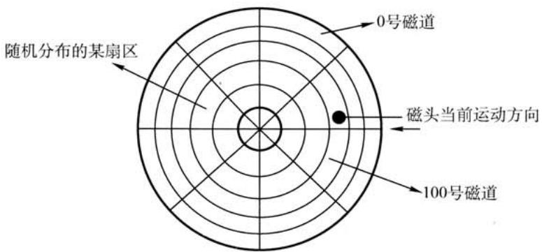

46．（8分）设某计算机的逻辑地址空间和物理地址空间均为64KB，按字节编址。若某进程最多需要6页（Page）数据存储空间，页的为1KB，操作系统采固定分配局部置换策略为此进程分配4个页框（PageFrame）。在时刻260前的该进程访问情况见下表（访问位即使用位）。

<table><tr><td rowspan=1 colspan=1>页号</td><td rowspan=1 colspan=1>页框号</td><td rowspan=1 colspan=1>装入时刻</td><td rowspan=1 colspan=1>访问位</td></tr><tr><td rowspan=1 colspan=1>0</td><td rowspan=1 colspan=1>7</td><td rowspan=1 colspan=1>130</td><td rowspan=1 colspan=1>1</td></tr><tr><td rowspan=1 colspan=1>1</td><td rowspan=1 colspan=1>4</td><td rowspan=1 colspan=1>230</td><td rowspan=1 colspan=1>1</td></tr><tr><td rowspan=1 colspan=1>2</td><td rowspan=1 colspan=1>2</td><td rowspan=1 colspan=1>200</td><td rowspan=1 colspan=1>1</td></tr><tr><td rowspan=1 colspan=1>3</td><td rowspan=1 colspan=1>9</td><td rowspan=1 colspan=1>260</td><td rowspan=1 colspan=1>1</td></tr></table>

当该进程执到时刻260时，要访问逻辑地址为17CAH的数据。请回答下列问题：

1）该逻辑地址对应的页号是多少?

2）若采先进先出（FIFO）置换算法，该逻辑地址对应的物理地址是多少?要求给出计算过程。

3）若采时钟（CLOCK）置换算法，该逻辑地址对应的物理地址是多少？要求给出计算过程（设搜索下页的指针沿顺时针向移动，且当前指向2号页框，意图见下图)。

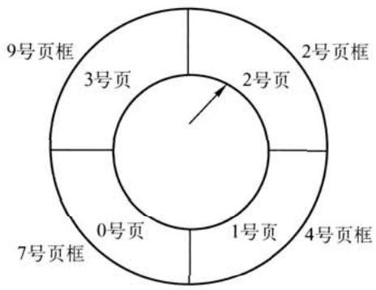

计算机专业基础综合考试真题思路分析

47．（9分）某局域采CSMA/CD协议实现介质访问控制，数据传输速率为 $1 0 \mathrm { { M b / s } }$ ，主机甲和主机乙之间的距离为 $2 \mathrm { k m }$ ，信号传播速度为 $2 0 0 0 0 0 \mathrm { k m / s }$ 。请回答下列问题，要求说明理由或写出计算过程。

1）若主机甲和主机乙发送数据时发生冲突，则从开始发送数据时刻起，到两台主机均检测到冲突时刻止，最短需经过多长时间？最长需经过多长时间（假设主机甲和主机乙发送数据过程中，其他主机不发送数据）？

2）若网络不存在任何冲突与差错，主机甲总是以标准的最长以太网数据帧（1518B）向主机乙发送数据，主机乙每成功收到一个数据帧后即向主机甲发送一个64B的确认帧，主机甲收到确认帧后可发送下一个数据帧。此时主机甲的有效数据传输速率是多少（不考虑以太网的前导码）？

# 2010年计算机学科专业基础综合试题参考答案

# 一、单项选择题

\$ \$20 \$31 DA \$42 5. B \$14. 7. 86.   
13. 15.   
17. D 18. B 19. 20. D 21. A 22. D 23. 24.   
25. B 26. 27. D 28. B 29. B 30. 31. 32.   
33. 34. C 35. D 36. 37. B 38. D 39. A 40. A

1.解析：

选项A可由in,in, in, in,out,out, in,out,out, in,out,out得到；选项B可由in, in, in,out,out, in,out,out, in,out,in,out得到；选项C可由in,in,out,in,out,out,in, in,out,in,out,out得到；选 项D可由in,out, in, in,in, in, in,out,out,out,out,out得到，但题意要求不允许连续三次退栈操作， 故D不可能得到。

【另解】先进栈的元素后出栈，进栈顺序为a,b,c,d,e,f，故连续出栈时的序列必然是按字母表逆序的，若出栈序列中出现了长度于等于3的连续逆序序列，则为不符合要求的出栈序列。

2.解析：

本题的队列实际上是个输出受限的双端队列。A操作：a左（或右）、b左、c右、d右、e右。B操作：a左（或右）、b左、c右、d左、e右。D操作：a左（或右）、b左、c左、d右、e左入。C操作：a左（或右）、b右、因d未出，此时只能进队，c怎么进都不可能在b和a之间。

【另解】初始时队列为空，第1个元素a左（或右），第2个元素b论是左还是右都必与a相邻，选项D中a与b不相邻，不合题意。

# 3.解析：

题中所给叉树的后序序列为d,b,c,a。结点d前驱和左树，左链域空，右树， 右链域指向其后继结点b；结点b无左树，左链域指向其前驱结点d；结点c无左树，左链 域指向其前驱结点b，右树，右链域指向其后继结点a。故选D。

# 4.解析：

插48以后，该叉树根结点的平衡因由-1变为-2，在最不平衡树根结点的右树（R）的左树（L）中插新结点引起的不平衡属于RL型平衡旋转，需要做两次旋转操作（先右旋后左旋）。

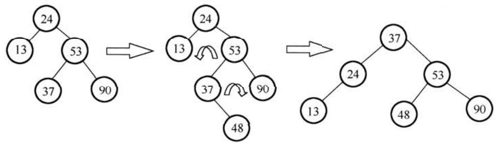

调整后，关键字37所在结点的左、右结点中保存的关键字分别是24、53。

计算机专业基础综合考试真题思路分析

5.解析：

设树中度为 $\textit { i } ( \textit { i } = 0 , 1 , 2 , 3 , 4 )$ 的结点数分别为 $N _ { i }$ ，树中结点总数为 $N$ ，则树中各结点的度之和等于 $N { - } 1$ ，即 $N = 1 + N _ { 1 } + 2 N _ { 2 } + 3 N _ { 3 } + 4 N _ { 4 } = N _ { 0 } + N _ { 1 } + N _ { 2 } + N _ { 3 } + N _ { 4 }$ ，根据题设中的数据，即可得到 $N _ { 0 } = 8 2$ ，即树T的叶结点的个数是82。

6.解析：

哈夫曼树为带权路径长度最小的二叉树，不一定是完全二叉树。哈夫曼树中没有度为1的结点，B正确；构造哈夫曼树时，最先选取两个权值最小的结点作为左、右子树构造一棵新的二叉树，C正确；哈夫曼树中任一非叶结点P的权值为其左、右子树根结点权值之和，其权值不小于其左、右子树根结点的权值，在与结点P的左、右子树根结点处于同层的结点中，若存在权值大于结点P权值的结点Q，则结点Q的兄弟结点中权值较小的一个应该与结点P作为左、右子树构造新的二叉树。综上可知，哈夫曼树中任一非叶结点的权值一定不小于下一层任一结点的权值。

7.解析：

要保证无向图G在任何情况下都是连通的，即任意变动图G中的边，G始终保持连通，首先需要G的任意6个结点构成完全连通子图G1，需 $n ( n - 1 ) / 2 = 6 { \times } ( 6 - 1 ) / 2 = 1 5$ 条边，然后再添条边将第7个结点与G1连接起来，共需16条边。

# 8.解析：

拓扑排序的过程如下图所示。

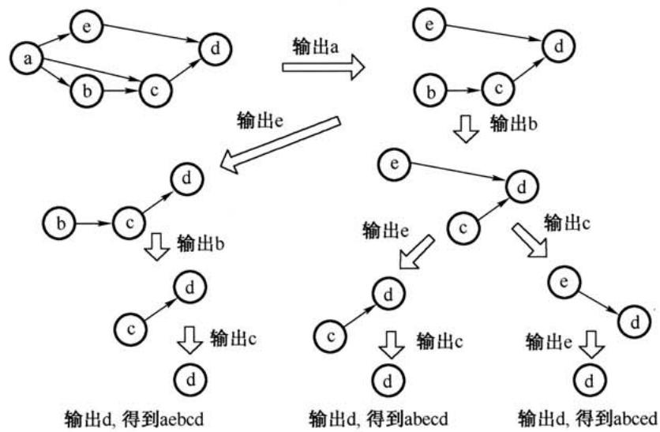

可以得到3个不同的拓扑序列，分别为abced、abecd、aebcd。

9.解析：

折半查找法在查找成功时进行的关键字比较次数最多为 $\log _ { 2 } n \rfloor + 1$ ，即判定树的高度；折半查找法在查找不成功时进的关键字比较次数最多为 $\log _ { 2 } n \rfloor + 1$ 。题中 $n = 1 6$ ，因此最多较$\lfloor \log _ { 2 } 1 6 \rfloor + 1 = 5$ 次。也可以画出草图求解。

思考：若本题题改为求最少的较次数呢?

10.解析：

快递排序的递归次数与元素的初始排列有关。若每次划分后分区比较平衡，则递归次数少；若划分后分区不平衡，则递归次数多。但快速排序的递归次数与分区处理顺序无关，即先处理较长的分区或先处理较短的分区都不影响递归次数。

此外，可以形象地把快速排序的递归调用过程用一个叉树描述，先处理较长或较短分区，可以想象为交换某递归结点处的左右树，这并不会影响树中的分数。

11.解析：

题中所给的三趟排序过程中，每趟排序是从前往后依次较，使最值“沉底”，符合冒泡排序的特点。

看第一趟可知仅有88被移到最后。

● 如果是希尔排序，则12,88,10应变为10,12,88。因此排除希尔排序。

$\bullet$ 如果是归并排序，则长度为2的序列是有序的。因此可排除归并排序。

● 如果是基数排序，则16,5,10应变为10,5,16。因此排除基数排序。

提示：对于此类题，先看备选项的排序算法有什么特征，再看题中的排序过程是否符合这特征，从得出答案。般先从选项中的简单排序法（插排序、起泡排序、选择排序)开始判断，若简单排序法不符合，再判断排序法（希尔排序、快速排序、堆排序、归并排序）。

12.解析：

CPU时钟频率（主频）越，完成指令的个执步骤所的时间就越短，执指令的速度越快，Ⅰ正确。数据通路的功能是实现CPU内部的运算器和寄存器以及寄存器之间的数据交换，优化数据通路结构，可以有效提计算机系统的吞吐量，从加快程序的执，Ⅱ正确。计算机程序需要先转化成机器指令序列才能最终得到执，通过对程序进编译优化可以得到更优的指令序列，从而使得程序的执行时间也越短，Ⅲ正确。

【另解】定量分析：CPU执时间 $=$ （程序指令条数 $\times$ 每条指令时钟周期数)/时钟频率。提时钟频率显然可以缩短CPU执时间；编译优化可能减少程序的指令数或优化指令结构；优化数据通路结构可能减少时钟周期，即提时钟频率，故选D。

# 13.解析：

本题的真正意图是考查补码的表范围，而不是补码的乘法运算。若采补码乘法规则计算出4个选项，是费不讨好的做法，且极容易出错。

8位补码所能表示的整数范围为 $- 1 2 8 \sim + 1 2 7$ 。将4个数全部转换为十进制： $\mathrm { r } 1 = - 2 , \mathrm { r } 2 = - 1 4$ ,$\boldsymbol { \mathrm { r } } 3 = - 1 1 2$ , $\mathrm { r } 4 = - 8$ ，得 $\mathbf { r } 2 \times \mathbf { r } 3 = 1 5 6 8$ ，远超出了表示范围，发溢出。

【提】解题时，尤其是对于这种看似很复杂的题，不要轻易动笔，要弄清题考查的真正意图，尽可能地“捷径”，以免绕进命题者设计的“死胡同”。

14.解析：

题中三种数据类型的精度从低到为int→float→double，从低到的转换通常可以保持其值不变，Ⅰ和II正确，从到低的转换可能会有数据的舍，从而损失精度。对于I，先将float型的f转换为int型，数点后的数位丢失，故其结果不为真。对于IV，初看似乎没有问题，但浮点运算 $\mathrm { d { + } f }$ 时需要对阶，对阶后f的尾数有效位被舍去变为0，故 $\mathrm { d { + } f }$ 仍然为d,再减去d后结果为0，故IV结果不为真。

此外，根据不同类型数据混合运算的“类型提升”原则，在IV中，等号左端的类型为double型，结果不为真。

# 15.解析：

用 $2 \mathrm { K } \times 4$ 位的芯组成个 $8 { \sf K } \times 8$ 位存储器，共需8 $2 \mathrm { K } \times 4$ 位的芯，分为4组，每组由2片 $2 \mathrm { K } \times 4$ 位的芯并联组成 $2 \mathrm { K } \times 8$ 位的芯，各组芯的地址分配如下：

第组（2个芯并联)： $0 0 0 0 \mathrm { H } \mathrm { \sim } 0 7 \mathrm { F F H }$ 。

第二组（2个芯并联）： ${ 0 8 0 0 } \mathrm { H } { \sim } { 0 } \mathrm { F F } \mathrm { F H } .$ 计算机专业基础综合考试真题思路分析第三组(2个芯并联）： $1 0 0 0 \mathrm { H } \mathrm { \sim } 1 7 \mathrm { F F H }$ 。

第四组（2个芯并联）： $1 8 0 0 \mathrm { H } \sim$ 1FFFH。

地址OB1FH所在的芯属于第二组，故其所在芯的最小地址为 $0 8 0 0 \mathrm { H }$ 。

16.解析：

RAM（分为DRAM和SRAM）断电后会失去信息，ROM断电后不会丢失信息，它们都采用随机存取方式（注意，采用随机存取方式的存储器并不一定就是随机存储器）。Cache一般采用高速的SRAM制成，而ROM只可读，不能用作Cache，II错误。DRAM需要定期刷新，而ROM不需要刷新，故IV错误。

# 17.解析：

Cache中存放的是主存的部分副本，TLB（快表）中存放的是Page（页表）的一部分副本。在同时具有虚拟页式存储器（有TLB）和Cache的系统中，CPU发出访存命令，先查找对应的Cache块。

1）若Cache命中，则说明所需内容在Cache内，其所在页必然已调主存，因此Page必然命中，但TLB不一定命中。

2）若Cache不命中，并不能说明所需内容未调主存，和TLB、Page命中与否没有联系但若TLB命中，Page也必然命中；当Page命中，TLB则未必命中，故D不可能发。

主存、Cache、TLB和Page的关系如下图所。

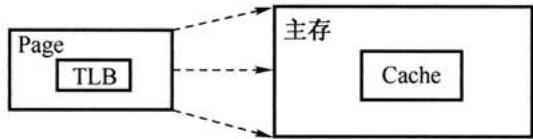

【提】本题看似既涉及虚拟存储器又涉及Cache，实际上这并不需要考虑Cache命中与否。因为旦缺页，说明信息不在主存，那么TLB中就定没有该页表项，所以不存在TLB命中、Page缺失的情况，也根本谈不上访问Cache是否命中。

# 18.解析：

读者先必须明“汇编语程序员可见”的含义，即汇编语程序员通过汇编程序可以对某个寄存器进行访问。汇编程序员可以通过指定待执行指令的地址来设置PC的值，如转移指令、子程序调用指令等。而IR、MAR、MDR是CPU的内部工作寄存器，程序员无法直接获取和设置它们的值，也无法直接对它们进行其他操作，所以对程序员不可见。

【提示】 $\textcircled{1}$ 指令寄存器IR中的内容总是根据PC所取出的指令代码。 $\textcircled{2}$ 在CPU的专寄存器中，只有PC和PSWR是汇编程序员可见的。

# 19.解析：

采用流水线方式，相邻或相近的两条指令可能会因为存在某种关联，后一条指令不能按照原指定的时钟周期运，从使流线断流。有三种相关可能引起指令流线阻塞： $\textcircled{1}$ 结构相关，又称资源相关； $\textcircled{2}$ 数据相关； $\textcircled{3}$ 控制相关，主要由转移指令引起。

数据旁路技术，其主要思想是不必待某条指令的执结果送回到寄存器，再从寄存器中取出该结果，作为下条指令的源操作数，是直接将执结果送到其他指令所需要的地，这样可以使流水线不发生停顿。

# 20.解析：

典型的总线标准有：ISA、EISA、VESA、PCI、PCI-Express、AGP、USB、RS-232C等。A中的CRT是纯平显示器；B中的CPI是每条指令的时钟周期数；C中的RAM是半导体随机存储器、MIPS是每秒执多少百万条指令数。

21.解析：

在单级（或单重）中断系统中，不允许中断嵌套。中断处理过程为： $\textcircled{1}$ 关中断； $\textcircled{2}$ 保存断点； $\textcircled{3}$ 识别中断源； $\textcircled{4}$ 保存现场； $\textcircled{5}$ 中断事件处理； $\textcircled{6}$ 恢复现场； $\textcircled{7}$ 开中断； $\textcircled{8}$ 中断返回。其中， $\textcircled{1} \sim \textcircled{3 }$ 由硬件完成， $\textcircled{4} \sim \textcircled { 8 }$ 由中断服务程序完成，故选A。

【排除法】选项B、C、D的第个任务（保存断点或关中断）都是由中断隐指令完成的，即由硬件直接执行，与中断服务程序无关。

# 22.解析：

刷新所需带宽 $=$ 分辨率 $. \times$ 色深 $\times$ 帧频 $= 1 6 0 0 { \times } 1 2 0 0 { \times } 2 4 6 \mathrm { i } \mathrm { t } { \times } 8 5 \mathrm { H } z = 3 9 1 6 . 8 \mathrm { M b / s }$ ，显存总带宽的 $5 0 \%$ 来刷屏，于是需要的显存总带宽为 $3 9 1 6 . 8 \mathbf { M } \mathbf { b } / \mathbf { s } / 0 . 5 = 7 8 3 3 . 6 \mathbf { M } \mathbf { b } / \mathbf { s } \approx 7 8 3 4 \mathbf { M } \mathbf { b } / \mathbf { s } ,$

# 23.解析：

操作系统提供的接口主要有两类：命令接口和系统调用。系统调用是能完成特定功能的子程序，当应用程序请求操作系统提供某种服务时，便调用具有相应功能的系统调用。库函数则是高级语言中提供的与系统调用对应的函数（也有些库函数与系统调用无关），目的是隐藏访管指令的细节，使系统调用更为方便、抽象。但要注意，库函数属于用户程序而非系统调，是系统调的上层。下图是Linux中的分层关系。

用户接口用户库函数接口标准系统程序(实用程序)系统程序：汇编、编译、编辑、Shell系统调用接口标准库函数标准函数：打开、关闭、读、写、创建、撤销操作系统系统调用：进程管理、存储管理、文件管理、设备管理

24.解析：

引起进程创建的事件有：户登录、作业调度、提供服务、应请求等。I．户登录成功后，系统要为此创建一个用户管理的进程，包括用户桌面、环境等。所有的用户进程会在该进程下创建和管理。II.设备分配是通过在系统中设置相应的数据结构实现的，不需要创建进程。III.．启动程序执行是典型的引起创建进程的事件。

25.解析：

信号量表相关资源的当前可数量。当信号量 $K > 0$ 时，表示还有 $K$ 个相关资源可用，所以该资源的可用个数是1。而当信号量 $K < 0$ 时，表示有 $| K |$ 个进程在等待该资源。由于资源有剩余，可见没有其他进程等待使用该资源，故进程数为0。

# 26.解析：

进程时间用完，可降低其优先级以让别的进程被调度进入执状态。B选项中进程刚完成I/O，进入就绪队列等待被处理机调度，为了让其尽快处理I/O结果，故应提高优先权。C选项中进程长期处于就绪队列，为不至于产生饥饿现象，也应适当提高优先级。D选项中进程的优先级不应该在此时降低，而应在时间片用完后再降低。

# 27.解析：

这是皮特森算法的实际实现，保证进入临界区的进程合理安全。该算法为了防止两个进程为进入临界区而无限期等待，设置变量turn，表示不允许进入临界区的编号，每个进程在先设

计算机专业基础综合考试真题思路分析

置标志后再设置turn标志，不允许另个进程进，这时，再同时检测另个进程状态标志和不允许进入表示，这样可以保证当两个进程同时要求进入临界区时只允许一个进程进入临界区。保存的是较晚的一次赋值，因此较晚的进程等待，较早的进程进入。先到先入，后到等待，从而完成临界区访问的要求。

其实这可以想象为两个进门，每个进门前都会和对客套一句“你先”。如果进门时没别人，就当和空说句废话，然后大步登门入室；如果两人同时进门，就互相请先，但各只客套次，所以先客套的请完对，就等着对请，然后光明正地进门。

# 28.解析：

最佳适配算法是指每次为作业分配内存空间时，总是找到能满足空间大小需要的最小的空闲分区给作业，可以产生最小的内存空闲分区，如下图所示。

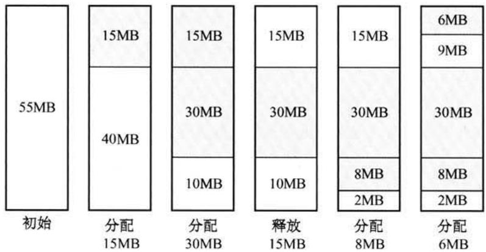

29.解析：

页大小为 $2 ^ { 1 0 } \mathrm { { B } }$ ，页表项为2B，故页可以存放 $2 ^ { 9 }$ 个页表项，逻辑地址空间为 $2 ^ { 1 6 }$ 页，即共需 $2 ^ { 1 6 }$ 个页表项，则需要 $2 ^ { 1 6 } / 2 ^ { 9 } = 2 ^ { 7 } = 1 2 8$ 个页保存页表项，即页录表中包含表项的个数至少是128。

30.解析：

每个磁盘索引块和磁盘数据块均为256B，每个磁盘索引块有 $2 5 6 / 4 = 6 4$ 个地址项。因此，4个直接地址索引指向的数据块大小为 $4 \times 2 5 6 \mathrm { B }$ ；2个级间接索引包含的直接地址索引数为 $2 \times ( 2 5 6 / 4 )$ ，即其指向的数据块大小为 $2 \times ( 2 5 6 / 4 ) \times 2 5 6 \mathrm { B }$ 。1个级间接索引所包含的直接地址索引数为 $( 2 5 6 / 4 ) \times ( 2 5 6 / 4 )$ ，即其所指向的数据块为 $( 2 5 6 / 4 ) \times ( 2 5 6 / 4 ) \times 2 5 6 \mathrm { B }$ 。即7个地址项所指向的数据块总大小为 $4 \times 2 5 6 + 2 \times ( 2 5 6 / 4 ) \times 2 5 6 + ( 2 5 6 / 4 ) \times ( 2 5 6 / 4 ) \times 2 5 6 = 1 0 8 2 3 6 8 { \it \mathrm { = 1 0 5 7 } } \times { \bf B }$

# 31.解析：

当个件系统含有多级录时，每访问个件，都要使从树根开始到树叶为、包括各中间结点名的全路径名。当前录又称作录，进程对各个件的访问都相对于当前录进，而不需要从根录层层的检索，加快了件的检索速度。选项A和B都与相对录无关；选项D，文件的读/写速度取决于磁盘的性能。

# 32.解析：

键盘是典型的通过中断I/O式作的外设，当户输信息时，计算机响应中断并通过中断处理程序获得输入信息。

# 33.解析：

计算机络的各层及其协议的集合称为体系结构，分层就涉及对各层功能的划分，因此A、B、D正确。体系结构是抽象的，它不包括各层协议的具体实现细节。《计算机络》中在讲解络层次时，仅有讲各层的协议和功能，内部实现细节没有提及。内部实现细节是由具体设备厂

家来确定的。

34.解析：

分组大小为1000B，其中分组头大小为20B，则分组携带的数据大小为980B，文件长度为980000B，需拆分为1000个分组，加上头部后，每个分组大小为1000B，总共需要传送的数据量大小为1MB。由于所有链路的数据传输速度相同，因此文件传输经过最短路径时所需时间最少，最短路径经过2个分组交换机。

当 $t = 1 \mathbf { M } { \times } 8 / ( 1 0 0 \mathbf { M } \mathbf { b } / \mathbf { s } ) = 8 0 \mathbf { m } \mathbf { s }$ 时，H1发送完最后个特。

当H1发送完最后一个分组时，该分组需要经过2个分组交换机的转发，在2次转发完成后，所有分组均到达H2。每次转发的时间为 $t _ { 0 } = 1 \mathrm { K } { \times } 8 / ( 1 0 0 \mathrm { M b / s } ) = 0 . 0 8 \mathrm { m s }$

所以，在不考虑分组拆装时间和传播延迟的情况下，当 $t = 8 0 \mathrm { m s } + 2 t _ { 0 } = 8 0 . 1 6 \mathrm { m s }$ 时，H2接收完文件，即所需的时间至少为 $8 0 . 1 6 \mathrm { { m s } }$ 。

# 35.解析：

R1在收到信息并更新路由表后，若需要经过R2到达net1，则其跳数为17，由于距离为16表示不可达，因此R1不能经过R2到达net1，R2也不可能到达net1。B、C错误，D正确。而题目中并未给出R1向R2发送的信息，因此A也不正确。

# 36.解析：

ICMP差错报告报文有5种：终点不可达、源点抑制、时间超过、参数问题、改变路由（重定向），其中源点抑制是当路由器或主机由于拥塞而丢弃数据报时，就向源点发送源点抑制报文，使源点知道应当把数据报的发送速率放慢。

# 37.解析：

由于该网络的IP地址为 $1 9 2 . 1 6 8 . 5 . 0 / 2 4$ ，络号为前24位，后8位为网号 $+$ 主机号。网掩码为 $2 5 5 . 2 5 5 . 2 5 5 . 2 4 8$ ，第4个字节248转换成二进制为11111000，因此后8位中，前5位用于子网号，在CIDR中可以表示 $2 ^ { 5 } = 3 2$ 个网；后3位于主机号，除去全0和全1的情况，可以表示 $2 ^ { 3 } - 2 = 6$ 个主机地址。

# 38.解析：

中继器和集线器工作在物理层，既不隔离冲突域也不隔离广播域。为了解决冲突域的问题，人们利用网桥和交换机来分隔互联网的各个网段中的通信量，建多个分离的冲突域，但当网桥和交换机接收到一个未知转发信息的数据帧时，为了保证该帧能被目的结点正确接收，将该帧从所有的端口广播出去，可以看出网桥和交换机的冲突域等于端口个数，广播域为1。路由器作在网络层，既隔离冲突域，也隔离播域。

【提】播风暴产于络层，因此只有网络层设备才能抑制。链路层设备和物理层设备对网络层的数据包是透明传输，对是否为广播报文是不可知的。

# 39.解析：

发送方的发送窗口的上限值取接收方窗口和拥塞窗口这两个值中较小的一个，于是此时发送方的发送窗口为 $\operatorname* { m i n } \{ 4 0 0 0 , 2 0 0 0 \} = 2 0 0 0 \mathrm { B }$ 。由于发送还没有收到第个最大段的确认，所以此时甲还可以向乙发送的最大字节数为 $2 0 0 0 - 1 0 0 0 = 1 0 0 0 \mathrm { B }$

# 40.解析：

当采用递归查询时，如果主机所询问的本地域名服务器不知道被查询域名的IP地址，那么本地域名服务器就以DNS客户的身份，向其他根域名服务器继续发出查询请求报文，而不是让该主机自己进行下一步的查询。因此，这种方法用户主机和本地域名服务器发送的域名请求条数均为1条。因此选A。

计算机专业基础综合考试真题思路分析

# 二、综合应用题

41.解答：

1）由装载因为0.7，数据总数为7，得维数组为 $7 / 0 . 7 = 1 0 $ ，数组下标为 $0 { \sim } 9$ 。所构造的散列函数值见下表。

<table><tr><td rowspan=1 colspan=1>key</td><td rowspan=1 colspan=1>7</td><td rowspan=1 colspan=1>8</td><td rowspan=1 colspan=1>30</td><td rowspan=1 colspan=1>11</td><td rowspan=1 colspan=1>18</td><td rowspan=1 colspan=1>9</td><td rowspan=1 colspan=1>14</td></tr><tr><td rowspan=1 colspan=1>H(key)</td><td rowspan=1 colspan=1>0</td><td rowspan=1 colspan=1>3</td><td rowspan=1 colspan=1>6</td><td rowspan=1 colspan=1>5</td><td rowspan=1 colspan=1>5</td><td rowspan=1 colspan=1>6</td><td rowspan=1 colspan=1>0</td></tr></table>

采线性探测再散列法处理冲突，所构造的散列表见下表。

<table><tr><td rowspan=1 colspan=1>地址</td><td rowspan=1 colspan=1>0</td><td rowspan=1 colspan=1>1</td><td rowspan=1 colspan=1>2</td><td rowspan=1 colspan=1>3</td><td rowspan=1 colspan=1>4</td><td rowspan=1 colspan=1>5</td><td rowspan=1 colspan=1>6</td><td rowspan=1 colspan=1>7</td><td rowspan=1 colspan=1>8</td><td rowspan=1 colspan=1>9</td></tr><tr><td rowspan=1 colspan=1>关键字</td><td rowspan=1 colspan=1>7</td><td rowspan=1 colspan=1>14</td><td rowspan=1 colspan=1></td><td rowspan=1 colspan=1>8</td><td rowspan=1 colspan=1></td><td rowspan=1 colspan=1>11</td><td rowspan=1 colspan=1>30</td><td rowspan=1 colspan=1>18</td><td rowspan=1 colspan=1>9</td><td rowspan=1 colspan=1></td></tr></table>

2）查找成功时，是根据每个元素查找次数来计算平均长度的，在等概率的情况下，各关键字的查找次数见下表。

<table><tr><td rowspan=1 colspan=1>key</td><td rowspan=1 colspan=1>7</td><td rowspan=1 colspan=1>8</td><td rowspan=1 colspan=1>30</td><td rowspan=1 colspan=1>11</td><td rowspan=1 colspan=1>18</td><td rowspan=1 colspan=1>9</td><td rowspan=1 colspan=1>14</td></tr><tr><td rowspan=1 colspan=1>次数</td><td rowspan=1 colspan=1>1</td><td rowspan=1 colspan=1>1</td><td rowspan=1 colspan=1>1</td><td rowspan=1 colspan=1>1</td><td rowspan=1 colspan=1>3</td><td rowspan=1 colspan=1>3</td><td rowspan=1 colspan=1>2</td></tr></table>

ASL $_ { H } \hat { c } ( x ) _ { J } =$ 查找次数/元素个数 $= ( 1 + 2 + 1 + 1 + 1 + 3 + 3 ) / 7 = 1 2 / 7$

这要特别防惯性思维。查找失败时，是根据查找失败位置计算平均次数，根据散列函数mod7，初始只可能在 $0 { \sim } 6$ 的位置。等概率情况下，查找 $0 { \sim } 6$ 位置查找失败的查找次数见下表。

<table><tr><td rowspan=1 colspan=1>H(key)</td><td rowspan=1 colspan=1>0</td><td rowspan=1 colspan=1>1</td><td rowspan=1 colspan=1>2</td><td rowspan=1 colspan=1>3</td><td rowspan=1 colspan=1>4</td><td rowspan=1 colspan=1>5</td><td rowspan=1 colspan=1>6</td></tr><tr><td rowspan=1 colspan=1>次数</td><td rowspan=1 colspan=1>3</td><td rowspan=1 colspan=1>2</td><td rowspan=1 colspan=1>1</td><td rowspan=1 colspan=1>2</td><td rowspan=1 colspan=1>1</td><td rowspan=1 colspan=1>5</td><td rowspan=1 colspan=1>4</td></tr></table>

ASL $\chi _ { \cdot \mathrm { B C } , \mathrm { D B } } =$ 查找次数/散列后的地址个数 $= ( 3 + 2 + 1 + 2 + 1 + 5 + 4 ) / 7 = 1 8 / 7 .$

42.解答：

1）算法的基本设计思想：

可以将这个问题视为把数组ab转换成数组ba（a代表数组的前 $p$ 个元素，b代表数组中余下的 $n ^ { - } p$ 个元素），先将a逆置得到 $\mathsf { a } ^ { - 1 } \mathsf { b }$ ，再将 $\boldsymbol { \mathbf { b } }$ 逆置得到 ${ \mathsf { a } } ^ { - 1 } { \mathsf { b } } ^ { - 1 }$ ，最后将整个 $\mathsf { a } ^ { - 1 } \mathsf { b } ^ { - 1 }$ 逆置得到$( a ^ { - 1 } b ^ { - 1 } ) ^ { - 1 } = b a$ 。设Reverse函数执将数组元素逆置的操作，对abedefgh向左循环移动3( $. p = 3$ )d)个位置的过程如下：

Reverse $1 0 , 1 9 - 1$ 得到cbadefgh;  
Reverse $( p , n - 1$ 得到cbahgfed;  
Reverse $( 0 , \mathrm { n - 1 } )$ 得到defghabc。

注：Reverse中，两个参数分别表数组中待转换元素的始末位置。

2）使用C语描述算法如下：

void Reverse(int R[l,int from,int to) { int i,temp; for $\left( \mathrm { i } { = } 0 ; \mathrm { i } { < } \left( \mathrm { t o } { - } \mathrm { f } \mathrm { r o m } { + } 1 \right) / 2 ; \mathrm { i } { + } + \right)$ { temp $- \frac { 2 } { 3 }$ [from $^ { + \mathrm { i } }$ ];R[from+i] $= \mathtt { R }$ [to-i];R[to-i] $=$ temp;}   
}//Reverse   
void Converse(int R[l,int n,int p){ Reverse(R, 0,p-1); Reverse(R,p,n-1); Reverse(R, 0,n-1);

3）上述算法中3个Reverse函数的时间复杂度分别为 $O ( p / 2 )$ $O ( ( n - p ) / 2 )$ 和 $O ( n / 2 )$ ，故所设计的算法的时间复杂度为 $O ( n )$ ，空间复杂度为 $O ( 1 )$ 。

【另解】借助辅助数组来实现。

算法思想：创建大小为 $p$ 的辅助数组S，将R中前 $p$ 个整数依次暂存在S中，同时将R中后 $n ^ { - } p$ 个整数左移，然后将S中暂存的 $p$ 个数依次放回到R中的后续单元。

时间复杂度为 $O ( n )$ ，空间复杂度为 $O ( p )$ 。

43.解答：

1）操作码占4位，则该指令系统最多可有 $2 ^ { 4 } = 1 6$ 条指令。操作数占6位，其中寻址式占3位、寄存器编号占3位，因此该机最多有 $2 ^ { 3 } = 8$ 个通寄存器。主存地址空间为128KB，按字编址，字长为16位，共有 $1 2 8 \mathrm { K B } / 2 \mathrm { B } = 2 ^ { 1 6 }$ 个存储单元，因此MAR少为16位；因为字长为16位，故MDR至少为16位。

2)寄存器字长为16位，PC和 $\mathtt { R n }$ 可表示的地址范围均为 $0 \sim 2 ^ { 1 6 } - 1$ ，而主存地址空间为 $2 ^ { 1 6 }$ ,故转移指令的标地址范围为 $0 0 0 0 \mathrm { H }$ \~FFFFH $0 { \sim } 2 ^ { 1 6 } { - } 1 )$ 。

3）汇编语句“add(R4), $( \mathsf { R } 5 ) + \mathbf { \eta } ^ { \prime \prime }$ ，对应的机器码为将对应的机器码写成六进制形式为 $0 0 1 0 0 0 1 1 0 0 0 1 0 1 0 1 \mathrm { B } = 2 3 1 5 \mathrm { H }$

<table><tr><td rowspan=1 colspan=1>字段</td><td rowspan=1 colspan=1>OP</td><td rowspan=1 colspan=1>Ms</td><td rowspan=1 colspan=1>Rs</td><td rowspan=1 colspan=1>Md</td><td rowspan=1 colspan=1>Rd</td></tr><tr><td rowspan=1 colspan=1>内容</td><td rowspan=1 colspan=1>0010</td><td rowspan=1 colspan=1>001</td><td rowspan=1 colspan=1>100</td><td rowspan=1 colspan=1>010</td><td rowspan=1 colspan=1>101</td></tr><tr><td rowspan=1 colspan=1>说明</td><td rowspan=1 colspan=1>add</td><td rowspan=1 colspan=1>寄存器间接</td><td rowspan=1 colspan=1>R4</td><td rowspan=1 colspan=1>寄存器间接、自增</td><td rowspan=1 colspan=1>R5</td></tr></table>

该指令的功能是将R4的内容所指存储单元的数据与R5的内容所指存储单元的数据相加，并将结果送入R5的内容所指存储单元中。 $( \mathrm { R } 4 ) = 1 2 3 4 \mathrm { H }$ , $( 1 2 3 4 \mathrm { H } ) = 5 6 7 8 \mathrm { H }$ ; $( \mathrm { R } 5 ) = 5 6 7 8 \mathrm { H }$ , $( 5 6 7 8 \mathrm { H } ) =$ $1 2 3 4 \mathrm { H }$ ；执行加法操作 $5 6 7 8 \mathrm { H } + 1 2 3 4 \mathrm { H } = 6 8 \mathrm { A C H }$ ，之后R5自增。

该指令执后，R5和存储单元5678H的内容会改变，R5的内容从5678H变为5679H，存储单元5678H中的内容变为该指令的计算结果68ACH。

【注意】第3问中两个操作数的存储地址和数值有点令晕头，请读者务必保持清醒。

44.解答：

1）每个Cache对应个标记项，如下图所。

<table><tr><td>有效位</td><td>脏位</td><td>替换控制位</td><td>标记位</td></tr></table>

不考虑于Cache致性维护和替换算法的控制位。地址总长度为28位 $( 2 ^ { 2 8 } = 2 5 6 \mathrm { M } )$ ,块内地址6位 $2 ^ { 6 } = 6 4$ ），Cache块号3位 $2 ^ { 3 } = 8$ ），故Tag的位数为 $2 8 - 6 - 3 = 1 9$ 位，还需使用一个有效位，故题中数据Cache行的结构如下图所示。

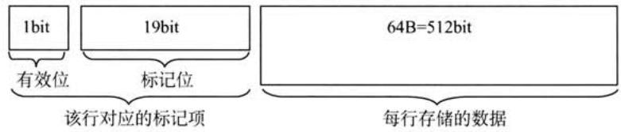

数据Cache共有8行，因此数据Cache的总容量为 ${ \bf 8 } { \times } ( 6 4 + 2 0 / 8 ) { \bf B } = 5 3 2 { \bf B }$

2）数组a在主存的存放位置及其与Cache之间的映射关系如下图所。

计算机专业基础综合考试真题思路分析

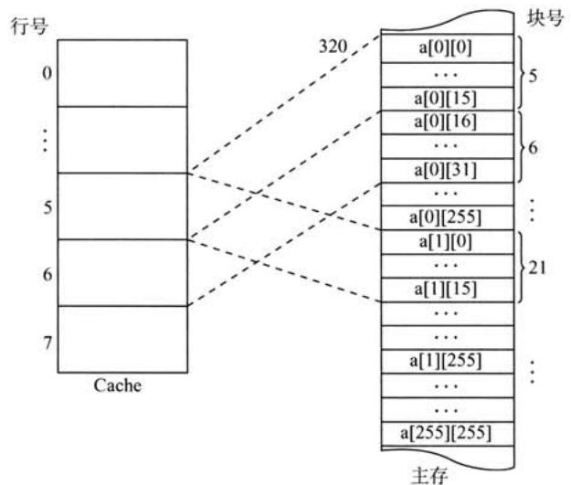

数组按优先式存放，地址为320，数组元素占4字节。a[0][31]所在的主存块对应的Cache行号为 $( 3 2 0 + 3 1 \times 4 ) / 6 4 = 6$ ；a[1][1]所在的主存块对应的Cache号为 $( 3 2 0 + 2 5 6 \times 4 +$ $1 { \times } 4 ) / 6 4 \% 8 = 5$

【另解】由1）可知主存和Cache的地址格式如下图所。

27 8 65 0主存地址 标记 块号块内地址8 65 0cache地址 块号块内地址

数组按优先式存放，地址320，数组元素占4字节。a[0][31]的地址为 $3 2 0 + 3 1 \times 4 = 1$ 10111100B，故其对应的Cache行号为 $1 1 0 \mathrm { B } = 6 $ ;a[1][1]的地址为 $3 2 0 + 2 5 6 \times 4 + 1 \times 4 = 1 3 4 8 = 1 0 1$ 01000100B，故其对应的Cache行号为 $1 0 1 \mathrm { B } = 5$ 。

3）数组a的大为 $2 5 6 \times 2 5 6 \times 4 8 = 2 ^ { 1 8 } \mathbf { B }$ ，占用 $2 ^ { 1 8 } / 6 4 = 2 ^ { 1 2 }$ 个主存块，按优先存放，程序A逐行访问数组a，共需访问的次数为 $2 ^ { 1 6 }$ 次，未命中次数为 $2 ^ { 1 2 }$ 次（即每个字块的第个数未命中），因此程序A的命中率为 $( 2 ^ { 1 6 } - 2 ^ { 1 2 } ) / 2 ^ { 1 6 } \times 1 0 0 \% = 9 3 . 7 5 \%$ 。

【另解】数组a按存放，程序A按存取。每个字块中存放16个int型数据，除访问的第个不命中，随后的15个全都命中，访问全部字块都符合这规律，且数组为字块的整数倍，故程序A的命中率为 $1 5 / 1 6 = 9 3 . 7 5 \%$ 。

程序B逐列访问数组a，Cache总容量为 $6 4 \mathrm { B } \times 8 = 5 1 2 \mathrm { B }$ ，数组a的为1KB，正好是Cache容量的2倍，可知不同的同列数组元素使的是同一个Cache单元，故逐列访问每个数据时，都会将之前的字块置换出，也即每次访问都不会命中，命中率为0。

由于从Cache读数据比从主存读数据快很多，所以程序A的执比程序B快得多。

注意：本题考查Cache容量计算，直接映射方式的地址计算，以及命中率计算（注意：行优先遍历与列优先遍历命中率差别很大)。

45.解答：

1）位图表磁盘的空闲状态。每位表个磁盘块的空闲状态，共需要 $1 6 ~ 3 8 4 / 3 2 = 5 1 2$ 字 $= 5 1 2 \times 4$ 字节 $= 2 \mathrm { K B }$ ，正好可放在系统提供的内存中。

2）采CSCAN调度算法，访问磁道的顺序和移动的磁道数见下表。

2010年计算机学科专业基础综合试题参考答案移动的磁道数为 $2 0 + 9 0 + 2 0 + 4 0 = 1 7 0$ ，故总的移动磁道时间为 $1 7 0 \mathrm { m s }$ 。

<table><tr><td rowspan=1 colspan=1>被访问的下一个磁道号</td><td rowspan=1 colspan=1>移动距离（磁道数）</td></tr><tr><td rowspan=1 colspan=1>120</td><td rowspan=1 colspan=1>20</td></tr><tr><td rowspan=1 colspan=1>30</td><td rowspan=1 colspan=1>90</td></tr><tr><td rowspan=1 colspan=1>50</td><td rowspan=1 colspan=1>20</td></tr><tr><td rowspan=1 colspan=1>90</td><td rowspan=1 colspan=1>40</td></tr></table>

由于转速为 $6 0 0 0 \mathrm { r p m }$ ，则平均旋转延迟为 $5 \mathrm { m s }$ ，总的旋转延迟时间 $= 2 0 \mathrm { m s }$ 。

由于转速为 $6 0 0 0 \mathrm { r p m }$ ，则读取个磁道上个扇区的平均读取时间为 $0 . 1 \mathrm { m s }$ ，总的读取区的时间为 $0 . 4 \mathrm { m s }$ 。

综上，读取上述磁道上所有扇区所花的总时间为 $1 9 0 . 4 \mathrm { { m s } }$ 。

3）采用FCFS（先来先服务）调度策略更高效。因为Flash半导体存储器的物理结构不需要考虑寻道时间和旋转延迟，可直接按I/O请求的先后顺序服务。

46.解答：

1）由于该计算机的逻辑地址空间和物理地址空间均为 $6 4 \mathrm { K B } = 2 ^ { 1 6 } \mathrm { B }$ ，按字节编址，且页的大小为 $1 \mathrm { K B } = 2 ^ { 1 0 } \mathrm { B }$ ，故逻辑地址和物理地址的地址格式均为

<table><tr><td>页号/页框号（6位）</td><td>页内偏移量（10位）</td></tr></table>

$1 7 { \mathrm { C A H } } = 0 0 0 1 0 1 1 1 1 0 0 1 0 1 0 { \mathrm { B } }$ ，可知该逻辑地址的页号为 $0 0 0 1 0 1 \mathbf { B } = 5 \mathbf { \Omega }$ 。

2）根据FIFO算法，需要替换装入时间最早的页，故需要置换装入时间最早的0号页，即将5号页装入7号页框中，所以物理地址为 $0 0 0 1 1 1 1 1 1 1 0 0 1 0 1 0 \mathrm { B } = 1 \mathrm { F C A H } .$

3）根据CLOCK算法，如果当前指针所指页框的使用位为0，则替换该页；否则将使用位清零，并将指针指向下一个页框，继续查找。根据题设和示意图，将从2号页框开始，前4次查找页框号的顺序为 $2  4  7  9$ ，并将对应页框的使位清零。在第5次查找中，指针指向2号页框，因2号页框的使用位为0，故淘汰2号页框对应的2号页，把5号页装入2号页框中，并将对应使用位设置为1，所以对应的物理地址为 $0 0 0 0 1 0 1 1 1 1 0 0 1 0 1 0 \mathrm { B } = 0 \mathrm { B C A H }$

47.解答：

1）显然当甲和乙同时向对方发送数据时，信号在信道中发生冲突后，冲突信号继续向两个方向传播。这种情况下两台主机均检测到冲突需要经过的时间最短：

设甲先发送数据，当数据即将到达乙时，乙也开始发送数据，此时乙将立刻检测到冲突，而甲要检测到冲突还需等待冲突信号从乙传播到甲。两台主机均检测到冲突的时间最长：

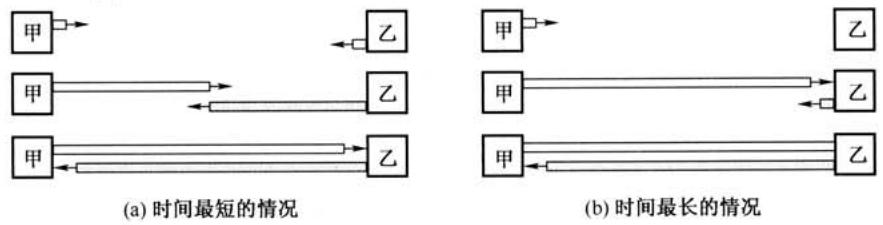

2）甲发送个数据帧的时间，即发送时延 $t _ { 1 } = 1 5 1 8 { \times } 8 \mathrm { b i t } / ( 1 0 \mathrm { M b } / \mathrm { s } ) = 1 . 2 1 4 4 \mathrm { m s }$ ；乙每成功收到一个数据帧后，向甲发送一个确认帧，确认帧的发送时延 $t _ { 2 } { = } 6 4 { \times } 8 \mathrm { b i t } / 1 0 \mathrm { M b } / \mathrm { s } = 0 . 0 5 1 2 \mathrm { m s }$ ；主机甲收到确认帧后，即发送下一数据帧，故主机甲的发送周期 $T =$ 数据帧发送时延 $t _ { 1 } +$ 确认帧发送时延 $t _ { 2 } +$ 双程传播时延 $= t _ { 1 } + t _ { 2 } + 2 t _ { 0 } = 1 . 2 8 5 6 \mathrm { m s }$ 。于是主机甲的有效数据传输率为 $1 5 0 0 \times 8 / T =$ $1 2 0 0 0 \mathrm { { b i t / 1 . 2 8 5 6 m s { \approx } 9 . 3 3 \mathrm { { M b / s } } } }$ （以太网帧的数据部分为1500B）。