# 2012年全国硕研究学统考试计算机科学与技术学科联考计算机学科专业基础综合试题

# 一、单项选择题（第 $1 { \sim } 4 0$ 题，每题2分，共80分。下列每题给出的四个选项中，只有个选项最符合试题要求）

1.求整数 $_ n$ $n { \stackrel { } { = } } 0$ ）阶乘的算法如下，其时间复杂度是 。

int fact(int n) { if $\mathrm { n } < = 1$ ) return 1; return $\mathtt { n } ^ { \star }$ fact(n-1);   
}

A. $O ( \log _ { 2 } n )$ B. O(n) C. $O ( n \mathrm { l o g } _ { 2 } n )$ (id: D. $O ( n ^ { 2 } )$

2.已知操作符包括 $^ +$ 、“-'、“\*、 $\cdot _ { / } ,$ 、(’和“)’。将中缀表达式 $\mathbf { a } + \mathbf { b } - \mathbf { a } ^ { * } ( ( \mathbf { c } + \mathbf { d } ) / \mathbf { e } - \mathbf { f } ) + \mathbf { g }$ 转换为等价的后缀表达式 $\mathbf { a b } + \mathbf { a c d } + \mathbf { e } / \mathbf { f } - \mathbf { ^ * } - \mathbf { g } +$ 时，栈来存放暂时还不能确定运算次序的操作符，若栈初始时为空，则转换过程中同时保存在栈中的操作符的最个数是 。

A.5 B.7 C.8 D.11

3.若棵叉树的前序遍历序列为a,e,b,d,c，后序遍历序列为b,c,d,e,a，则根结点的孩子结点 。

A.只有e B.有e、b C.有e、c D.无法确定

4.若平衡叉树的度为6，且所有叶结点的平衡因均为1，则该平衡叉树的结点总数为 。

A.10 B.20 C.32 D.33

5.对有 $_ n$ 个结点、 $e$ 条边且使邻接表存储的有向图进度优先遍历，其算法时间复杂度是

A. $O ( n )$ B. O(e) C. $O ( n + e )$ id D. O(ne)

6．若邻接矩阵存储有向图，矩阵中主对线以下的元素均为零，则关于该图拓扑序列的结论是

A.存在，且唯一 B.存在，且不唯一C.存在，可能不唯一 D.无法确定是否存在

7.如右图所示的有向带权图，若采用迪杰斯特拉（Dijkstra）算法求从源点a到其他各顶点的最短路径，则得到的第一条最短路径的目标顶点是b，第条最短路径的标顶点是c，后续得到的其余各最短路径的目标顶点依次是 。

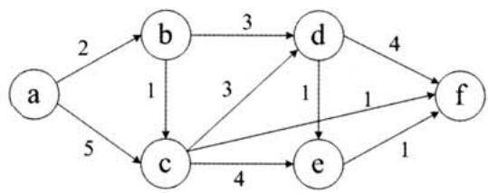

A. d, e, f B. e, d,f C. f, d, e D. f, e,d

8．下列关于最成树的叙述中，正确的是 。

I.最小成树的代价唯一计算机专业基础综合考试真题思路分析

ⅡI.所有权值最的边一定会出现在所有的最成树中III.使普姆（Prim）算法从不同顶点开始得到的最成树定相同IV．使普姆算法和克鲁斯卡尔（Kruskal）算法得到的最成树总不相同

A.仅I B.仅IⅡ C.仅I、II D.仅IⅡI、IV

9.已知棵3阶B-树，如下图所。删除关键字78得到棵新B-树，其最右叶结点中的关键字是 。

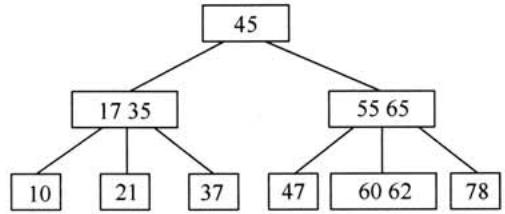

A.60 B.60,62 C.62,65 D.65

10.在内部排序过程中，对尚未确定最终位置的所有元素进行一遍处理称为一趟排序。下列排序法中，每趟排序结束都至少能够确定一个元素最终位置的法是 。

I.简单选择排序 II.希尔排序 II.快速排序 IV.堆排序 V.二路归并排序

A.仅I、III、IV B.仅I、I、VC.仅II、III、IV D.仅III、IV、V

11．对一待排序序列分别进行折半插入排序和直接插入排序，两者之间可能的不同之处是 。

A.排序的总趟数 B.元素的移动次数C.使用辅助空间的数量 D.元素之间的比较次数

12．假定基准程序A在某计算机上的运时间为100秒，其中90秒为CPU时间，其余为I/O时间。若CPU速度提高 $5 0 \%$ ，I/O速度不变，则运基准程序A所耗费的时间是 。

A. 55s B.60s C.65s D.70s

13.假定编译器规定int和short型长度分别为32位和16位，执行下列C语语句：

unsigned short $\times = 6 5 5 3 0$ ;   
unsigned int $y = \mathbf { x }$ ;

得到y的机器数为 。

A.00007FFAH B.0000FFFAH C.FFFF7FFAH D. FFFF FFFAH

14．float类型（即IEEE754单精度浮点数格式）能表的最正整数是

A. $2 ^ { 1 2 6 } - 2 ^ { 1 0 3 }$ i B. $2 ^ { 1 2 7 } - 2 ^ { 1 0 4 }$ i C. $2 ^ { 1 2 7 } - 2 ^ { 1 0 3 }$ id: D. $2 ^ { 1 2 8 } - 2 ^ { 1 0 4 }$

15．某计算机存储器按字节编址，采端式存放数据。假定编译器规定int型和short型长度分别为32位和16位，并且数据按边界对齐存储。某C语言程序段如下：

struct{ int a; char bi short c; record;   
record. $a = 2 7 3$ ;

若record变量的首地址为 $0 \mathbf { x } C 0 0 8$ ，则地址 $0 \mathbf { x } C 0 0 8$ 中内容及record.c的地址分别为 。

A. $_ { 0 \times 0 0 }$ 、, $0 \mathbf { x } C 0 0 \mathbf { D }$ id B.0x00、0xC0OE

C.0x11、0xC00D D.0x11、0xC00E

16．下列关于闪存（FlashMemory）的叙述中，错误的是 。

A．信息可读可写，并且读、写速度样快B．存储元由MOS管组成，是种半导体存储器C．掉电后信息不丢失，是种易失性存储器D．采随机访问式，可替代计算机外部存储器

17．假设某计算机按字编址，Cache有4个，Cache和主存之间交换的块为1个字。若Cache的内容初始为空，采2路组相联映射式和LRU替换策略。访问的主存地址依次为$0 , 4 , 8 , 2 , 0 , 6 , 8 , 6 , 4 , 8$ 时，命中Cache的次数是 。

A.1 B.2 C.3 D.4

18．某计算机的控制器采微程序控制式，微指令中的操作控制字段采字段直接编码法，共有33个微命令，构成5个互斥类，分别包含7、3、12、5和6个微命令，则操作控制字段至少有 。

A.5位 B.6位 C.15位 D.33位

19.某同步总线的时钟频率为 $1 0 0 \mathrm { M H z }$ ，宽度为32位，地址/数据线复，每传输个地址或数据占个时钟周期。若该总线持突发（猝发）传输式，则次“主存写”总线事务传输128位数据所需要的时间至少是 。

A.20ns B. 40ns C. 50ns D. 80ns

20．下列关于USB总线特性的描述中，错误的是 。

A．可实现外设的即插即和热拔插B.可通过级联方式连接多台外设C.是种通信总线，连接不同外设D.同时可传输2位数据，数据传输率

21．下列选项中，在I/O总线的数据线上传输的信息包括 。

1.I/O接口中的命令字 II.I/O接口中的状态字 II.中断类型号

A.仅I、ⅡI B.仅I、II C.仅II、III D.I、II、III

22．响应外部中断的过程中，中断隐指令完成的操作，除保护断点外，还包括

1.关中断 II.保存通用寄存器的内容 III.．形成中断服务程序入口地址并送PC

A.仅I、II B.仅I、III C.仅Ⅱ、 D.I、II、III

23．下列选项中，不可能在户态发的事件是

A.系统调用 B.外部中断 C.进程切换 D.缺页

24．中断处理和程序调都需要压栈以保护现场，中断处理定会保存程序调不需要保存其内容的是 。

A.程序计数器 B．程序状态字寄存器C.通用数据寄存器 D.通用地址寄存器

25．下列关于虚拟存储器的叙述中，正确的是_ 。

A．虚拟存储只能基于连续分配技术B．虚拟存储只能基于连续分配技术C.虚拟存储容量只受外存容量的限制D.虚拟存储容量只受内存容量的限制

26．操作系统的I/O系统通常由四个层次组成，每层明确定义了与邻近层次的接。

计算机专业基础综合考试真题思路分析其合理的层次组织排列顺序是 。

A.用户级I/O软件、设备无关软件、设备驱动程序、中断处理程序B.户级I/O软件、设备关软件、中断处理程序、设备驱动程序C.户级I/O软件、设备驱动程序、设备无关软件、中断处理程序D.用户级 $_ { \mathrm { I / O } }$ 软件、中断处理程序、设备无关软件、设备驱动程序27.假设5个进程 $\mathrm { { P _ { 0 } } }$ (i:) $\mathrm { P } _ { 1 }$ 、 $\mathrm { P } _ { 2 }$ (:) $\mathrm { P } _ { 3 }$ 、 $\mathrm { P } _ { 4 }$ 共享三类资源 $\mathsf { R } _ { 1 }$ $\mathsf { R } _ { 2 }$ ${ \sf R } _ { 3 }$

，这些资源总数分别为18、

6、22。T0时刻的资源分配情况如下表所，此时存在的一个安全序列是

<table><tr><td rowspan=2 colspan=1>进程</td><td rowspan=1 colspan=3>已分配资源</td><td rowspan=1 colspan=3>资源最大需求</td></tr><tr><td rowspan=1 colspan=1>R1}$</td><td rowspan=1 colspan=1>$R^2}$</td><td rowspan=1 colspan=1>R3}$</td><td rowspan=1 colspan=1>R1}$</td><td rowspan=1 colspan=1>$R 2}$</td><td rowspan=1 colspan=1>$R₃}$</td></tr><tr><td rowspan=1 colspan=1>P </td><td rowspan=1 colspan=1>3</td><td rowspan=1 colspan=1>2</td><td rowspan=1 colspan=1>3</td><td rowspan=1 colspan=1>5</td><td rowspan=1 colspan=1>5</td><td rowspan=1 colspan=1>10</td></tr><tr><td rowspan=1 colspan=1>P1</td><td rowspan=1 colspan=1>4</td><td rowspan=1 colspan=1>0</td><td rowspan=1 colspan=1>3</td><td rowspan=1 colspan=1>5</td><td rowspan=1 colspan=1>3</td><td rowspan=1 colspan=1>6</td></tr><tr><td rowspan=1 colspan=1>$P_2}$</td><td rowspan=1 colspan=1>4</td><td rowspan=1 colspan=1>0</td><td rowspan=1 colspan=1>5</td><td rowspan=1 colspan=1>4</td><td rowspan=1 colspan=1>0</td><td rowspan=1 colspan=1>11</td></tr><tr><td rowspan=1 colspan=1>P 3}$</td><td rowspan=1 colspan=1>2</td><td rowspan=1 colspan=1>0</td><td rowspan=1 colspan=1>4</td><td rowspan=1 colspan=1>4</td><td rowspan=1 colspan=1>2</td><td rowspan=1 colspan=1>5</td></tr><tr><td rowspan=1 colspan=1>P4}</td><td rowspan=1 colspan=1>3</td><td rowspan=1 colspan=1>1</td><td rowspan=1 colspan=1>4</td><td rowspan=1 colspan=1>4</td><td rowspan=1 colspan=1>2</td><td rowspan=1 colspan=1>4</td></tr></table>

A. $\mathrm { P } _ { 0 } , \mathrm { P } _ { 2 } , \mathrm { P } _ { 4 } , \mathrm { P } _ { 1 } , \mathrm { P } _ { 3 }$ B. $\mathrm { P } _ { 1 } , \mathrm { P } _ { 0 } , \mathrm { P } _ { 3 } , \mathrm { P } _ { 4 } , \mathrm { P } _ { 2 }$   
C. $\mathrm { P } _ { 2 } , \mathrm { P } _ { 1 } , \mathrm { P } _ { 0 } , \mathrm { P } _ { 3 } , \mathrm { P } _ { 4 }$ D. $\mathrm { P } _ { 3 } , \mathrm { P } _ { 4 } , \mathrm { P } _ { 2 } , \mathrm { P } _ { 1 } , \mathrm { P } _ { 0 }$

28.若一个用户进程通过read系统调读取一个磁盘文件中的数据，则下列关于此过程的叙述中，正确的是 。

I.若该文件的数据不在内存中，则该进程进入睡眠等待状态I.请求read系统调会导致CPU从户态切换到核态II.read系统调用的参数应包含件的名称

A.仅I、ⅡI B.仅I、III C.仅Ⅱ、Ⅲ D.I、Ⅱ和Ⅲ

29.一个多道批处理系统中仅有 $\mathrm { P } _ { 1 }$ 和 $\mathsf { P } _ { 2 }$ 两个作业， ${ \sf P } _ { 2 }$ 比 $\mathrm { P } _ { 1 }$ 晚 $5 \mathrm { m s }$ 到达，它们的计算和I/O操作顺序如下：

$\mathrm { P } _ { 1 }$ ：计算 $6 0 \mathrm { m s }$ , $\mathrm { I } / \mathrm { O } 8 0 \mathrm { m s }$ ，计算 $2 0 \mathrm { m s }$ ${ \sf P } _ { 2 }$ ：计算 $1 2 0 \mathrm { m s }$ , $\mathrm { I } / \mathrm { O } 4 0 \mathrm { m s }$ ，计算 $4 0 \mathrm { m s }$ 若不考虑调度和切换时间，则完成两个作业需要的时间最少是 。

A. $2 4 0 \mathrm { m s }$ B. $2 6 0 \mathrm { m s }$ C.340ms D. 360ms

30.若某单处理器多进程系统中有多个就绪态进程，则下列关于处理机调度的叙述中，错误的是 _。

A.在进程结束时能进行处理机调度  
B.创建新进程后能进行处理机调度  
C.在进程处于临界区时不能进处理机调度  
D.在系统调完成并返回户态时能进处理机调度

31．下列关于进程和线程的叙述中，正确的是

A.不管系统是否持线程，进程都是资源分配的基本单位B.线程是资源分配的基本单位，进程是调度的基本单位C．系统级线程和用户级线程的切换都需要内核的支持D.同一进程中的各个线程拥有各自不同的地址空间

32.下列选项中，不能改善磁盘设备I/O性能的是

A.重排I/O请求次序 B.在个磁盘上设置多个分区

C.预读和滞后写 D.优化文件物理块的分布

33．在TCP/IP体系结构中，直接为ICMP提供服务的协议是 。

A. PPP B. IP C.UDP D. TCP

34．在物理层接口特性中，用于描述完成每种功能的事件发生顺序的是 。

A.机械特性 B.功能特性 C.过程特性 D.电特性

35.以太网的MAC协议提供的是 。

A.无连接不可靠服务 B.无连接可靠服务C有连接不可靠服务 D.有连接可靠服务

36.两台主机之间的数据链路层采用后退 $N$ 帧协议（GBN）传输数据，数据传输速率为16kbps，单向传播时延为 $2 7 0 \mathrm { m s }$ ，数据帧长度范围是 $1 2 8 \sim 5 1 2$ 字节，接收方总是以与数据帧等长的帧进行确认。为使信道利用率达到最高，帧序号的比特数至小为 。

A.5 B.4 C.3 D.2

37．下列关于IP路由器功能的描述中，正确的是 。

I.运路由协议，设置路由表  
II.监测到拥塞时，合理丢弃IP分组  
III.对收到的IP分组头进差错校验，确保传输的IP分组不丢失

IV．根据收到的IP分组的目的IP地址，将其转发到合适的输出线路上

A.仅I、IV B.仅I、II、IC.仅I、II、IV D.I、Ⅱ、III、IV

38.ARP协议的功能是 。

A.根据IP地址查询MAC地址 B.根据MAC地址查询IP地址 C.根据域名查询IP地址 D.根据IP地址查询域名

39.某主机的IP地址为180.80.77.55，子网掩码为255.255.252.0。若该主机向其所在子网发送广播分组，则目的地址可以是 。

A.180.80.76.0 B.180.80.76.255 C.180.80.77.255 D.180.80.79.255

40．若户1与户2之间发送和接收电邮件的过程如下图所，则图中 $\textcircled{1}$ 、 $\textcircled{2}$ 、 $\textcircled{3}$ 阶段分别使用的应用层协议可以是 。

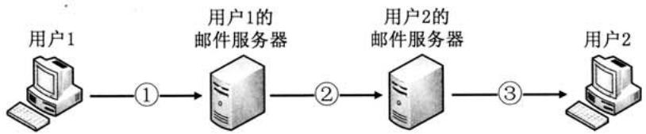

A.SMTP、SMTP、SMTP B.POP3、SMTP、POP3  
C.POP3、SMTP、SMTP D.SMTP、SMTP、POP3

# 二、综合应用题（第 $4 1 \sim 4 7$ 题，共70分）

41．设有6个有序表A、B、C、D、E、F，分别含有10、35、40、50、60和200个数据元素，各表中元素按升序排列。要求通过5次两两合并，将6个表最终合并成1个升序表，并在最坏情况下比较的总次数达到最。请回答下列问题。

1）给出完整的合并过程，并求出最坏情况下较的总次数。

2）根据你的合并过程，描述 $N$ ( $N \geqslant 2$ ）个不等长升序表的合并策略，并说明理由。

42.假定采用带头结点的单链表保存单词，当两个单词有相同的后缀时，则可共享相同的

计算机专业基础综合考试真题思路分析后缀存储空间，例如，“loading”和“being”的存储映像如下图所。

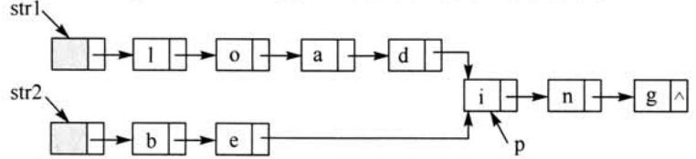

设strl和str2分别指向两个单词所在单链表的头结点，链表结点结构为datanext，请设计个时间上尽可能效的算法，找出由strl和str2所指向两个链表共同后缀的起始位置（如图中字符i所在结点的位置p)。要求：

1）给出算法的基本设计思想。

2）根据设计思想，采C或 ${ \mathrm { C } } { + + }$ 或Java语描述算法，关键之处给出注释。

3）说明你所设计算法的时间复杂度。

43.假定某计算机的CPU主频为 ${ 8 0 } \mathrm { M H z }$ ,CPI为4，平均每条指令访存1.5次，主存与Cache之间交换的块为16B，Cache的命中率为 $9 9 \%$ ，存储器总线宽度为32位。请回答下列问题。

1）该计算机的MIPS数是多少？平均每秒Cache缺失的次数是多少？在不考虑DMA传送的情况下，主存带宽至少达到多少才能满CPU的访存要求？

2）假定在Cache缺失的情况下访问主存时，存在 $0 . 0 0 0 5 \%$ 的缺页率，则CPU平均每秒产多少次缺页异常？若页为4KB，每次缺页都需要访问磁盘，访问磁盘时DMA传送采周期挪式，磁盘I/O接的数据缓冲寄存器为32位，则磁盘I/O接平均每秒发出的DMA请求次数至少是多少?

3）CPU和DMA控制器同时要求使存储器总线时，哪个优先级更？为什么？

4）为了提性能，主存采四体低位交叉存储模式，作时每1/4个存储周期启动个体。若每个体的存储周期为 $5 0 \mathrm { n s }$ ，则该主存能提供的最带宽是多少？

44.某16位计算机中，带符号整数补码表示，数据Cache和指令Cache分离。题44表给出了指令系统中部分指令格式，其中Rs和Rd表寄存器，mem表存储单元地址， $\mathbf { \tau } ( \mathbf { x } )$ 表示寄存器 $\mathbf { X }$ 或存储单元 $\mathbf { X }$ 的内容。

指令系统中部分指令格式  

<table><tr><td rowspan=1 colspan=1>名称</td><td rowspan=1 colspan=1>指令的汇编格式</td><td rowspan=1 colspan=1>指令功能</td></tr><tr><td rowspan=1 colspan=1>加法指令</td><td rowspan=1 colspan=1>ADD Rs, Rd</td><td rowspan=1 colspan=1>(Rs) + (Rd)-&gt;Rd</td></tr><tr><td rowspan=1 colspan=1>算术/逻辑左移</td><td rowspan=1 colspan=1>SHLRd</td><td rowspan=1 colspan=1>2*(Rd)-&gt;Rd</td></tr><tr><td rowspan=1 colspan=1>算术右移</td><td rowspan=1 colspan=1>SHRRd</td><td rowspan=1 colspan=1>(Rd)/2-&gt;Rd</td></tr><tr><td rowspan=1 colspan=1>取数指令</td><td rowspan=1 colspan=1>LOADRd, mem</td><td rowspan=1 colspan=1>(mem)-&gt;Rd</td></tr><tr><td rowspan=1 colspan=1>存数指令</td><td rowspan=1 colspan=1>STORE Rs, mem</td><td rowspan=1 colspan=1>(Rs)-&gt;mem</td></tr></table>

该计算机采用5段流水方式执行指令，各流水段分别是取指（IF）、译码/读寄存器（ID）、执/计算有效地址（EX）、访问存储器（M）和结果写回寄存器（WB），流水线采用“按序发射，按序完成”式，没有采转发技术处理数据相关，并且同个寄存器的读和写操作不能在同个时钟周期内进。请回答下列问题：

1）若int型变量 $\mathbf { x }$ 的值为-513，存放在寄存器R1中，则执指令“SHRR1”后，R1的内容是多少？（六进制表）

2）若某个时间段中，有连续的4条指令进流线，在其执过程中没有发任何阻塞，则执行这4条指令所需的时钟周期数为多少？

3）若级语程序中某赋值语句为 $\mathbf { x } = \mathbf { a } + \mathbf { b }$ ，x、a和b均为int型变量，它们的存储单元地址分别表示为[x]、[a]和[b]。该语句对应的指令序列及其在指令流线中的执过程如下图所示。

$\mathrm { I } _ { 1 }$ LOAD R1, [a]$\mathrm { I } _ { 2 }$ LOAD R2,[b]$\mathrm { I } _ { 3 }$ ADD R1,R2$\mathrm { I } _ { 4 }$ STORE R2,[x]

时间单元  

<table><tr><td rowspan=1 colspan=1>指令</td><td rowspan=1 colspan=1>1</td><td rowspan=1 colspan=1>2</td><td rowspan=1 colspan=1>3</td><td rowspan=1 colspan=1>4</td><td rowspan=1 colspan=1>5</td><td rowspan=1 colspan=1>6</td><td rowspan=1 colspan=1>7</td><td rowspan=1 colspan=1>8</td><td rowspan=1 colspan=1>9</td><td rowspan=1 colspan=1>10</td><td rowspan=1 colspan=1>11</td><td rowspan=1 colspan=1>12</td><td rowspan=1 colspan=1>13</td><td rowspan=1 colspan=1>14</td></tr><tr><td rowspan=1 colspan=1>I1</td><td rowspan=1 colspan=1>IF</td><td rowspan=1 colspan=1>ID</td><td rowspan=1 colspan=1>EX</td><td rowspan=1 colspan=1>M</td><td rowspan=1 colspan=1>WB</td><td rowspan=1 colspan=1></td><td rowspan=1 colspan=1></td><td rowspan=1 colspan=1></td><td rowspan=1 colspan=1></td><td rowspan=1 colspan=1></td><td rowspan=1 colspan=1></td><td rowspan=1 colspan=1></td><td rowspan=1 colspan=1></td><td rowspan=1 colspan=1></td></tr><tr><td rowspan=1 colspan=1>$12}$</td><td rowspan=1 colspan=1></td><td rowspan=1 colspan=1>IF</td><td rowspan=1 colspan=1>ID</td><td rowspan=1 colspan=1>EX</td><td rowspan=1 colspan=1>M</td><td rowspan=1 colspan=1>WB</td><td rowspan=1 colspan=1></td><td rowspan=1 colspan=1></td><td rowspan=1 colspan=1></td><td rowspan=1 colspan=1></td><td rowspan=1 colspan=1></td><td rowspan=1 colspan=1></td><td rowspan=1 colspan=1></td><td rowspan=1 colspan=1></td></tr><tr><td rowspan=1 colspan=1>13}$</td><td rowspan=1 colspan=1></td><td rowspan=1 colspan=1></td><td rowspan=1 colspan=1>IF</td><td rowspan=1 colspan=1></td><td rowspan=1 colspan=1></td><td rowspan=1 colspan=1></td><td rowspan=1 colspan=1>ID</td><td rowspan=1 colspan=1>EX</td><td rowspan=1 colspan=1>M</td><td rowspan=1 colspan=1>WB</td><td rowspan=1 colspan=1></td><td rowspan=1 colspan=1></td><td rowspan=1 colspan=1></td><td rowspan=1 colspan=1></td></tr><tr><td rowspan=1 colspan=1>14}</td><td rowspan=1 colspan=1></td><td rowspan=1 colspan=1></td><td rowspan=1 colspan=1></td><td rowspan=1 colspan=1></td><td rowspan=1 colspan=1></td><td rowspan=1 colspan=1></td><td rowspan=1 colspan=1>IF</td><td rowspan=1 colspan=1></td><td rowspan=1 colspan=1></td><td rowspan=1 colspan=1></td><td rowspan=1 colspan=1>ID</td><td rowspan=1 colspan=1>EX</td><td rowspan=1 colspan=1>M</td><td rowspan=1 colspan=1>WB</td></tr></table>

则这4条指令执行过程中， $\mathrm { I } _ { 3 }$ 的ID段和 $\mathrm { I } _ { 4 }$ 的IF段被阻塞的原因各是什么？

4）若高级语程序中某赋值语句为 $\mathbf { x } = \mathbf { x } ^ { * } 2 + \mathbf { a }$ , $\mathbf { x }$ 和a均为unsigned int类型变量，它们的存储单元地址分别表为[x]、[a]，则执这条语句至少需要多少个时钟周期？要求模仿题44图画出这条语句对应的指令序列及其在流水线中的执行过程示意图。

45.某请求分页系统的局部页面置换策略如下：系统从0时刻开始扫描，每隔5个时间单位扫描一轮驻留集（扫描时间忽略不计），本轮没有被访问过的页框将被系统回收，并放入到空闲页框链尾，其中内容在下一次分配之前不被清空。当发生缺页时，如果该页曾被使用过且还在空闲页链表中，那么重新放回进程的驻留集中；否则，从空闲页框链表头部取出一个页框。

假设不考虑其他进程的影响和系统开销。初始时进程驻留集为空。目前系统空闲页框链表中页框号依次为 $3 2 、 1 5 、 2 1 、 4 1$ 。进程P依次访问的 $<$ 虚拟页号，访问时刻 $\mid >$ 是 ${ < } 1$ , $1 >$ , $< 3 , 2 >$ , ${ < } 0$ ,$4 \mathrm { > } , < 0 , 6 \mathrm { > } , < 1 , 1 1 > , < 0 , 1 3 > , < 2 , 1 4 >$ 请回答下列问题。

1）访问 ${ < } 0 , 4 >$ 时，对应的页框号是什么？说明理由。

2）访问 ${ < } 1$ , $1 1 >$ 时，对应的页框号是什么？说明理由。

3）访问 $^ { < 2 }$ , $1 4 >$ 时，对应的页框号是什么？说明理由。

4）该策略是否适合于时间局部性好的程序？说明理由。

46.某文件系统空间的最大容量为4TB（ $1 \mathrm { T B } = 2 ^ { 4 0 } \mathrm { B } \dot { } \quad$ )，以磁盘块为基本分配单位。磁盘块为1KB。件控制块（FCB）包含一个512B的索引表区。请回答下列问题。

1）假设索引表区仅采用直接索引结构，索引表区存放文件占用的磁盘块号，索引表项中块号最少占多少字节？可支持的单个件最大长度是多少字节?

2）假设索引表区采用如下结构：第 $0 \sim 7$ 字节采用 $<$ 起始块号，块数 $>$ 格式表示件创建时预分配的连续存储空间，其中起始块号占6B，块数占2B；剩余504字节采用直接索引结构，一个索引项占6B，那么可支持的单个件最长度是多少字节？为了使单个件的长度达到最大，请指出起始块号和块数分别所占字节数的合理值并说明理由。

47.主机H通过快速以太网连接Internet，IP地址为192.168.0.8，服务器S的IP地址为211.68.71.80。H与S使用TCP通信时，在H上捕获的其中5个IP分组如题47-a表所示。

计算机专业基础综合考试真题思路分析

题47-a表  

<table><tr><td>编号</td><td colspan="3">IP分组的前40字节内容（十六进制）</td></tr><tr><td>1</td><td>450000300 019b 40 00 0b d9 13 88 846b 41 c5</td><td>80061d e8 c0 a8 00 08 0000 0000 7002 43 80</td><td>d3 44 47 50 5d b0 00 00</td></tr><tr><td>2</td><td>43 00 00 30 00004000 13 88 0b d9 e0599f ef</td><td>3106 6e 83 d3 44 47 50</td><td>c0 a8 00 08 37 e1 00 00</td></tr><tr><td>3</td><td>45 00 0028 019c 40 00</td><td>84b 41 c6 7012 16 d0 80061d ef c0 a8 00 08</td><td>d3 44 47 50</td></tr><tr><td></td><td>0b d9 13 88 846b 41 c6 450000 38 019d4000</td><td>e0 59 9f f0 50 f0 43 80 80061d de c0 a8 00 08</td><td>2b 32 00 00 d34447 50</td></tr><tr><td>4</td><td>0b d91388 846b 41 c6</td><td>e059 9f f0 50184380</td><td>e6 55 00 00</td></tr><tr><td>5</td><td>4500002868114000 13 88 0b d9e0 59 9f f0</td><td>3106 06 7a d344 47 50 84 6b 41 d650 10 16 d0</td><td>c0 a8 00 08 57 d2 00 00</td></tr></table>

回答下列问题。

1）题47-a表中的IP分组中，哪个是由H发送的？哪个完成了TCP连接建过程?哪个在通过快速以太传输时进了填充？

2）根据题47-a表中的IP分组，分析S已经收到的应层数据字节数是多少？

3）若题47-a表中的某个IP分组在S发出时的前40字节如题47-b表所，则该IP分组到达H时经过了多少个路由器？

题47-b表  

<table><tr><td>来自S的分组</td><td>45 000028</td><td></td><td></td><td>6811 40 00 40 06 ec ad d3444750 ca76 0106</td></tr><tr><td></td><td>13 88 al 08</td><td>e0599f f0</td><td></td><td>846b41d6 5010 16d0b7 d600 00</td></tr></table>

注：IP分组头和TCP段头结构分别如题47-a图和题47-b图所示。

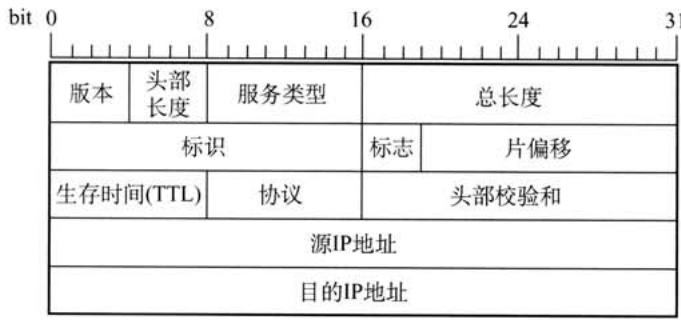  
题47-a图 IP分组头结构

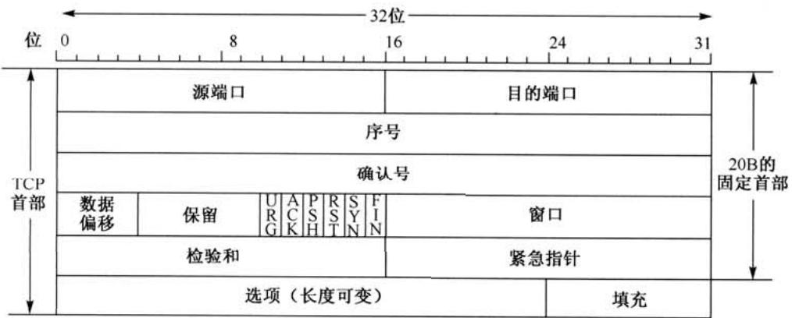  
题47-b图 TCP段头结构

# 2012年计算机学科专业基础综合试题参考答案

# 一、单项选择题

B 2. A 3. A 4. B 5. 6. C 7. 86. A   
10. A 11. D 12. D 13. B 14. D 15. D A   
17. 18. 19. C 20. D 21. D 22. B 23. 24. B   
25. B 26. A 27. D 28. A 29. B 30. 31. A 32. B   
33. B 34. 35. A 36. B 37. 38. A 39. D 40. D

1.解析：

本算法是个递归运算，即算法中出现了调身的情形。递归的边界条件是 $n { \leqslant } 1$ ，每调次fact)，传该层fact()的参数值减1。采递归式来表时间复杂度有

$$
T ( n ) = \left\{ \begin{array} { c c } { { O ( 1 ) } } & { { n \leq 1 } } \\ { { T ( n - 1 ) + 1 } } & { { n > 1 } } \end{array} \right.
$$

则 $T ( n ) = T ( n - 1 ) + 1 = T ( n - 2 ) + 2 = \cdots = T ( 1 ) + n ^ { - } 1 = O ( n )$ ，故时间复杂度为 $O ( n )$ 。

2.解析：

表达式求值是栈的典型应用。中缀表达式不仅依赖于运算符的优先级，而且要处理括号。后缀表达式的运算符在表达式的后面且没有括号，其形式已经包含了运算符的优先级。所以从中缀表达式转换到后缀表达式需要用运算符进行处理，使其包含运算符优先级的信息，从而转换为后缀表达式的形式。转换过程如下表：

<table><tr><td rowspan=1 colspan=1>运算符栈</td><td rowspan=1 colspan=1>中缀未处理部分</td><td rowspan=1 colspan=1>后缀生成部分</td><td rowspan=1 colspan=1>说明</td></tr><tr><td rowspan=1 colspan=1>#</td><td rowspan=1 colspan=1>a+b-a*(c+d)/e-f)+g</td><td rowspan=1 colspan=1></td><td rowspan=1 colspan=1></td></tr><tr><td rowspan=1 colspan=1>#</td><td rowspan=1 colspan=1>+b-a*(c+d)/e-f)+g</td><td rowspan=1 colspan=1>a</td><td rowspan=1 colspan=1></td></tr><tr><td rowspan=1 colspan=1>+</td><td rowspan=1 colspan=1>b-a*(c+d)/e-f)+g</td><td rowspan=1 colspan=1>a</td><td rowspan=1 colspan=1>“+”入栈</td></tr><tr><td rowspan=1 colspan=1>+</td><td rowspan=1 colspan=1>-a*(c+d)/e-f)+g</td><td rowspan=1 colspan=1>ab</td><td rowspan=1 colspan=1></td></tr><tr><td rowspan=1 colspan=1>-</td><td rowspan=1 colspan=1>a*(c+d)/e-f)+g</td><td rowspan=1 colspan=1>ab+</td><td rowspan=1 colspan=1>“+”出栈，“-”入栈</td></tr><tr><td rowspan=1 colspan=1>-</td><td rowspan=1 colspan=1>*(c+d)/e-f)+g</td><td rowspan=1 colspan=1>ab+a</td><td rowspan=1 colspan=1></td></tr><tr><td rowspan=1 colspan=1>-*</td><td rowspan=1 colspan=1>(c+d)/e-f)+g</td><td rowspan=1 colspan=1>ab+a</td><td rowspan=1 colspan=1>“*”入栈</td></tr><tr><td rowspan=1 colspan=1>-*(</td><td rowspan=1 colspan=1>c+d)/e-f)+g</td><td rowspan=1 colspan=1>ab+a</td><td rowspan=1 colspan=1>两个“(”依次入栈</td></tr><tr><td rowspan=1 colspan=1>−*(</td><td rowspan=1 colspan=1>+d)/e-f)+g</td><td rowspan=1 colspan=1>ab+ac</td><td rowspan=1 colspan=1></td></tr><tr><td rowspan=1 colspan=1>-*(+</td><td rowspan=1 colspan=1>d)/e-f)+g</td><td rowspan=1 colspan=1>ab+ac</td><td rowspan=1 colspan=1>“+”入栈</td></tr><tr><td rowspan=1 colspan=1>-*(+</td><td rowspan=1 colspan=1>$)/e-f)+g</td><td rowspan=1 colspan=1>ab+acd</td><td rowspan=1 colspan=1></td></tr><tr><td rowspan=1 colspan=1>-*(</td><td rowspan=1 colspan=1>/e-1)+g</td><td rowspan=1 colspan=1>ab+acd+</td><td rowspan=1 colspan=1>“+”和“(”依次出栈</td></tr><tr><td rowspan=1 colspan=1>-*(1</td><td rowspan=1 colspan=1>e-1)+g</td><td rowspan=1 colspan=1>ab+acd+</td><td rowspan=1 colspan=1>“”入栈</td></tr></table>

计算机专业基础综合考试真题思路分析可知，栈中的操作符的最大个数为5。

（续表）  

<table><tr><td rowspan=1 colspan=1>运算符栈</td><td rowspan=1 colspan=1>中缀未处理部分</td><td rowspan=1 colspan=1>后缀生成部分</td><td rowspan=1 colspan=1>说明</td></tr><tr><td rowspan=1 colspan=1>-*1</td><td rowspan=1 colspan=1>-f)+g</td><td rowspan=1 colspan=1>ab+acd+e</td><td rowspan=1 colspan=1></td></tr><tr><td rowspan=1 colspan=1>-*(-</td><td rowspan=1 colspan=1>$f)+g</td><td rowspan=1 colspan=1>ab+acd+e/</td><td rowspan=1 colspan=1>“”出栈，“-”入栈</td></tr><tr><td rowspan=1 colspan=1>-*(-</td><td rowspan=1 colspan=1>)+g</td><td rowspan=1 colspan=1>ab+acd+e/f</td><td rowspan=1 colspan=1></td></tr><tr><td rowspan=1 colspan=1>-*</td><td rowspan=1 colspan=1>+g</td><td rowspan=1 colspan=1>ab+acd+e/f-</td><td rowspan=1 colspan=1>“”和“(”依次出栈</td></tr><tr><td rowspan=1 colspan=1>-</td><td rowspan=1 colspan=1>+g</td><td rowspan=1 colspan=1>ab+acd+e/f-*</td><td rowspan=1 colspan=1>“*”出栈</td></tr><tr><td rowspan=1 colspan=1>#</td><td rowspan=1 colspan=1>+g</td><td rowspan=1 colspan=1>ab+acd+e/f-*-</td><td rowspan=1 colspan=1>“-”出栈</td></tr><tr><td rowspan=1 colspan=1>+</td><td rowspan=1 colspan=1>g</td><td rowspan=1 colspan=1>ab+acd+e/f-*-</td><td rowspan=1 colspan=1>“+”入栈</td></tr><tr><td rowspan=1 colspan=1>#</td><td rowspan=1 colspan=1></td><td rowspan=1 colspan=1>ab+acd+e/f-*-g</td><td rowspan=1 colspan=1>“+”出栈</td></tr></table>

3.解析：

前序序列和后序序列不能唯确定棵叉树，但可以确定叉树中结点的祖先关系：当两个结点的前序序列为XY与后序序列为YX时，则X为Y的祖先。考虑前序序列a,e,b,d,c、后序序列b,c,d,e,a，可知a为根结点，e为a的孩子结点。此外，a的孩子结点的前序序列e,b,d,c、后序序列b,c,d,e，可知e是bcd的祖先，故根结点的孩结点只有e。故选A。

【排除法】显然a为根结点，且确定e为a的孩结点，排除D。各种遍历算法中左右树的遍历次序是固定的，若b也为a的孩结点，则在前序序列和后序序列中e、b的相对次序应是不变的，故排除B，同理排除C。

【特殊法】前序序列和后序序列对应着多棵不同的叉树树形，我们只需画出满该条件的任一棵二叉树即可，任意一棵二叉树必定满足正确选项的要求。

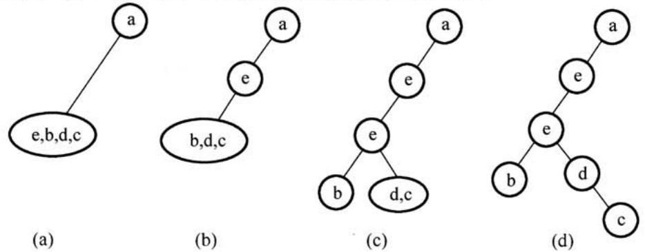

显然选A，最终得到的叉树满题设中前序序列和后序序列的要求。

4.解析：

所有叶结点的平衡因均为1，即平衡叉树满平衡的最少结点情况，如下图所。对于高度为 $N$ 、左右子树的高度分别为 $N { - } 1$ 和 $N { - } 2$ 、所有叶结点的平衡因均为1的平衡叉树，总结点数的公式为： $C _ { N } = C _ { N - 1 } + C _ { N - 2 } + 1$ , $C _ { 1 } = 1$ , $C _ { 2 } = 2$ , $C _ { 3 } = 2 + 1 + 1 = 4$ ，可推出 $C _ { 6 } = 2 0$ 。

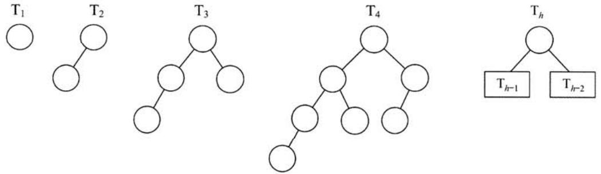

【画图法】先画出 $\mathrm { T } _ { 1 }$ 和 $\mathrm { T } _ { 2 }$ ；然后新建个根结点，连接 $\mathrm { T } _ { 2 }$ 、 $\mathrm { T } _ { 1 }$ 构成 $\mathrm { T } _ { 3 }$ ；新建一个根结点，连接 $\mathrm { T } _ { 3 }$ 、 $\mathrm { T } _ { 2 }$ 构成 $\mathrm { T } _ { 4 }$ ；以此类推，直到画出 $\mathrm { T } _ { 6 }$ ，可知 $\mathrm { T } _ { 6 }$ 的结点数为20。

【排除法】对于选项A，高度为6、结点数为10的树怎么也无法达到平衡。对于选项C，结点较多时，考虑较极端情形，即第6层只有最左叶的完全叉树刚好有32个结点，虽然满平衡的条件，但显然再删去部分结点，依然不影响平衡，不是最少结点的情况。同理D错误。只可能选B。

# 5.解析：

广度优先遍历需要借助队列实现。邻接表的结构包括：顶点表；边表（有向图为出边表）。当采用邻接表存储方式时，在对图进行广度优先遍历时每个顶点均需入队一次（顶点表遍历），故时间复杂度为 $O ( n )$ ，在搜索所有顶点的邻接点的过程中，每条边至少访问一次（出边表遍历），故时间复杂度为 $O ( e )$ ，算法总的时间复杂度为 $O ( n + e )$

# 6.解析：

对角线以下元素均为零，表明只有顶点 $i$ 到顶点 $j ~ ( i < j )$ 可能有边，而顶点 $j$ 到顶点 $i$ 一定没有边，即有向图是一个无环图，因此一定存在拓扑序列。对于拓扑序列是否唯一，试举一例：设有向图的邻接矩阵 $\left[ { \begin{array} { l l l } { 0 } & { 1 } & { 1 } \\ { 0 } & { 0 } & { 0 } \\ { 0 } & { 0 } & { 0 } \end{array} } \right]$ ，则存在两个拓扑序列，因此该图存在可能不唯的拓扑序列。

结论：对于任一有向图，如果它的邻接矩阵中对角线以下（或以上）的元素均为零，则存在拓扑序列（可能不唯一）。反正，若图存在拓扑序列，却不一定能满足邻接矩阵中主对角线以下的元素均为零，但是可以通过适当地调整结点编号，使其邻接矩阵满足前述性质。

7.解析：

从a到各顶点的最短路径的求解过程：

<table><tr><td rowspan=1 colspan=1>顶点</td><td rowspan=1 colspan=1>第1趟</td><td rowspan=1 colspan=1>第2趟</td><td rowspan=1 colspan=1>第3趟</td><td rowspan=1 colspan=1>第4趟</td><td rowspan=1 colspan=1>第5趟</td></tr><tr><td rowspan=1 colspan=1>b</td><td rowspan=1 colspan=1>(a,b) 2</td><td rowspan=1 colspan=1></td><td rowspan=1 colspan=1></td><td rowspan=1 colspan=1></td><td rowspan=1 colspan=1></td></tr><tr><td rowspan=1 colspan=1>c</td><td rowspan=1 colspan=1>(a,c) 5</td><td rowspan=1 colspan=1>(a, b,c)3</td><td rowspan=1 colspan=1></td><td rowspan=1 colspan=1></td><td rowspan=1 colspan=1></td></tr><tr><td rowspan=1 colspan=1>d</td><td rowspan=1 colspan=1>∞</td><td rowspan=1 colspan=1>(a, b, d) 5</td><td rowspan=1 colspan=1>(a, b,d) 5</td><td rowspan=1 colspan=1>(a, b,d) 5</td><td rowspan=1 colspan=1></td></tr><tr><td rowspan=1 colspan=1>e</td><td rowspan=1 colspan=1>∞</td><td rowspan=1 colspan=1>∞</td><td rowspan=1 colspan=1>(a, b, c, f) 4</td><td rowspan=1 colspan=1></td><td rowspan=1 colspan=1></td></tr><tr><td rowspan=1 colspan=1>f</td><td rowspan=1 colspan=1>∞</td><td rowspan=1 colspan=1>∞</td><td rowspan=1 colspan=1>(a, b, c, e) 7</td><td rowspan=1 colspan=1>(a, b, c, e) 7</td><td rowspan=1 colspan=1>(a, b, d, e) 6</td></tr><tr><td rowspan=1 colspan=1>集合S</td><td rowspan=1 colspan=1>{a, b}</td><td rowspan=1 colspan=1>{a, b,c}</td><td rowspan=1 colspan=1>{a, b, c, f}</td><td rowspan=1 colspan=1>{a, b, c, f, d}</td><td rowspan=1 colspan=1>{a, b, c, f, d, e}</td></tr></table>

后续目标顶点依次为f,d,e。

【排除法】对于A，若下一个顶点为d，路径a,b,d的长度5，而a,b,c,f的长度仅为4，显然错误。同理可以排除B。将f加入集合S后，采用上述的方法也可以排除D。

# 8.解析：

对于Ⅰ，最小生成树的树形可能不唯一（这是因为可能存在权值相同的边），但是代价一定是唯一的，Ⅰ正确。对于Ⅱ，如果权值最小的边有多条并且构成环状，则总有权值最小的边将不出现在某棵最成树中，Ⅱ错误。对于Ⅲ，设 $N$ 个结点构成环， $N - 1$ 条边权值相等，则从不同的顶点开始普里姆算法会得到 $N - 1$ 中不同的最成树，III错误。对于IV，当最成树唯一时（各边的权值不同）， $\mathrm { P r i m }$ 算法和Kruskal算法得到的最成树相同，IV错误。

# 9.解析：

对于上图所的3阶B-树，被删关键字78所在结点在删除前的关键字个数 $= 1 = \left\lceil 3 / 2 \right\rceil - 1$ ,

计算机专业基础综合考试真题思路分析

且其左兄弟结点的关键字个数 $= 2 \geq \lceil 3 / 2 \rceil$ ，属于“兄弟够借”的情况，则需把该结点的左兄弟结点中最的关键字上移到双亲结点中，同时把双亲结点中于上移关键字的关键字下移到要删除关键字的结点中，这样就达到了新的平衡，如下图所。

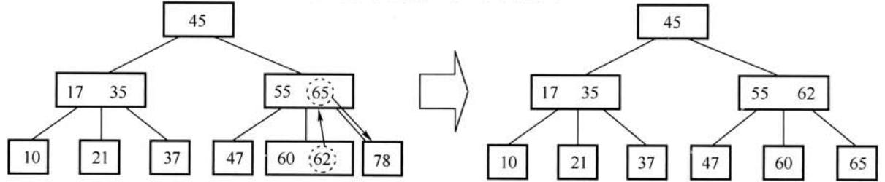

10．解析：

对于I，简单选择排序每次选择未排序列中的最元素放其最终位置。对于I，希尔排序每次是对划分的表进排序，得到局部有序的结果，所以不能保证每趟排序结束都能确定个元素的最终位置。对于IⅢ，快速排序每趟排序结束后都将枢轴元素放到最终位置。对于IV，堆排序属于选择排序，每次都将大根堆的根结点与表尾结点交换，确定其最终位置。对于V，路归并排序每趟对表进两两归并从得到若个局部有序的结果，但法确定最终位置。

11.解析：

折半插排序与直接插排序都是将待插元素插前的有序表，区别是：确定当前记录在前有序表中的位置时，直接插排序是采顺序查找法，折半插排序是采折半查找法。排序的总趟数取决于元素个数 $_ n$ ，两者都是 $n - 1$ 趟。元素的移动次数都取决于初试序列，两者相同。使辅助空间的数量也都是 $O ( 1 )$ 。折半插排序的较次数与序列初态关，为 $O ( n \mathrm { l o g } _ { 2 } n )$ ；直接插排序的较次数与序列初态有关，为 $O ( n ) { \sim } O ( n ^ { 2 } )$ 。

12.解析：

程序A的运时间为100s，除去CPU时间90s，剩余10s为 $_ { \mathrm { I / O } }$ 时间。CPU提速后运基准程序A所耗费的时间是 $T = 9 0 / 1 . 5 + 1 0 = 7 0 \mathrm { s }$ 。

【误区】CPU速度提 $5 0 \%$ ，则CPU时间减少半，误选A。

13.解析：

将个16位unsignedshort转换成32位形式的unsignedint，因为都是符号数，新表形式的位0填充。16位符号整数所能表的最值为65535，其六进制表为FFFFH，故 $\mathbf { x }$ 的六进制表为 $\because F F F H - 5 \mathrm { H } = \mathrm { F F F A H }$ ，所以y的六进制表为0000FFFAH。

【排除法】先直接排除C、D，然后分析余下选项的特征。由于A、B的值相差乎近1倍，可采算出 $0 0 0 1 0 0 0 0 \mathrm { { H } }$ （接近B且好算的数）的值，再推断出答案。

14.解析：

IEEE754单精度浮点数是尾数采取隐藏位策略的原码表，且阶码移码(偏置值为127)表示的浮点数。规格化的短浮点数的真值为： $( - 1 ) ^ { S } \times 1 . m \times 2 ^ { E - 1 2 7 }$ , $s$ 为符号位，阶码 $E$ 的取值为 $1 \sim$ 254（8位表示），尾数 $m$ 为23位，共32位；故float类型能表示的最整数是 $1 . 1 1 1 . . . 1 \times 2 ^ { 2 5 4 - 1 2 7 } =$ $2 ^ { 1 2 7 } \times ( 2 - 2 ^ { - 2 3 } ) = 2 ^ { 1 2 8 } - 2 ^ { 1 0 4 }$ ，故选 $\mathrm { D }$ 。

【另解】IEEE754单精度浮点数的格式如下图所。

<table><tr><td>数符（1）</td><td>阶码（8）</td><td>尾数（23）</td></tr></table>

当表最正整数时：数符取0；阶码取最值为127；尾数部分隐含了整数部分的“1”，23位尾数全取1时尾数最，为 $2 - 2 ^ { - 2 3 }$ ，此时浮点数的为 $( 2 - 2 ^ { - 2 3 } ) \times 2 ^ { 1 2 7 } = 2 ^ { 1 2 8 } - 2 ^ { 1 0 4 }$ 。

15.解析：

尽管record大小为7个字节（成员a有4个字节，成员b有1个字节，成员c有2个字节），由于数据按边界对齐方式存储（见考点笔记），故record共占用8个字节。record.a的十六进制表示为 $0 \times 0 0 0 0 0 1 1 1$ ，由于采端式存放数据，故地址 $0 \mathrm { x C } 0 0 8$ 中内容应为低字节0x11;record.b只占1个字节，后的个字节留空；record.c占2个字节，故其地址为 $0 \mathrm { x C 0 0 E }$ 。各字节的存储分配如下图所示。

<table><tr><td rowspan=1 colspan=1>地址</td><td rowspan=1 colspan=1>0xC008</td><td rowspan=1 colspan=1>0xC009</td><td rowspan=1 colspan=1>0xC00A</td><td rowspan=1 colspan=1>0xC00B</td></tr><tr><td rowspan=1 colspan=1>内容</td><td rowspan=1 colspan=1>record.a (0x11)</td><td rowspan=1 colspan=1>record.a (0x01)</td><td rowspan=1 colspan=1>record.a (0x00)</td><td rowspan=1 colspan=1>record.a (0x00)</td></tr><tr><td rowspan=1 colspan=1>地址</td><td rowspan=1 colspan=1>0xC00C</td><td rowspan=1 colspan=1>0xC0JD</td><td rowspan=1 colspan=1>0xC00E</td><td rowspan=1 colspan=1>0xC00F</td></tr><tr><td rowspan=1 colspan=1>内容</td><td rowspan=1 colspan=1>record.b</td><td rowspan=1 colspan=1>-</td><td rowspan=1 colspan=1>record.c</td><td rowspan=1 colspan=1>record.c</td></tr></table>

16.解析：

闪存是EEPROM的进一步发展，可读可写，用MOS管的浮栅上有无电荷来存储信息。闪存依然是ROM的一种，写入时必须先擦除原有数据，故写的速度比读的速度要慢不少（硬件常识)。闪存是一种易失性存储器，它采用随机访问式。现在常见的SSD固态硬盘，即由Flash芯组成。

# 17.解析：

地址映射采用2路组相联，则主存地址为 $0 { \sim } 1$ 、 $4 { \sim } 5$ 、 ${ 8 \sim 9 }$ 可映射到第0组Cache中，主存地址为 $2 \sim 3 . 6 \sim 7$ 可映射到第1组Cache中。Cache置换过程如下表所示。

<table><tr><td rowspan=1 colspan=2>走向</td><td rowspan=1 colspan=1>0</td><td rowspan=1 colspan=1>4</td><td rowspan=1 colspan=1>8</td><td rowspan=1 colspan=1>2</td><td rowspan=1 colspan=1>0</td><td rowspan=1 colspan=1>6</td><td rowspan=1 colspan=1>8</td><td rowspan=1 colspan=1>6</td><td rowspan=1 colspan=1>4</td><td rowspan=1 colspan=1>8</td></tr><tr><td rowspan=2 colspan=1>第0组</td><td rowspan=1 colspan=1>块0</td><td rowspan=1 colspan=1></td><td rowspan=1 colspan=1>0</td><td rowspan=1 colspan=1>4</td><td rowspan=1 colspan=1>4</td><td rowspan=1 colspan=1>8</td><td rowspan=1 colspan=1>8</td><td rowspan=1 colspan=1>0</td><td rowspan=1 colspan=1>0</td><td rowspan=1 colspan=1>8</td><td rowspan=1 colspan=1>4</td></tr><tr><td rowspan=1 colspan=1>块1</td><td rowspan=1 colspan=1>0</td><td rowspan=1 colspan=1>4</td><td rowspan=1 colspan=1>8</td><td rowspan=1 colspan=1>8</td><td rowspan=1 colspan=1>0</td><td rowspan=1 colspan=1>0</td><td rowspan=1 colspan=1>8</td><td rowspan=1 colspan=1>8</td><td rowspan=1 colspan=1>4</td><td rowspan=1 colspan=1>8</td></tr><tr><td rowspan=2 colspan=1>第1组</td><td rowspan=1 colspan=1>块2</td><td rowspan=1 colspan=1></td><td rowspan=1 colspan=1></td><td rowspan=1 colspan=1></td><td rowspan=1 colspan=1></td><td rowspan=1 colspan=1></td><td rowspan=1 colspan=1>2</td><td rowspan=1 colspan=1>2</td><td rowspan=1 colspan=1>2</td><td rowspan=1 colspan=1>2</td><td rowspan=1 colspan=1>2</td></tr><tr><td rowspan=1 colspan=1>块3</td><td rowspan=1 colspan=1></td><td rowspan=1 colspan=1></td><td rowspan=1 colspan=1></td><td rowspan=1 colspan=1>2</td><td rowspan=1 colspan=1>2</td><td rowspan=1 colspan=1>6</td><td rowspan=1 colspan=1>6</td><td rowspan=1 colspan=1>6*</td><td rowspan=1 colspan=1>6</td><td rowspan=1 colspan=1>6</td></tr></table>

注：“_”表示当前访问块，“\*”表示本次访问命中。

注意：在不同的《计算机组成原理》教材中，关于组相联映射的介绍并不相同。通常采用唐朔飞教材中的方式，但本题中采用的是蒋本珊教材中的方式。可以推断两次命题的老师应该不是同一位老师，这也给考生答题带来了困扰。

# 18.解析：

字段直接编码法将微命令字段分成若干个小字段，互斥性微命令组合在同一字段中，相容性微命令分在不同字段中，每个字段还要留出一个状态，表示本字段不发出任何微命令。5个互斥类，分别包含7、3、12、5和6个微命令，需要3、2、4、3和3位，共15位。

# 19.解析：

总线频率为 $1 0 0 \mathrm { M H z }$ ，则时钟周期为10ns。总线位宽与存储字长都是32位，故每一个时钟周期可传送一个32位存储字。猝发式发送可以连续传送地址连续的数据，故总的传送时间为：传送地址 $1 0 \mathrm { n s }$ ，传送128位数据 $4 0 \mathrm { n s }$ ，共需 $5 0 \mathrm { n s }$

# 20.解析：

USB（通用串行总线）的特点有： $\textcircled{1}$ 即插即用； $\textcircled{2}$ 热插拔； $\textcircled{3}$ 有很强的连接能力，采用菊花链形式将众多外设连接起来； $\textcircled{4}$ 有很好的可扩充性，个USB控制器可扩充达127个外部USB设备； $\textcircled{5}$ 速传输，速度可达480Mbps。所以A、B、C选项都符合USB总线的特点。对于D，USB是串总线，不能同时传输2位数据。

计算机专业基础综合考试真题思路分析

21.解析：

I/O接与CPU之间的IVO总线有数据线、控制线和地址线。控制线和地址线都是单向传输的，从CPU传送给I/O接，I/O接口中的命令字、状态字以及中断类型号均是由I/O接发往CPU的，故只能通过I/O总线的数据线传输。

# 22.解析：

在响应外部中断的过程中，中断隐指令完成的操作包括： $\textcircled{1}$ 关中断； $\textcircled{2}$ 保护断点； $\textcircled{3}$ 引出中断服务程序（形成中断服务程序地址并送PC），所以只有I、III正确。II中的保存通寄存器的内容是在进入中断服务程序后首先进行的操作。

# 23.解析：

本题关键是对“在户态发”（与上题的“执”区分）的理解。对于A，系统调是操作系统提供给户程序的接，系统调发在户态，被调程序在核态下执。对于B，外部中断是户态到核态的“门”，也发在户态，在核态完成中断过程。对于C，进程切换属于系统调执过程中的事件，只能发在核态。对于D，缺页产后，在户态发生缺页中断，然后进入核心态执缺页中断服务程序。

# 24.解析：

程序调只需保存程序断点，即该指令的下条指令的地址；中断调子程序不仅要保护断点（PC的内容），且要保护程序状态字寄存器的内容PSW。在中断处理中，最重要的两个寄存器是PC和PSWR。

# 25.解析：

在程序装入时，可以只将程序的部分装入内存，而将其余部分留在外存，就可以启动程序执。采连续分配式时，会使相当部分内存空间都处于暂时或“永久”的空闲状态，造成内存资源的严重浪费，也法从逻辑上扩内存容量，因此虚拟内存的实现只能建在离散分配的内存管理的基础上。有以下三种实现式： $\textcircled{1}$ 请求分页存储管理； $\textcircled{2}$ 请求分段存储管理； $\textcircled{3}$ 请求段页式存储管理。虚拟存储器容量既不受外存容量限制，也不受内存容量限制，是由CPU的寻址范围决定的。

# 26.解析：

设备管理软件般分为四个层次：户层、与设备关的系统调处理层、设备驱动程序以及中断处理程序。

# 27.解析：

先求得各进程的需求矩阵Need与可利资源矢量Available:

<table><tr><td rowspan=2 colspan=1>进程</td><td rowspan=1 colspan=3>Need</td></tr><tr><td rowspan=1 colspan=1>R1}</td><td rowspan=1 colspan=1>$R 2r}$</td><td rowspan=1 colspan=1>R3}$</td></tr><tr><td rowspan=1 colspan=1>P $</td><td rowspan=1 colspan=1>2</td><td rowspan=1 colspan=1>3</td><td rowspan=1 colspan=1>7</td></tr><tr><td rowspan=1 colspan=1>P_1}$</td><td rowspan=1 colspan=1>1</td><td rowspan=1 colspan=1>3</td><td rowspan=1 colspan=1>3</td></tr><tr><td rowspan=1 colspan=1>$P_2}$</td><td rowspan=1 colspan=1>0</td><td rowspan=1 colspan=1>0</td><td rowspan=1 colspan=1>6</td></tr><tr><td rowspan=1 colspan=1>P 3}$</td><td rowspan=1 colspan=1>2</td><td rowspan=1 colspan=1>2</td><td rowspan=1 colspan=1>1</td></tr><tr><td rowspan=1 colspan=1>P4}</td><td rowspan=1 colspan=1>1</td><td rowspan=1 colspan=1>1</td><td rowspan=1 colspan=1>0</td></tr></table>

<table><tr><td rowspan=2 colspan=1>Available</td><td rowspan=1 colspan=1>R1}</td><td rowspan=1 colspan=1>$R2}$</td><td rowspan=1 colspan=1>R3</td></tr><tr><td rowspan=1 colspan=1>2</td><td rowspan=1 colspan=1>3</td><td rowspan=1 colspan=1>3</td></tr></table>

较Need和Available可以发现，初始时进程 $\mathrm { { \cal P } } _ { 1 }$ 与 ${ \bf P } _ { 3 }$ 可满需求，排除A、C。尝试给 $\mathrm { { \bf P } } _ { 1 }$ 分配资源，则 $\mathrm { P } _ { 1 }$ 完成后Available将变为(6,3,6)，无法满 ${ \bf P } _ { 0 }$ 的需求，排除B。尝试给 ${ \sf P } _ { 3 }$ 分配资源，则 ${ \sf P } _ { 3 }$ 完成后Available将变为(4，3，7)，该向量能满其他所有进程的需求。所以，以 ${ \bf P } _ { 3 }$

开头的所有序列都是安全序列。

28.解析：

对于I，当所读文件的数据不在内存时，产生中断（缺页中断），原进程进入阻塞状态，直到所需数据从外存调入内存后，才将该进程唤醒。对于I，read系统调通过陷入将CPU从户态切换到核态，从获取操作系统提供的服务。对于IⅢ，要读个件先要open系统调打开该件。open中的参数包含件的路径名与件名，read只需要使open返回的文件描述符，并不使用文件名作为参数。read要求用户提供三个输入参数： $\textcircled{1}$ 文件描述符fd;$\textcircled{2}$ buf缓冲区首址； $\textcircled{3}$ 传送的字节数 $_ n$ 。read的功能是试图从fd所指示的件中读入 $n$ 个字节的数据，并将它们送至由指针buf所指示的缓冲区中。

29.解析：

由于 ${ \sf P } _ { 2 }$ 比 $\mathrm { P } _ { 1 }$ 晚5ms到达， $\mathrm { P } _ { 1 }$ 先占CPU，作业运的特图如下所。

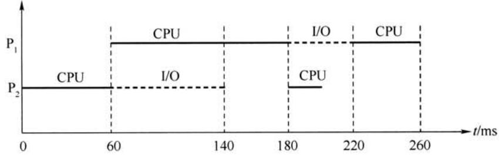

30.解析：

选项A、B、D显然是可以进行处理机调度的情况。对于C，当进程处于临界区时，说明进程正在占用处理机，只要不破坏临界资源的使用规则，是不会影响处理机调度的。比如，通常访问的临界资源可能是慢速的外设（如打印机），如果在进程访问打印机时，不能进行处理机调度，那么系统的性能将是非常差的。

# 31.解析：

在引入线程后，进程依然还是资源分配的基本单位，线程是调度的基本单位，同一进程中的各个线程共享进程的地址空间。在用户级线程中，有关线程管理的所有工作都由应用程序完成，无须内核的预，内核意识不到线程的存在。

32.解析：

对于A，重排I/O请求次序也就是进行I/O调度，从而使进程之间公平地共享磁盘访问，减少I/O完成所需要的平均等待时间。对于C，缓冲区结合预读和滞后写技术对于具有重复性及阵发性的I/O进程改善磁盘IVO性能很有帮助。对于D，优化文件物理块的分布可以减少寻找时间与延迟时间，从而提磁盘性能。在一个磁盘上设置多个分区与改善设备IO性能并无多联系，相反还会带来处理的复杂和降低利率。

# 33.解析：

ICMP报文作为数据字段封装在IP分组中，因此，IP协议直接为ICMP提供服务。UDP和TCP都是传输层协议，为应用层提供服务。PPP协议是链路层协议，为网络层提供服务。

# 34.解析：

此题为概念题，过程特性定义各条物理线路的作过程和时序关系。

35.解析：

考虑到局域网信道质量好，以太网采取了两项重要的措施以使通信更简便： $\textcircled{1}$ 采用无连接的工作方式； $\textcircled{2}$ 不对发送的数据帧进编号，也不要求对发回确认。因此，以太提供的服务是不可靠的服务，即尽最努的交付。差错的纠正由层完成。

计算机专业基础综合考试真题思路分析

36.解析：

本题即求从发送个帧到接收到这个帧的确认为的时间内最多可以发送多少数据帧。要尽可能多发帧，应以短的数据帧计算，先计算出发送帧的时间： $1 2 8 \times 8 / ( 1 6 \times 1 0 ^ { 3 } ) = 6 4 \mathrm { m s }$ ；发送一帧到收到确认为的总时间： $6 4 + 2 7 0 { \times } 2 + 6 4 = 6 6 8 \mathrm { m s }$ ；这段时间总共可以发送 $6 6 8 / 6 4 =$ 10.4（帧），发送这么多帧至少需要4位特进编号。

# 37.解析：

Ⅰ和IV显然是IP路由器的功能。对于I，当路由器监测到拥塞时，可合理丢弃IP分组，并向发出该IP分组的源主机发送个源点抑制的ICMP报。对于I，路由器对收到的IP分组部进差错检验，丢弃有差错部的报，但不保证IP分组不丢失。

# 38.解析：

在实际络的数据链路层上传送数据时，最终必须使硬件地址，ARP协议是将络层的IP地址解析为数据链路层的MAC地址。

# 39.解析：

掩码的第3个字节为11111100，可知前22位为号、后10位为主机号。IP地址的第3个字节为01001101（下画线为号的部分），将主机号（即后10位）全置为1，可以得到广播地址为180.80.79.255。

# 40．解析：

SMTP采“推”的通信式，在户代理向邮件服务器及邮件服务器之间发送邮件时，SMTP客户主动将邮件“推”送到SMTP服务器。POP3采“拉”的通信式，当户读取邮件时，用户代理向邮件服务器发出请求，“拉”取用户邮箱中的邮件。

# 二、综合应用题

# 41.解答：

本题同时对多个知识点进了综合考查。对有序表进两两合并考查了归并排序中的merge()函数；对合并过程的设计考查了哈夫曼树和最佳归并树。外部排序属于纲新增考点。

1）对于长度分别为 $m$ , $n$ 的两个有序表的合并，最坏情况下是直较到两个表尾元素，较次数为 $m + n - 1$ 次。故最坏情况的较次数依赖于表长，为了缩短总的较次数，根据哈夫曼树（最佳归并树）思想的启发，可采如图所的合并顺序。

根据上图中的哈夫曼树，6个序列的合并过程为：

第1次合并：表A与表B合并，成含有45个元素的表AB;

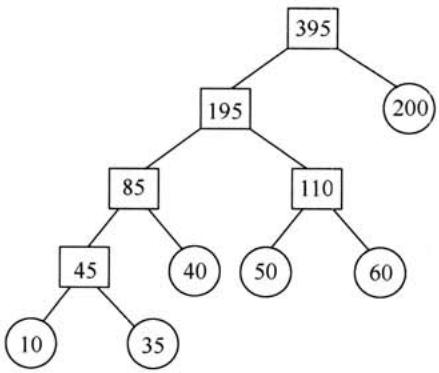

第2次合并：表AB与表C合并，成含有85个元素的表ABC；

第3次合并：表D与表E合并，成含有110个元素的表DE；

第4次合并：表ABC与表DE合并，成含有195个元素的表ABCDE；

第5次合并：表ABCDE与表F合并，成含有395个元素的最终表。

由上述分析可知，最坏情况下的比较次数为：第1次合并，最多较次数=10+35-1=44第2次合并，最多较次数 $= 4 5 + 4 0 - 1 = 8 4$ ；第3次合并，最多较次数 $= 5 0 + 6 0 - 1 = 1 0 9$ ;第4次合并，最多比较次数=85+110-1=194；第5次合并，最多较次数=195+200-1=394故比较的总次数最多为： $4 4 + 8 4 + 1 0 9 + 1 9 4 + 3 9 4 = 8 2 5$ d

2）各表的合并策略是：在对多个有序表进两两合并时，若表长不同；则最坏情况下总的较次数依赖于表的合并次序。可以借哈夫曼树的构造思想，依次选择最短的两个表进合并，可以获得最坏情况下最佳的合并效率。

【1）2）评分说明】 $\textcircled{1}$ 对于类似哈夫曼树（或最佳归并树）思想进合并，过程描述正确，给5分。按其他策略进合并，过程描述正确，给3分。

$\textcircled{2}$ 正确算出与合并过程致的总较次数，给2分。若计算过程正确，但结果错误，可给1分。

$\textcircled{3}$ 考只要说明采的是类似哈夫曼树（或最佳归并树）的构造法作为合并策略，即可给3分。如果采其他策略，只要能够完成合并，给2分。

42.解答：

顺序遍历两个链表到尾结点时，并不能保证两个链表同时到达尾结点。这是因为两个链表的长度不同。假设个链表比另个链表长 $k$ 个结点，我们先在长链表上遍历 $k$ 个结点，之后同步遍历两个链表，这样就能够保证它们同时到达最后个结点。由于两个链表从第个公共结点到链表的尾结点都是重合的，所以它们肯定同时到达第一个公共结点。

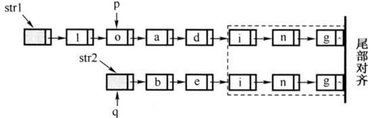

算法的基本设计思想：

$\textcircled{1}$ 分别求出strl和str2所指的两个链表的长度 $m$ 和 $n$ 。

$\textcircled{2}$ 将两个链表以表尾对齐：令指针p、q分别指向strl和str2的头结点，若 $m \geqslant n$ ，则使p指向链表中的第 $m - n + 1$ 个结点；若 $m < n$ ，则使q指向链表中的第 $n ^ { - } m + 1$ 个结点，即使指针p和q所指的结点到表尾的长度相等。

$\textcircled{3}$ 反复将指针p和q同步向后移动，并判断它们是否指向同结点。若p和 $\mathsf { q }$ 指向同一结点，则该点即为所求的共同后缀的起始位置。

2）算法的C语言代码描述：

LinkNode \*Find_1st_Common(LinkList str1,LinkList str2){int len1 $=$ Length(str1),len2 $=$ Length(str2);LinkNode $^ { \star } \mathrm { p } , ^ { \star } \mathrm { q } i$ for $p =$ str1;len1>len2;len1--) //使p指向的链表与q指向的链表等长$\scriptstyle \mathbf { p } = \mathbf { p } \cdot$ >next;for $q =$ str2;len1<len2;len2--) //使q指向的链表与p指向的链表等长q=q->next;while(p->next! $\ c =$ NULL&&p->next! $=$ q->next) { //查找共同后缀起始点p=p->next; //两个指针同步向后移动q=q->next;}return p->next; //返回共同后缀的起始点  
}

【1)、2）的评分说明】 $\textcircled{1}$ 若考所给算法实现正确，且时间复杂度为 $O ( m + n )$ ，可给12分；若算法正确，但时间复杂度超过 $O ( m + n )$ ，则最可给9分。

$\textcircled{2}$ 若在算法的基本设计思想描述中因字表达没有常清晰反映出算法思路，但在算法

计算机专业基础综合考试真题思路分析实现中能够清晰看出算法思想且正确的，可参照 $\textcircled{1}$ 的标准给分。

$\textcircled{3}$ 若算法的基本设计思想描述或算法实现中部分正确，可参照 $\textcircled{1}$ 中各种情况的相应给分标准酌情给分。

3）时间复杂度为 $O ( \mathrm { l e n } 1 + \mathrm { l e n } 2 )$ 或O(max(len1,len2))，其中len1、len2分别为两个链表的长度。

【3）的评分说明】 若考所估计的时间复杂度与考所实现的算法致，可给1分。

43.解答：

本题综合涉及多个考点：计算机的性能指标、存储器的性能指标、DMA的性能分析，DMA式的特点，多体交叉存储器的性能分析。

1）平均每秒CPU执的指令数为： $8 0 \mathbf { M } / 4 = 2 0 \mathbf { M }$ ，故MIPS数为20；（1分）

平均每条指令访存1.5次，故平均每秒Cache缺失的次数 $= 2 0 \mathbf { M } { \times } 1 . 5 { \times } ( 1 { - } 9 9 \% ) = 3 0 0 \mathbf { k }$ ；（1分）

当Cache缺失时，CPU访问主存，主存与Cache之间以块为传送单位，此时，主存带宽为$1 6 \mathbf { B } { \times } 3 0 0 \mathbf { k } / \mathbf { s } = 4 . 8 \mathbf { M } \mathbf { B } / \mathbf { s }$ 。在不考虑DMA传送的情况下，主存带宽至少达到 $4 . 8  { \mathrm { M B / s } }$ 才能满足CPU的访存要求。（2分）

2)题中假定在Cache缺失的情况下访问主存，平均每秒产生缺页中断 $3 0 0 0 0 0 { \times } 0 . 0 0 0 5 \% = 1 . 5$ 次。因为存储器总线宽度为32位，所以每传送32位数据，磁盘控制器发出一次DMA请求，故平均每秒磁盘DMA请求的次数至少为 $1 . 5 { \times } 4 \mathrm { K B } / 4 \mathrm { B } = 1 . 5 \mathrm { K } = 1 5 3 6$ （2分）

3）CPU和DMA控制器同时要求使存储器总线时，DMA请求优先级更；（1分）

因为DMA请求得不到及时响应，IO传输数据可能会丢失。（1分)

4）四体交叉存储模式能提供的最带宽为 $4 { \times } 4 \mathrm { B } / 5 0 \mathrm { n s } = 3 2 0 \mathrm { M B } / \mathrm { s } ,$ 。（2分）

44.解答：

1) $\mathbf { x }$ 的机器码为[x]+=1111110111111111B，即指令执前 $( \mathsf { R } 1 ) =$ FDFFH，右移1位后位1111111011111111B，即指令执后 $\mathbf { ( R 1 ) = }$ FEFFH。（2分）

2）每个时钟周期只能有条指令进入流线，从第5个时钟周期开始，每个时钟周期都会有一条指令执行完毕，故至少需要 $4 + ( 5 - 1 ) = 8$ 个时钟周期。（2分）

3） $\mathrm { I } _ { 3 }$ 的ID段被阻塞的原因：因为 $\mathrm { I } _ { 3 }$ 与 $\mathrm { I } _ { 1 }$ 和 $\mathrm { I } _ { 2 }$ 都存在数据相关，需等到 $\mathrm { I } _ { 1 }$ 和 $\mathrm { I } _ { 2 }$ 将结果写回寄存器后， $\mathrm { I } _ { 3 }$ 才能读寄存器内容，所以 $\mathrm { I } _ { 3 }$ 的 $\mathrm { I D }$ 段被阻塞（1分）。 $\mathrm { I } _ { 4 }$ 的IF段被阻塞的原因：因为 $\mathrm { I } _ { 4 }$ 的前条指令 $\mathrm { I } _ { 3 }$ 在ID段被阻塞，所以 $\mathrm { I } _ { 4 }$ 的IF段被阻塞（1分）。

注意：要求“按序发射，按序完成”，故2）中下一条指令的IF必须和上一条指令的ID并行，以免因上一条指令发生冲突而导致下一条指令先执行完。

4）因 $2 ^ { * } \mathbf { x }$ 操作有左移和加法两种实现方法，故 $\mathbf { x } = \mathbf { x } ^ { * } 2 + \mathbf { a }$ 对应的指令序列为

11 LOAD R1,[x]  
12 Load R2,[a]  
13 shL r1 //或者 ADD R1,R1  
14 ADD R1,r2  
15 STORE R2,[x]

这5条指令在流线中执过程如下表所。  

<table><tr><td rowspan=1 colspan=1></td><td rowspan=1 colspan=17>时间单元</td></tr><tr><td rowspan=1 colspan=1>指令</td><td rowspan=1 colspan=1>1</td><td rowspan=1 colspan=1>2</td><td rowspan=1 colspan=1>3</td><td rowspan=1 colspan=1>4</td><td rowspan=1 colspan=1>5</td><td rowspan=1 colspan=1>6</td><td rowspan=1 colspan=1>7</td><td rowspan=1 colspan=1>8</td><td rowspan=1 colspan=1>9</td><td rowspan=1 colspan=1>10</td><td rowspan=1 colspan=1>11</td><td rowspan=1 colspan=1>12</td><td rowspan=1 colspan=1>13</td><td rowspan=1 colspan=1>14</td><td rowspan=1 colspan=1>15</td><td rowspan=1 colspan=1>16</td><td rowspan=1 colspan=1>17</td></tr><tr><td rowspan=1 colspan=1>I1}</td><td rowspan=1 colspan=1>IF</td><td rowspan=1 colspan=1>ID</td><td rowspan=1 colspan=1>EX</td><td rowspan=1 colspan=1>M</td><td rowspan=1 colspan=1>WB</td><td rowspan=1 colspan=1></td><td rowspan=1 colspan=1></td><td rowspan=1 colspan=1></td><td rowspan=1 colspan=1></td><td rowspan=1 colspan=1></td><td rowspan=1 colspan=1></td><td rowspan=1 colspan=1></td><td rowspan=1 colspan=1></td><td rowspan=1 colspan=1></td><td rowspan=1 colspan=1></td><td rowspan=1 colspan=1></td><td rowspan=1 colspan=1></td></tr><tr><td rowspan=1 colspan=1>$1_2}$</td><td rowspan=1 colspan=1></td><td rowspan=1 colspan=1>IF</td><td rowspan=1 colspan=1>ID</td><td rowspan=1 colspan=1>EX</td><td rowspan=1 colspan=1>M</td><td rowspan=1 colspan=1>WB</td><td rowspan=1 colspan=1></td><td rowspan=1 colspan=1></td><td rowspan=1 colspan=1></td><td rowspan=1 colspan=1></td><td rowspan=1 colspan=1></td><td rowspan=1 colspan=1></td><td rowspan=1 colspan=1></td><td rowspan=1 colspan=1></td><td rowspan=1 colspan=1></td><td rowspan=1 colspan=1></td><td rowspan=1 colspan=1></td></tr><tr><td rowspan=1 colspan=1>13</td><td rowspan=1 colspan=1></td><td rowspan=1 colspan=1></td><td rowspan=1 colspan=1>IF</td><td rowspan=1 colspan=1></td><td rowspan=1 colspan=1></td><td rowspan=1 colspan=1>ID</td><td rowspan=1 colspan=1>EX</td><td rowspan=1 colspan=1>M</td><td rowspan=1 colspan=1>WB</td><td rowspan=1 colspan=1></td><td rowspan=1 colspan=1></td><td rowspan=1 colspan=1></td><td rowspan=1 colspan=1></td><td rowspan=1 colspan=1></td><td rowspan=1 colspan=1></td><td rowspan=1 colspan=1></td><td rowspan=1 colspan=1></td></tr></table>

（续表）

<table><tr><td rowspan=1 colspan=1></td><td rowspan=1 colspan=17>时间单元</td></tr><tr><td rowspan=1 colspan=1>指令</td><td rowspan=1 colspan=1>1</td><td rowspan=1 colspan=1>2</td><td rowspan=1 colspan=1>3</td><td rowspan=1 colspan=1>4</td><td rowspan=1 colspan=1>5</td><td rowspan=1 colspan=1>6</td><td rowspan=1 colspan=1>7</td><td rowspan=1 colspan=1>8</td><td rowspan=1 colspan=1>9</td><td rowspan=1 colspan=1>10</td><td rowspan=1 colspan=1>11</td><td rowspan=1 colspan=1>12</td><td rowspan=1 colspan=1>13</td><td rowspan=1 colspan=1>14</td><td rowspan=1 colspan=1>15</td><td rowspan=1 colspan=1>16</td><td rowspan=1 colspan=1>17</td></tr><tr><td rowspan=1 colspan=1>14</td><td rowspan=1 colspan=1></td><td rowspan=1 colspan=1></td><td rowspan=1 colspan=1></td><td rowspan=1 colspan=1></td><td rowspan=1 colspan=1></td><td rowspan=1 colspan=1>IF</td><td rowspan=1 colspan=1></td><td rowspan=1 colspan=1></td><td rowspan=1 colspan=1></td><td rowspan=1 colspan=1>ID</td><td rowspan=1 colspan=1>EX</td><td rowspan=1 colspan=1>M</td><td rowspan=1 colspan=1>WB</td><td rowspan=1 colspan=1></td><td rowspan=1 colspan=1></td><td rowspan=1 colspan=1></td><td rowspan=1 colspan=1></td></tr><tr><td rowspan=1 colspan=1>Is</td><td rowspan=1 colspan=1></td><td rowspan=1 colspan=1></td><td rowspan=1 colspan=1></td><td rowspan=1 colspan=1></td><td rowspan=1 colspan=1></td><td rowspan=1 colspan=1></td><td rowspan=1 colspan=1></td><td rowspan=1 colspan=1></td><td rowspan=1 colspan=1></td><td rowspan=1 colspan=1>IF</td><td rowspan=1 colspan=1></td><td rowspan=1 colspan=1></td><td rowspan=1 colspan=1></td><td rowspan=1 colspan=1>ID</td><td rowspan=1 colspan=1>Ex</td><td rowspan=1 colspan=1>M</td><td rowspan=1 colspan=1>WB</td></tr></table>

故执行 $\mathbf { x } = \mathbf { x } ^ { * } 2 + \mathbf { a }$ 语句最少需要17个时钟周期。

45.解答：

1）页框号为21。理由：因为起始驻留集为空，因此0页对应的页框为空闲链表中的第三个空闲页框21，其对应的页框号为21。

2）页框号为32。理由：因 $1 1 > 1 0$ 故发第三轮扫描，页号为1的页框在第轮已处于空闲页框链表中，此刻该页又被重新访问，因此应被重新放回驻留集中，其页框号为32。

3）页框号为41。理由：因为第2页从来没有被访问过，它不在驻留集中，因此从空闲页框链表中取出链表头的页框41，页框号为41。

4）合适。理由：如果程序的时间局部性越好，那么从空闲页框链表中重新取回的机会越大，该策略的优势越明显。

# 46.解答：

1）件系统中所能容纳的磁盘块总数为 $4 \mathrm { T B } / 1 \mathrm { K B } = 2 ^ { 3 2 }$ 。要完全表所有磁盘块，索引项中的块号最少要占 $3 2 / 8 \ = \ 4 \mathrm { B }$ 。索引表区仅采直接索引结构，故512B的索引表区能容纳$5 1 2 \mathrm { B } / 4 \mathrm { B } = 1 2 8$ 个索引项。每个索引项对应个磁盘块，所以该系统可持的单个件最长度是 $1 2 8 \times 1 \mathrm { K B } = 1 2 8 \mathrm { K B }$ 。

2）这的考查的分配式不同于我们所熟悉的三种经典分配式，但是题中给出了详细的解释。所求的单个件最长度共包含两部分：预分配的连续空间和直接索引区。

连续区块数占2B，共可以表 $2 ^ { 1 6 }$ 个磁盘块，即 $2 ^ { 2 6 } \mathrm { B }$ 。直接索引区共 $5 0 4 \mathrm { B } / 6 \mathrm { B } = 8 4 $ 个索引项。所以该系统可支持的单个文件最大长度是 $2 ^ { 2 6 } \mathrm { B } + 8 4 \mathrm { K B }$ 。

为了使单个文件的长度达到最大，应使连续区的块数字段表示的空间大小尽可能接近系统最容量4TB。分别设起始块号和块数分别占4B，这样起始块号可以寻址的范围是 $2 ^ { 3 2 }$ 个磁盘块，共4TB，即整个系统空间。同样，块数字段可以表最多 $2 ^ { 3 2 }$ 个磁盘块，共4TB。

47.解答：

【解析】1）由题47-a表看出，源IP地址为IP分组头的第 $1 3 \sim 1 6$ 字节。表中1、3、4号分组的源IP地址均为192.168.0.8（ $\mathsf { c 0 a 8 0 0 0 8 H } )$ ，所以1、3、4号分组是由H发送的。

题47-a表中，1号分组封装的TCP段的 $\mathbf { S Y N } = 1 , \mathbf { A C K } = 0$ , $\mathtt { s e q } = 8 4 6 \mathsf { b } 4 1 \mathsf { c } 5 \mathrm { H }$ ；2号分组封装的TCP段的 $\mathrm { S Y N } = 1 , \mathrm { A C K } = 1$ , $\mathbf { s e q } = \mathbf { e } 0 5 9$ 9fefH, $\mathrm { a c k } = 8 4 6 \mathrm { b } 4 1 \mathrm { c } 6 \mathrm { H } ; 3$ 号分组封装的TCP段的 $\mathsf { A C K } = 1$ ,$\mathtt { s e q } = 8 4 6 \mathsf { b } 4 1 \mathsf { c } 6 \mathsf { H }$ , $\operatorname { a c k } = \operatorname { e } 0 5 9 9 \operatorname { f f } 0 \operatorname { I }$ I，所以1、2、3号分组完成了TCP连接的建过程。

由于快速以太数据帧有效载荷的最长度为46字节，表中3、5号分组的总长度为40（28H）字节，于46字节，其余分组总长度均于46字节。所以3、5号分组通过快速以太网传输时需要填充。

2）由3号分组封装的TCP段可知，发送应层数据初始序号为 $\mathbf { s e q } \ = \ 8 4 6 \mathbf { b }$ 41c6H，由5号分组封装的TCP段可知，ack为 $\mathrm { s e q } = 8 4 6 \mathrm { b } ~ 4 1 \mathrm { d } 6 \mathrm { H }$ ，所以S经收到的应层数据的字节数

计算机专业基础综合考试真题思路分析为 $8 4 6 \mathsf { b } 4 1 \mathsf { d } 6 \mathsf { H } - 8 4 6 \mathsf { b } 4 1 \mathsf { c } 6 \mathsf { H } = 1 0 \mathsf { H } = 1 6$ 字节。

【评分说明】其他正确解答，亦给2分；若解答结果不正确，但分析过程正确给1分；其他情况酌情给分。

3）由于S发出的IP分组的标识 $= 6 8 1 1 \mathrm { { H } }$ ，所以该分组所对应的是表中的5号分组。S发出的IP分组的 $\mathrm { T T L } = 4 0 \mathrm { H } = 6 4$ ，5号分组的 $\mathrm { T T L } = 3 1 \mathrm { H } = 4 9$ , $6 4 - 4 9 = 1 5$ ，所以可以推断该IP分组到达H时经过了15个路由器。

【评分说明】若解答结果不正确，但分析过程正确给1分；其他情况酌情给分。