# 2013年全国硕研究学统考试

# 计算机科学与技术学科联考计算机学科专业基础综合试题

# 一、单项选择题（第 $1 \sim 4 0$ 小题，每小题2分，共80分。下列每题给出的四个选项中，只有个选项最符合试题要求）

1．已知两个长度分别为 $m$ 和 $n$ 的升序链表，若将它们合并为一个长度为 $m \mathrm { ~ + ~ } n$ 的降序链表，则最坏情况下的时间复杂度是

A. $O ( n )$ i B. O(mn) C. $O ( \operatorname* { m i n } ( m , n ) )$ (id:) D. $O ( \operatorname* { m a x } ( m , n ) )$

2.一个栈的入栈序列为 $1 , 2 , 3 , \cdots , n$ ，其出栈序列是 ${ \mathfrak { p } } _ { 1 }$ ${ \bf \Phi } _ { 1 } , { \bf \Phi } _ { { \bf P } 2 } , { \bf \Phi } _ { { \bf P } 3 } , \cdots$ , ${ \mathfrak { p } } _ { n }$ 。若 ${ \mathsf p } _ { 2 } = 3$ ，则 ${ \mathsf p } _ { 3 }$ 可仅值的个数是 。

A. $n { - } 3$ B. n-2 C. $n { - } 1$ D.无法确定

3.若将关键字1,2,3,4,5,6,7依次插入到初始为空的平衡二叉树T中，则T中平衡因子为0的分支结点的个数是 。

A.0 B.1 C.2 D.3

4.已知三叉树T中6个叶结点的权分别是2,3,4,5,6,7，T的带权（外部）路径长度最是 。

A.27 B.46 C.54 D.56

5.若X是后序线索叉树中的叶结点，且X存在左兄弟结点Y，则X的右线索指向的是 。

A.X的父结点 B.以Y为根的树的最左下结点C.X的左兄弟结点Y D．以Y为根的树的最右下结点

6．在任意棵空叉排序树 $\mathrm { T } _ { 1 }$ 中，删除某结点v之后形成叉排序树 $\mathrm { T } _ { 2 }$ ，再将 $\mathbf { v }$ 插入$\mathrm { T } _ { 2 }$ 形成叉排序树 $\mathrm { T } _ { 3 }$ 。下列关于 $\mathrm { T } _ { 1 }$ 与 $\mathrm { T } _ { 3 }$ 的叙述中，正确的是

I.若v是 $\mathrm { T _ { 1 } }$ 的叶结点，则 $\mathrm { T } _ { 1 }$ 与 $\mathrm { T } _ { 3 }$ 不同I若v是 $\mathrm { T } _ { 1 }$ 的叶结点，则 $\mathrm { T } _ { 1 }$ 与 $\mathrm { T } _ { 3 }$ 相同II.若 $\mathbf { V }$ 不是 $\mathrm { T } _ { 1 }$ 的叶结点，则 $\mathrm { T } _ { 1 }$ 与 $\mathrm { T } _ { 3 }$ 不同IV.若 $\mathbf { v }$ 不是 $\mathrm { T } _ { 1 }$ 的叶结点，则 $\mathrm { T } _ { 1 }$ 与 $\mathrm { T } _ { 3 }$ 相同

A.仅I、 B.仅I、IV C.仅II、I D.仅II、IV

7．设图的邻接矩阵 $A$ 如下所。各顶点的度依次是 。

$$
\scriptstyle A = { \left[ \begin{array} { l l l l } { 0 } & { 1 } & { 0 } & { 1 } \\ { 0 } & { 0 } & { 1 } & { 1 } \\ { 0 } & { 1 } & { 0 } & { 0 } \\ { 1 } & { 0 } & { 0 } & { 0 } \end{array} \right] }
$$

A. 1,2, 1,2 B.2,2,1,1 C. 3,4,2,3 D. 4,4,2,2

8.若对如下向图进遍历，则下列选项中，不是度优先遍历序列的是

A. h,c, a, b,d,e,g,f B. e, a, f, g, b,h, c, d C. d, b, c, a, h, e, f,g D. a, b, c, d,h, e, f, g

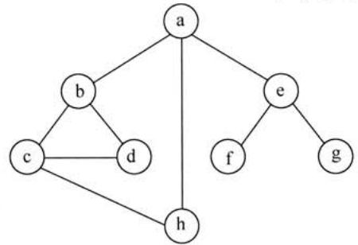

9.下列AOE网表示一项包含8个活动的工程。通过同时加快若干活动的进度可以缩短整个工程的工期。下列选项中，加快其进度就可以缩短工程工期的是

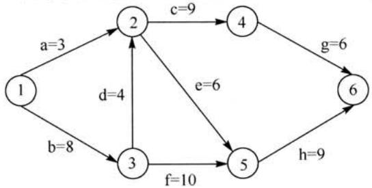

A.c和e B.d和c C.f和d D.f和r

10.在棵度为2的5阶B树中，所含关键字的个数最少是 。

A.5 B.7 C.8 D.14

11.对给定的关键字序列110,119,007,911,114,120,122进行基数排序，则第2趟分配收集后得到的关键字序列是 。

A.007,110,119,114,911,120,122 B.007,110,119,114,911,122,120   
C. 007,110,911,114,119,120,122 D.110,120,911,122,114,007,119

12.某计算机主频为 $1 . 2 \mathrm { G H z }$ ，其指令分为4类，它们在基准程序中所占比例及CPI如下表所示。

<table><tr><td rowspan=1 colspan=1>指令类型</td><td rowspan=1 colspan=1>所占比例</td><td rowspan=1 colspan=1>CPI</td></tr><tr><td rowspan=1 colspan=1>A</td><td rowspan=1 colspan=1>50%</td><td rowspan=1 colspan=1>2</td></tr><tr><td rowspan=1 colspan=1>B</td><td rowspan=1 colspan=1>20%</td><td rowspan=1 colspan=1>3</td></tr><tr><td rowspan=1 colspan=1>C</td><td rowspan=1 colspan=1>10%</td><td rowspan=1 colspan=1>4</td></tr><tr><td rowspan=1 colspan=1>D</td><td rowspan=1 colspan=1>20%</td><td rowspan=1 colspan=1>5</td></tr></table>

该机的MIPS数是 。

A.100 B.200 C.400 D.600

13．若某数采IEEE754单精度浮点数格式表为 $\mathrm { C 6 4 0 0 0 0 0 0 H }$ ，则该数的值是

A. $- 1 . 5 \times 2 ^ { 1 3 }$ B. $- 1 . 5 \times 2 ^ { 1 2 }$ C. $- 0 . 5 \times 2 ^ { 1 3 }$ D. $- 0 . 5 \times 2 ^ { 1 2 }$

14.某字长为8位的计算机中，已知整型变量 $\mathbf { X }$ 和y的机器数分别为 $[ \mathbf { x } ] _ { * * } = 1$ 1110100, $[ \boldsymbol { \mathbf { y } } ] _ { * * } =$ 10110000。若整型变量 ${ \bf z } = 2 { \bf x } + { \bf y } / 2$ ，则 $\mathbf { z }$ 的机器数为 。

A.11000000 B.00100100 C.10101010 D.溢出

15.海明码对长度为8位的数据进检/纠错时，若能纠正位错，则校验位数至少为

A.2 B.3 C.4 D.5

16.某计算机主存地址空间大小为256MB，按字节编址。虚拟地址空间大小为4GB，采用

计算机专业基础综合考试真题思路分析

页式存储管理，页为4KB，TLB（快表）采全相联映射，有4个页表项，内容如下表所示。

<table><tr><td rowspan=1 colspan=1>有效位</td><td rowspan=1 colspan=1>标记</td><td rowspan=1 colspan=1>页框号</td><td rowspan=1 colspan=1>…</td></tr><tr><td rowspan=1 colspan=1>0</td><td rowspan=1 colspan=1>FF180H</td><td rowspan=1 colspan=1>0002H</td><td rowspan=1 colspan=1>…</td></tr><tr><td rowspan=1 colspan=1>1</td><td rowspan=1 colspan=1>3FFF1H</td><td rowspan=1 colspan=1>0035H</td><td rowspan=1 colspan=1>…</td></tr><tr><td rowspan=1 colspan=1>0</td><td rowspan=1 colspan=1>02FF3H</td><td rowspan=1 colspan=1>0351H</td><td rowspan=1 colspan=1>…</td></tr><tr><td rowspan=1 colspan=1>1</td><td rowspan=1 colspan=1>03FFFH</td><td rowspan=1 colspan=1>0153H</td><td rowspan=1 colspan=1>…</td></tr></table>

则对虚拟地址03FFF180H进虚实地址变换的结果是 。

A.0153180H B.0035180H C.TLB缺失 D.缺页

17．假设变址寄存器R的内容为 $1 0 0 0 \mathrm { H }$ ，指令中的形式地址为 $2 0 0 0 \mathrm { H }$ ；地址 $1 0 0 0 \mathrm { H }$ 中的内容为 $2 0 0 0 \mathrm { H }$ ，地址 $2 0 0 0 \mathrm { H }$ 中的内容为 $3 0 0 0 \mathrm { H }$ ，地址 $3 0 0 0 \mathrm { H }$ 中的内容为 $4 0 0 0 \mathrm { H }$ ，则变址寻址式下访问到的操作数是 。

A.1000H B.2000H C.3000H D.4000H

18.某CPU主频为 $1 . 0 3 \mathrm { G H z }$ ，采4级指令流线，每个流段的执需要1个时钟周期。假定CPU执了100条指令，在其执过程中，没有发任何流线阻塞，此时流线的吞吐率为

A. $0 . 2 5 \times 1 0 ^ { 9 }$ 条指令/秒 B. $0 . 9 7 \times 1 0 ^ { 9 }$ 条指令/秒C. $1 . 0 \times 1 0 ^ { 9 }$ 条指令/秒 D. $1 . 0 3 \times 1 0 ^ { 9 }$ 条指令/秒

19．下列选项中，于设备和设备控制器（I/O接）之间互连的接标准是

A. PCI B.USB C.AGP D. PCI-Express

20．下列选项中，于提RAID可靠性的措施有 。

I.磁盘镜像 II.条带化 I．奇偶校验 IV.增加Cache 机制仅I、II B.仅I、II C.仅I、和IV D.仅I、I和IV

21．某磁盘的转速为 $1 0 0 0 0 \mathrm { r p m }$ ，平均寻道时间是6ms，磁盘传输速率是20MB/s，磁盘控制器延迟为 $0 . 2 \mathrm { m s }$ ，读取个4KB的扇区所需的平均时间约为 。

A. 9ms B. $9 . 4 \mathrm { m s }$ C. 12ms D. 12.4ms

22．下列关于中断I/O式和DMA式较的叙述中，错误的是_ 。

A．中断I/O式请求的是CPU处理时间，DMA式请求的是总线使权B．中断响应发在条指令执结束后，DMA响应发在个总线事务完成后C．中断I/O式下数据传送通过软件完成，DMA式下数据传送由硬件完成D．中断I/O式适于所有外部设备，DMA式仅适于快速外部设备

23．户在删除某件的过程中，操作系统不可能执的操作是 。

A.删除此文件所在的目录 B.删除与此文件关联的目录项C.删除与此件对应的件控制块 D.释放与此件关联的内存缓冲区

24．为持CD-ROM中视频件的快速随机播放，播放性能最好的件数据块组织式是 。

A.连续结构 B.链式结构 C．直接索引结构 D．多级索引结构

25．户程序发出磁盘I/O请求后，系统的处理流程是：户程序→系统调处理程序→设备驱动程序→中断处理程序。其中，计算数据所在磁盘的柱面号、磁头号、扇区号的程序是 。

A.用户程序 B．系统调处理程序

2013年全国硕研究学统考试计算机科学与技术学科联考计算机学科专业基础综合试题

C.设备驱动程序 D.中断处理程序

26．若某件系统索引结点（inode）中有直接地址项和间接地址项，则下列选项中，与单个文件长度无关的因素是

A.索引结点的总数 B.间接地址索引的级数 C.地址项的个数 D.件块

27.设系统缓冲区和户作区均采单缓冲，从外设读入1个数据块到系统缓冲区的时间为100，从系统缓冲区读入1个数据块到用户作区的时间为5，对户作区中的1个数据块进行分析的时间为90（如下图所示）。进程从外设读入并分析2个数据块的最短时间是 。

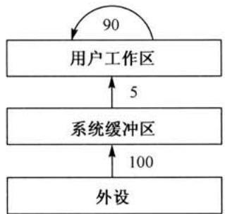

A.200 B.295 C.300 D.390

28．下列选项中，会导致户进程从户态切换到内核态的操作是 。

1.整数除以零 II.sin()函数调用 II.read系统调用

A.仅I、ⅡI B.仅I、III C.仅I、I D.I、II和

29.计算机开机后，操作系统最终被加载到 。

A. BIOS B.ROM C. EPROM D.RAM

30.若用户进程访问内存时产生缺页，则下列选项中，操作系统可能执的操作是

I.处理越界错 II.置换页 II.分配内存

A.仅I、ⅡI B.仅II、II C.仅I、II D.I、I和III

31．某系统正在执行三个进程 $\mathrm { { \cal P } } _ { 1 }$ 、 $\mathrm { P } _ { 2 }$ 和 ${ \sf P } _ { 3 }$ ，各进程的计算（CPU）时间和I/O时间例如下表所示。

<table><tr><td rowspan=1 colspan=1>进程</td><td rowspan=1 colspan=1>计算时间</td><td rowspan=1 colspan=1>O时间</td></tr><tr><td rowspan=1 colspan=1>P_1$</td><td rowspan=1 colspan=1>90%</td><td rowspan=1 colspan=1>10%</td></tr><tr><td rowspan=1 colspan=1>$P_2}$</td><td rowspan=1 colspan=1>50%</td><td rowspan=1 colspan=1>50%</td></tr><tr><td rowspan=1 colspan=1>$P3}$</td><td rowspan=1 colspan=1>15%</td><td rowspan=1 colspan=1>85%</td></tr></table>

为提系统资源利率，合理的进程优先级设置应为 。

A. $\mathsf { P } _ { 1 } > \mathsf { P } _ { 2 } > \mathsf { P } _ { 3 }$ B. $\mathrm { P } _ { 3 } > \mathrm { P } _ { 2 } > \mathrm { P } _ { 1 }$ C. $\mathsf { P } _ { 2 } > \mathsf { P } _ { 1 } = \mathsf { P } _ { 3 }$ D. $\mathsf { P } _ { 1 } > \mathsf { P } _ { 2 } = \mathsf { P } 3$

32.下列关于银行家算法的叙述中，正确的是 。

A.银行家算法可以预防死锁B．当系统处于安全状态时，系统中定无死锁进程C．当系统处于不安全状态时，系统中定会出现死锁进程D．银家算法破坏了死锁必要条件中的“请求和保持”条件

33．在OSI参考模型中，下列功能需由应层的相邻层实现的是 O

A.对话管理 B.数据格式转换C.路由选择 D.可靠数据传输

34．若下图为10BaseT卡接收到的信号波形，则该卡收到的特串是 。

计算机专业基础综合考试真题思路分析

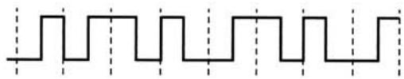

A.00110110 B.10101101   
C.01010010 D.11000101

35．主机甲通过1个路由器（存储转发式）与主机乙互联，两段链路的数据传输速率均为10Mbps，主机甲分别采报交换和分组为10kb的分组交换向主机发送1个为8Mb $1 \mathbf { M } = 1 0 ^ { 6 } \mathbf { k b }$ ）的报。若忽略链路传播延迟、分组头开销和分组拆装时间，则两种交换方式完成该报文传输所需的总时间分别为 。

A. $8 0 0 \mathrm { m s }$ 、 $1 6 0 0 \mathrm { m s }$ B.801ms、1600msC. $1 6 0 0 \mathrm { m s }$ 、 $8 0 0 \mathrm { m s }$ D.1600ms、801ms

36．下列介质访问控制法中，可能发冲突的是 。

A.CDMA B.CSMA C.TDMA D.FDMA

37．HDLC协议对01111000111110组帧后对应的特串为 。

A.011111000011111010 B.01111000111110101111110   
C.01111100011111010 D.011111000111111001111101

38.对于 $1 0 0 \mathbf { M } \mathbf { b } / \mathbf { s }$ 的以太交换机，当输出端排队，以直通交换(cut-through switching）式转发个以太帧（不包括前导码）时，引的转发延迟少是

A. $0 \mu \mathrm { s }$ B. $0 . 4 8 \mu \mathrm { s }$   
C. $5 . 1 2 \mu \mathrm { s }$ i: D. $1 2 1 . 4 4 \mu s$

39.主机甲与主机之间已建个TCP连接，双持续有数据传输，且数据差错与丢失。若甲收到1个来的TCP段，该段的序号为1913、确认序号为2046、有效载荷为100字节，则甲即发送给的TCP段的序号和确认序号分别是 。

A.2046、2012 B.2046、2013  
C.2047、2012 D.2047、2013

40．下列关于SMTP协议的叙述中，正确的是_ 。

I.只持传输7特ASCII码内容II.支持在邮件服务器之间发送邮件I.持从户代理向邮件服务器发送邮件IV.支持从邮件服务器向用户代理发送邮件

A.仅I、IⅡ和II B.仅I、II和IV C.仅I、II和IV D.仅II、III和IV

# 二、综合应用题（第 $4 1 \sim 4 7$ 题，共70分)

41．（13分）已知个整数序列 $\mathbf { A } = ( a _ { 0 } , a _ { 1 } , \cdots , a _ { n - 1 } )$ ，其中 $0 { \leqslant } a _ { i } { < } n$ $0 \leqslant i < n$ 。若存在 $a _ { p 1 } =$ $a _ { p 2 } = \cdots = a _ { p m } = x$ 且 $m > n / 2$ ( $0 \leqslant p _ { k } < n$ , $1 \leqslant k \leqslant m$ )，则称 $x$ 为A的主元素。例如 $\mathbf { A } = ( 0 , 5 , 5 , 3 , 5 , 7 ,$ 5,5)，则5为主元素；又如 $\mathbf { A } = ( 0 , 5 , 5 , 3 , 5 , 1 , 5 , 7 )$ ，则A中没有主元素。假设A中的 $_ n$ 个元素保存在个维数组中，请设计个尽可能效的算法，找出A的主元素。若存在主元素，则输出该元素；否则输出-1。要求：

(1）给出算法的基本设计思想。

（2）根据设计思想，采C、 $C { + + }$ 或Java语描述算法，关键之处给出注释。

(3）说明你所设计算法的时间复杂度和空间复杂度。

42.（10分）设包含4个数据元素的集合 ${ \bf S } { = } \{ \mathrm {  ~ \omega ~ } ^ { \ast } { \bf d o } ^ { \prime \prime }$ ,“for"，“repeat"，“while”}，各元素的查找概率依次为 $p _ { 1 } = 0 . 3 5$ , $p _ { 2 } = 0 . 1 5$ , $p _ { 3 } = 0 . 1 5$ , $p _ { 4 } = 0 . 3 5$ 。将S保存在个长度为4的顺序表中，采折半查找法，查找成功时的平均查找长度为2.2。请回答：

（1）若采用顺序存储结构保存S，且要求平均查找长度更短，则元素应如何排列？应使用何种查找方法？查找成功时的平均查找长度是多少？

（2）若采链式存储结构保存S，且要求平均查找长度更短，则元素应如何排列？应使何种查找方法？查找成功时的平均查找长度是多少？

43.（9分）某32位计算机，CPU主频为 ${ 8 0 0 } \mathrm { M H z }$ ，Cache命中时的CPI为4，Cache块大小为32字节；主存采用8体交叉存储方式，每个体的存储字长为32位、存储周期为 $4 0 \mathrm { n s }$ ；存储器总线宽度为32位，总线时钟频率为 ${ 2 0 0 } \mathrm { M H z }$ ，支持突发传送总线事务。每次读突发传送总线事务的过程包括：送首地址和命令、存储器准备数据、传送数据。每次突发传送32字节，传送地址或32位数据均需要一个总线时钟周期。请回答下列问题，要求给出理由或计算过程。

（1）CPU和总线的时钟周期各为多少？总线的带宽（即最数据传输率）为多少？

（2）Cache缺失时，需要用个读突发传送总线事务来完成一个主存块的读取？

（3）存储器总线完成一次读突发传送总线事务所需的时间是多少？

(4）若程序BP执行过程中，共执行了100条指令，平均每条指令需进行1.2次访存，Cache缺失率为 $5 \%$ ，不考虑替换等开销，则BP的CPU执时间是多少？

44.（14分）某计算机采用16位定长指令字格式，其CPU中有一个标志寄存器，其中包含进位/借位标志CF、零标志ZF和符号标志NF。假定为该机设计了条件转移指令，其格式如下：

<table><tr><td>15</td><td>11</td><td>10</td><td>9</td><td>8 7</td><td>0</td></tr><tr><td>00000</td><td>c</td><td>z</td><td>N</td><td>OFFSET</td><td></td></tr></table>

其中，00000为操作码OP：C、 $Z$ 和 $N$ 分别为CF、ZF和NF的对应检测位，某检测位为1时表示需检测对应标志位，需检测的标志位中只要有一个为1就转移，否则不转移。例如，若 $C = 1$ ,$Z = 0$ , $N = 1$ ，则需检测CF和NF的值，当 $\mathrm { C F } = 1$ 或 $\mathrm { N F } = 1$ 时发生转移；OFFSET是相对偏移量，用补码表示。转移执时，转移目标地址为 $( \mathrm { P C } ) + 2 + 2 \times ($ OFFSET；顺序执时，下条指令地址为 $( \mathrm { P C } ) + 2$ 。请回答下列问题。

（1）该计算机存储器按字节编址还是按字编址？该条件转移指令向后（反向）最多可跳转多少条指令？

（2）某条件转移指令的地址为 $2 0 0 \mathrm { C H }$ ，指令内容如下图所，若该指令执时 $\mathrm { C F } = 0$ ,$\mathrm { Z F } = 0$ , $\mathrm { N F } = 1$ ，则该指令执后PC的值是多少？若该指令执时 $\mathrm { C F } = 1$ , $\mathrm { Z F } = 0$ , $\mathrm { N F } = 0$ ,则该指令执后PC的值又是多少？请给出计算过程。

<table><tr><td>15</td><td>11 10</td><td>9 1</td><td>8</td><td>7</td><td>0</td></tr><tr><td>00000</td><td>0</td><td></td><td>1</td><td>11100011</td><td></td></tr></table>

（3）实现“符号数较于等于时转移”功能的指令中， $C$ $Z$ 和 $N$ 应各是什么？

（4）以下是该指令对应的数据通路示意图，要求给出图中部件 $\textcircled{1} \sim \textcircled { 3 }$ 的名称或功能说明。

45．（7分）某博物馆最多可容纳500同时参观，有个出，该出次仅允许个人通过。参观者的活动描述如下：

计算机专业基础综合考试真题思路分析

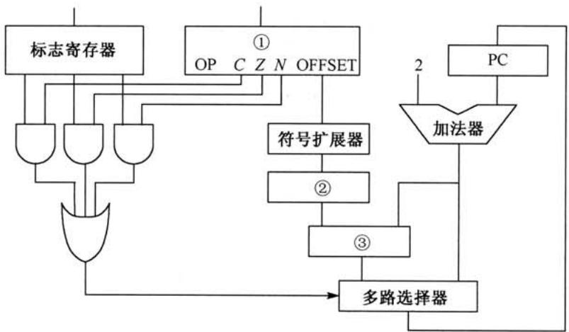

cobegin参观者进程i：

请添加必要的信号量和P、V（或waitO、signalQ）操作，以实现上述过程中的互斥与同步。要求写出完整的过程，说明信号量的含义并赋初值。

46．（8分）某计算机主存按字节编址，逻辑地址和物理地址都是32位，页表项为4字节。请回答下列问题。

（1）若使级页表的分页存储管理式，逻辑地址结构如下：

<table><tr><td>页号（20位）</td><td>页内偏移量（12位）</td></tr></table>

则页的是多少字节？页表最占多少字节?

（2）若使级页表的分页存储管理式，逻辑地址结构如下：

<table><tr><td>页目录号（10位）</td><td>页表索引（10位）</td><td>页内偏移量（12）</td></tr></table>

设逻辑地址为LA，请分别给出其对应的页录号和页表索引的表达式。

（3）采用（1）中的分页存储管理式，一个代码段起始逻辑地址为00008000H，其长度为8KB，被装载到从物理地址00900000H开始的连续主存空间中。页表从主存00200000H开始的物理地址处连续存放，如下图所示（地址大小自下向上递增）。请计算出该代码段对应的两个页表项的物理地址、这两个页表项中的页框号以及代码页2的起始物理地址。

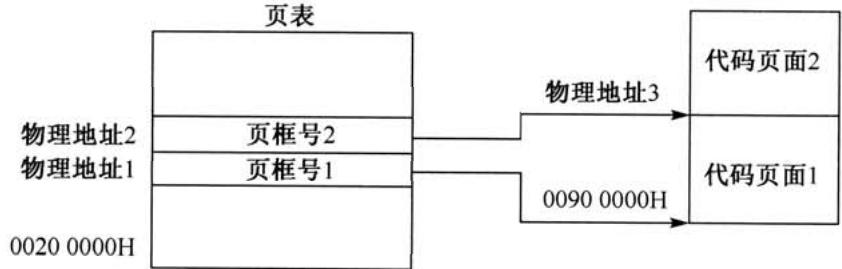

47．（9分）假设Internet的两个治系统构成的络如题47图所，治系统ASI由路由

2013年全国硕研究学统考试计算机科学与技术学科联考计算机学科专业基础综合试题器R1连接两个构成；治系统AS2由路由器R2、R3互联并连接3个构成。各地址、R2的接口名、R1与R3的部分接口IP地址如题47图所示。

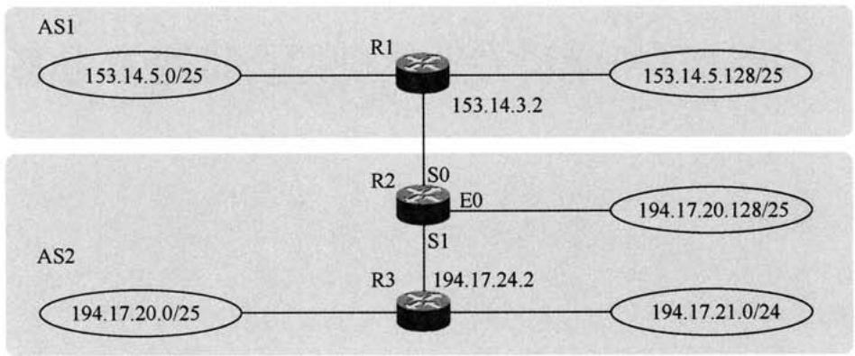  
题47图 络拓扑结构

请回答下列问题。

（1）假设路由表结构如下表所示。请利用路由聚合技术，给出R2的路由表，要求包括到达题47图中所有子网的路由，且路由表中的路由项尽可能少。

<table><tr><td>目的网络</td><td>下一跳</td><td>接口</td></tr></table>

（2）若R2收到个的IP地址为194.17.20.200的IP分组，R2会通过哪个接转发该1P分组？

（3）R1与R2之间利用哪个路由协议交换路由信息？该路由协议的报文被封装到哪个协议的分组中进行传输？

# 2013年计算机学科专业基础综合试题参考答案

# 一、单项选择题

D\$ 2. \$\1. r}\$ \$42 5. AA 6. 7. C 8.  
10. 13. 14. 15. c 16.  
17. D 18. 19. B 20. B 21. B 22. D 23. A 24.  
25. 26. A 27. 28. B 29. D 30. B 31. B 32. B  
33. B 34. A 35. D 36. B 37. A 38. B 39. B 40. A

1.解析：

两个升序链表合并，两两比较表中元素，每较次确定个元素的链接位置（取较元素，头插法)。当个链表较结束后，将另个链表的剩余元素插即可。最坏的情况是两个链表中的元素依次进比较，直到两个链表都到表尾，即每个元素都经过较，时间复杂度为$O ( m + n ) = O ( \operatorname* { m a x } ( m , n ) ) ,$

# 2.解析：

显然，3之后的4,5，…， $_ n$ 都是 ${ \mathsf p } _ { 3 }$ 可取的数（直进栈直到该数栈后马上出栈)。接下来分析1和 $2 \colon { \mathfrak { p } } _ { 1 }$ 只能是3之前栈的数（可能是1或2），当 ${ \sf p } _ { 1 } = 1$ 时， ${ \mathsf p } _ { 3 }$ 可取2；当 ${ \tt p } _ { 1 } = 2$ 时，${ \mathsf p } _ { 3 }$ 可取1，故 ${ \mathsf p } _ { 3 }$ 可能取除3之外的所有数，个数为 $n { - } 1$ 。

# 3.解析：

利7个关键字构建平衡叉树T，平衡因为0的分结点个数为3，构建的平衡叉树如下图所示。构造及调整的过程如下：

$$
\begin{array} { r } { \odot \Rightarrow \bigotimes _ { \bigodot } \mapsto ( \begin{array} { c } { \overbrace { \bigcirc } } \\ { \bigcirc } \\ { \bigcirc } \end{array} ) \Rightarrow ( \begin{array} { c } { \overbrace { \bigcirc } } \\ { \bigcirc } \\ { \bigcirc } \end{array} ) \Rightarrow ( \begin{array} { c } { \overbrace { \bigcirc } } \\ { \bigcirc } \\ { \bigcirc } \end{array} ) \Rightarrow ( \begin{array} { c } { \overbrace { \bigcirc } } \\ { \bigcirc } \\ { \bigcirc } \end{array} ) \Rightarrow } \\ { ( \begin{array} { c } { \overbrace { \bigcirc } } \\ { \bigcirc } \\ { \bigcirc } \\ { \bigcirc } \\ { \bigcirc } \end{array} ) \Rightarrow ( \begin{array} { c } { \overbrace { \bigcirc } } \\ { \bigcirc } \\ { \bigcirc } \end{array} ) \quad \stackrel { \circ } {  } ( \begin{array} { c } { \bigotimes } \\ { \bigcirc } \\ { \bigcirc } \end{array} ) \Rightarrow ( \begin{array} { c } { \overbrace { \bigcirc } } \\ { \bigcirc } \\ { \bigcirc } \end{array} ) \Rightarrow } \\ { \bigodot \bigotimes \bigotimes \bigotimes \bigotimes \bigotimes } \end{array}
$$

4.解析：

将哈夫曼树的思想推到三叉树的情形。为了构成严格的三叉树，需添加权为0的虚叶结点，对于严格的三叉树 $( n _ { 0 } - 1 ) \% ( 3 - 1 ) = u = 1 \neq 0$ ，需要添加 $m { - } u { - } 1 = 3 { - } 1 { - } 1$ 个叶结点，说明7个叶结点刚好可以构成个严格的三叉树。按照哈夫曼树的原则，权为0的叶结点应离树根最远，构造最小带权生成树的过程如下：

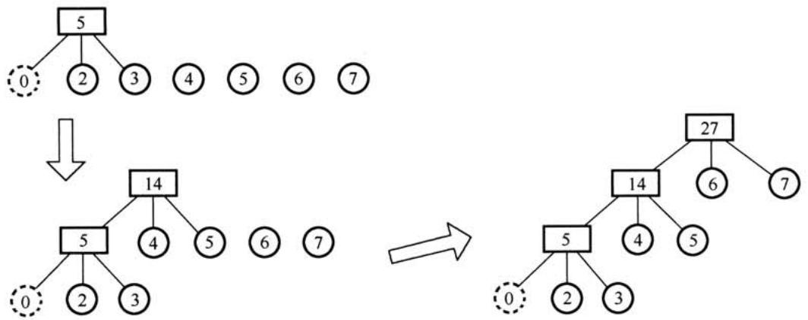

最小的带权路径长度为 $( 2 + 3 ) { \times } 3 + ( 4 + 5 ) { \times } 2 + ( 6 + 7 ) { \times } 1 = 4 6$

5.解析：

根据后序线索二叉树的定义，X结点为叶子结点且有左兄弟，那么这个结点为右孩子结点，利用后序遍历的方式可知X结点的后序后继是其父结点，即其右线索指向的是父结点。为了更加形象，在解题的过程中可以画出如下草图。

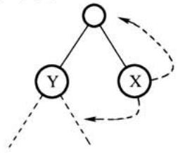

6.解析：

在一棵二叉排序树中删除一个结点后再将此结点插入到二叉排序树中，如果删除的结点是叶结点，那么在插结点后，后来的叉排序树与删除结点之前相同。如果删除的结点不是叶子结点，那么再插入这个结点后，后来的二叉树会发生变化，不完全相同。

# 7.解析：

邻接矩阵A为非对称矩阵，说明图是有向图，度为入度加出度之和。各顶点的度是矩阵中此结点对应的行（对应出度）和列（对应入度）的非零元素之和。

# 8.解析：

此题为送分题。只要掌握DFS和BFS的遍历过程，便能轻易解决。逐个代入，手工模拟，选项D是深度优先遍历，而不是度优先遍历。

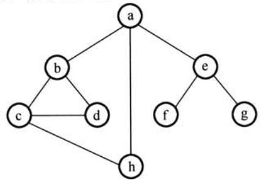

9.解析：

找出AOE网的全部关键路径为(b,d,c,g)、(b,d,e,h)和(b,f,h)。根据定义，只有关键路径上的活动时间同时减少时，才能缩短工期，即正确选项中的两条路径必须涵盖在所有关键路径之中。利用关键路径算法可求出图中的关键路径共有三条：(b,d,c,g)、(b,d,e,h)和(b,f,h)。由此可知，选项A和B中并不能包含(b,f,h)这条路径，选项C中，并不能包含(b,d,c,g)和(b,d，e,h)这两条路径，只有C包含了所有的关键路径，因此只有加快f和d的进度才能缩短工期（建

计算机专业基础综合考试真题思路分析议考生在图中检验）。

10.解析：

对于5阶B树，根结点只有达到5个关键字时才能产分裂，成为度为2的B树，因此度为2的5阶B树所含关键字的个数最少是5。

11.解析：

基数排序的第1趟排序是按照个位数字的来排序的，第2趟排序是按照位数字的进排序的，排序的过程如下图所。

10-19-007--11--14-120--122e[1] e[2] e[3] e[4] e[5] e[6] e[7] e[8] e[9]↓ ↓分配： 911 122 114 007 119120收集： 10--120-011--122--114--007--19e[0] e[1] e[2] e[3] e[4] e[5] e[6] e[7] e[8] \$09↓ ↓ ↓ 1007 10 120分配： 122119收集： 007--0---14--19-120--122

12.解析：

基准程序的CPI=2×0.5+3×0.2+4×0.1+5×0.2=3。计算机的主频为1.2GHz，即1200MHz，故该机器的 $\mathrm { M I P S } = 1 2 0 0 / 3 = 4 0 0$ 。

13.解析：

IEEE754单精度浮点数格式为 $\mathrm { C 6 4 0 0 0 0 0 0 H }$ ，进制格式为11000110010000000000000 00000000，转换为标准的格式为

<table><tr><td rowspan=1 colspan=1>S</td><td rowspan=1 colspan=1>阶码</td><td rowspan=1 colspan=1>尾数</td></tr><tr><td rowspan=1 colspan=1>1</td><td rowspan=1 colspan=1>10001100</td><td rowspan=1 colspan=1>100 0000 0000 0000 0000 0000</td></tr></table>

数符=1表示负数；阶码值为10001100-01111111=00001101=13；尾数值为1.5（注意其有隐含位，要加1)。因此，浮点数的值为 $- 1 . 5 \times 2 ^ { 1 3 }$ 。

14.解析：

$\mathbf { x } ^ { \ast } 2$ ，将 $\mathbf { x }$ 算术左移位为11101000； $y / 2$ ，将 $\mathbf { y }$ 算术右移位为11011000，均溢出或丢失精度。补码相加为 $1 \ 1 1 0 1 0 0 0 + 1 \ 1 0 1 1 0 0 0 = 1 \ 1 0 0 0 0 0 0$ ，亦溢出。

# 15.解析：

设校验位的位数为 $k$ ，数据位的位数为 $_ n$ ，海明码能纠正位错应满下述关系： $2 ^ { k } \geq n + k + 1$ 。$n = 8$ ，当 $k = 4$ 时， $2 ^ { 4 }$ $( = 1 6 ) > 8 + 4 + 1$ ( $\scriptstyle ( = 1 3$ )，符合要求，故校验位少是4位。

16.解析：

按字节编址，页面大小为4KB，页内地址共12位。地址空间大小为4GB，虚拟地址共32位，前20位为页号。虚拟地址为03FFF180H，故页号为03FFFH，页内地址为180H。查找页标记03FFFH所对应的页表项，页框号为0153H，页框号与页内地址拼接即为物理地址015$3 1 8 0 \mathrm { H }$ 。

17.解析：

根据变址寻址的方法，变址寄存器的内容（1000H）与形式地址的内容（2000H）相加，得到操作数的实际地址（3000H），根据实际地址访问内存，获取操作数 $4 0 0 0 \mathrm { H }$

变址寄存器 形式地址  
100H 2000H 地址 内容  
1000H 2000 H  
3000H 3000H  
3000H 4000H

18.解析：

采用4级流执行100条指令，在执行过程中共用 $4 + ( 1 0 0 - 1 ) = 1 0 3$ 个时钟周期。CPU的主频是 $1 . 0 3 \mathrm { G H z }$ ，也就是说每秒钟有1.03G个时钟周期。流线的吞吐率为 $1 . 0 3 \mathrm { G } \times 1 0 0 / 1 0 3 = 1 . 0 { \times } 1 0 ^ { 9 }$ 条指令/秒。

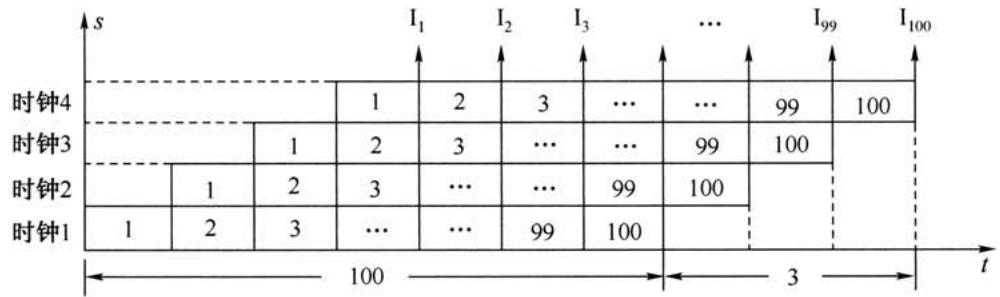

19.解析：

USB是一种连接外部设备的IO总线标准，属于设备总线，是设备和设备控制器之间的接。PCI、AGP、PCI-E作为计算机系统的局部总线标准，通常来连接主存、卡、视频卡等。

20.解析：

RAID0方案是无冗余和无校验的磁盘阵列，而RAID1 ${ \sim } 5$ 方案均是加入了冗余（镜像）或校验的磁盘阵列。条带化技术就是一种自动地将IVO的负载均衡到多个物理磁盘上的技术，条带化技术就是将一块连续的数据分成很多小部分并把它们分别存储到不同磁盘上去。这就能使多个进程同时访问数据的多个不同部分但不会造成磁盘冲突，而且在需要对这种数据进行顺序访问的时候可以获得最大程度上的I/O并行能力，从而获得非常好的性能。故能够提高RAID可靠性的措施主要是对磁盘进行镜像处理和奇偶校验，其余选项不符合条件。

# 21.解析：

磁盘转速是 $1 0 0 0 0 \mathrm { r p m }$ ，转一圈的时间为 $6 \mathrm { m s }$ ，因此平均查询扇区的时间为 $3 \mathrm { m s }$ ，平均寻道时间为6ms，读取4KB扇区信息的时间为 $4 \mathrm { K B } / ( 2 0 \mathrm { M B } / \mathrm { s } ) = 0 . 2 \mathrm { m s }$ ，磁盘控制器延迟为 $0 . 2 \mathrm { m s }$ ,总时间为 $3 + 6 + 0 . 2 + 0 . 2 = 9 . 4 \mathrm { m s }$ 。

# 22.解析：

中断处理方式：在I/O设备输入每个数据的过程中，由于无须CPU干预，因而可使CPU与I/O设备并作。仅当输完个数据时，才需CPU花费极短的时间去做些中断处理。因此中断申请使用的是CPU处理时间，发生的时间是在一条指令执行结束之后，数据是在软件的控制下完成传送的。DMA式与之不同。DMA式：数据传输的基本单位是数据块，即在CPU与I/O设备之间，每次传送至少个数据块；DMA式每次申请的是总线的使权，所传送的数据是从设备直接送入内存的，或者相反；仅在传送一个或多个数据块的开始和结束时，才需CPU干预，整块数据的传送是在控制器的控制下完成的。

计算机专业基础综合考试真题思路分析

23.解析：

此文件所在目录下可能还存在其他文件，因此删除文件时不能（也不需要）删除文件所在的录，而与此件关联的目录项和件控制块需要随着件同删除，同时释放件关联的内存缓冲区。

# 24.解析：

为了实现快速随机播放，要保证最短的查询时间，即不能选取链表和索引结构，因此连续结构最优。

25.解析：

计算磁盘号、磁头号和扇区号的作是由设备驱动程序完成的。题中的功能因设备硬件的不同而不同，因此应由厂家提供的设备驱动程序实现。

# 26.解析：

四个选项中，只有A选项是与单个件长度关的。索引结点的总数即件的总数，与单个件的长度关；间接地址级数越多、地址项数越多、件块越，单个件的长度就会越大。

# 27.解析：

数据块1从外设到户作区的总时间为105，在这段时间中，数据块2没有进操作。在数据块1进分析处理时，数据块2从外设到户作区的总时间为105，这段时间是并的。再加上处理数据块2的时间90，总时间为300，答案为C。

# 28.解析：

需要在系统内核态执的操作是整数除零操作(需要中断处理）和read系统调函数，sin(函数调用是在用户态下进行的。

# 29.解析：

此题为基本常识题，送分题。系统开机后，操作系统的程序会被动加载到内存中的系统区，这段区域是RAM。

# 30.解析：

用户进程访问内存时缺页会发生缺页中断。发生缺页中断，系统会执的操作可能是置换页或分配内存。系统内没有越界的错误，不会进越界出错处理。

# 31.解析：

为了合理地设置进程优先级，应该将进程的CPU时间和I/O时间做综合考虑，对于CPU占时间较少I/O占时间较多的进程，优先调度能让I/O更早地得到使，提了系统的资源利用率，显然应该具有更高的优先级。

# 32.解析：

银家算法是避免死锁的法，破坏死锁产的必要条件是预防死锁的法。利银家算法，系统处于安全状态时就可以避免死锁（即此时必然死锁)；当系统进不安全状态后便可能进死锁状态（但也不是必然）。

# 33.解析：

在OSI参考模型中，应层的相邻层是表示层。表示层是OSI七层协议的第六层。表示层的功能是表出户看得懂的数据格式，实现与数据表有关的功能。主要完成数据字符集的转换、数据格式化和文本压缩、数据加密和解密等工作。

# 34.解析：

10BaseT即10Mb/s的以太，采曼彻斯特编码，将个码元分成两个相等的间隔，前

个间隔为低电平后个间隔为电平表示码元1；码元0正好相反，也可以采相反的规定。  
故对应比特串可以是 $0 0 1 1 0 1 1 0$ 或11001001。

35.解析：

不进行分组时，发送一个报文的时延是 $8 \mathbf { M 6 } / 1 0 \mathbf { M 6 } / \mathbf { s } = 8 0 0 \mathbf { m s }$ ，采报交换时，主机甲发送报文需要一次时延，而报文到达路由器进行存储转发又需要一次时延，总时延为 $8 0 0 \mathrm { m } \mathbf { s } { \times } 2 =$ $1 6 0 0 \mathrm { m s }$ 。进行分组后，发送一个报文的时延是 $1 0 \mathbf { k } \mathbf { b } / 1 0 \mathbf { M } \mathbf { b } / \mathbf { s } = 1 \mathbf { m } \mathbf { s }$ ，一共有 $8 \mathbf { M } \mathbf { b } / 1 0 \mathbf { k } \mathbf { b } = 8 0 0$ 个分组，主机甲发送800个分组需要 $1 \mathrm { m s } { \times } 8 0 0 = 8 0 0 \mathrm { m s }$ 的时延，而路由器接收到第一个分组后直接开始转发，即除了第一个分组，其余分组经过路由器转发不会产生额外的时延，总时延就为$8 0 0 \mathrm { { m s } + 1 \mathrm { { m s } = 8 0 1 \mathrm { { m s } } } }$ 。

36.解析：

选项A、C和D都是信道划分协议，信道划分协议是静态划分信道的方法，肯定不会发生冲突。CSMA全称是载波侦听多路访问协议，其原理是站点在发送数据前先侦听信道，发现信道空闲后再发送，但在发送过程中有可能会发生冲突。

# 37.解析：

HDLC协议对比特串进组帧时，HDLC数据帧以位模式01111110标识每一个帧的开始和结束，因此在帧数据中凡是出现了5个连续的位“1”的时候，就会在输出的位流中填充个$" 0 \phantom { " }$ 。因此组帧后的特串为011111000011111010（下画线部分为新增的0)。

# 38.解析：

直通交换在输入端口检测到一个数据帧时，检查帧首部，获取帧的目的地址，启动内部的动态查找表转换成相应的输出端口，在输入与输出交叉处接通，把数据帧直通到相应的端口，实现交换功能。直通交换方式只检查帧的目的地址，共6B，所以最短的传输延迟是$6 { \times } 8 6 \mathrm { i t } / 1 0 0 \mathrm { M b } / \mathrm { s } = 0 . 4 8 \mu \mathrm { s }$ 。

39.解析：

确认序号ack是期望收到对方下一个报文段的数据的第一个字节的序号，序号seq是指本报文段所发送的数据的第一个字节的序号。甲收到1个来自乙的TCP段，该段的序号 $\mathsf { s e q } = 1 9 1 3$ (确认序号 $\mathrm { a c k } = 2 0 4 6$ 、有效载荷为100字节，表明到序号 $1 9 1 3 + 1 0 0 - 1 = 2 0 1 2$ 为止的所有数据甲均已收到，期望收到下个报段的序号从2046开始。故甲发给的TCP段的序号 $\mathbf { s e q } _ { 1 } =$ $\mathrm { a c k } = 2 0 4 6$ 和确认序号 $\mathbf { a c k } _ { 1 } = \mathbf { s e q } + 1 0 0 = 2 0 1 3$ 。

40.解析：

根据下图可知，SMTP协议用于用户代理向邮件服务器发送邮件，或在邮件服务器之间发送邮件。SMTP协议只持传输7比特的ASCII码内容。

发件人 发送方 接收方 收件人  
用户代理 发送 邮件服务器 邮件服务器 读取 用户代理邮件 邮件  
S SMTP 连接 服务 服 POP3 连接SMTP 发送邮件SMTP SMTP客户 TCP连接 服务器

# 二、综合应用题

41.解答：

（1）给出算法的基本设计思想：

算法的策略是从前向后扫描数组元素，标记出一个可能成为主元素的元素Num。然后重新

计算机专业基础综合考试真题思路分析计数，确认Num是否是主元素。

算法可分为以下两步：

$\textcircled{1}$ 选取候选的主元素：依次扫描所给数组中的每个整数，将第个遇到的整数 $\operatorname { N u m }$ 保存到c中，记录Num的出现次数为1；若遇到的下个整数仍等于 $\operatorname { N u m }$ ，则计数加1，否则计数减1；当计数减到0时，将遇到的下个整数保存到c中，计数重新记为1，开始新轮计数，即从当前位置开始重复上述过程，直到扫描完全部数组元素。

$\textcircled{2}$ 判断c中元素是否是真正的主元素：再次扫描该数组，统计c中元素出现的次数，若于 $_ { n / 2 }$ ，则为主元素；否则，序列中不存在主元素。

(2）算法实现：

int Majority(int A[l,int n)   
{   
int i,c,count $^ { = 1 }$ ; //c用来保存候选主元素，count用来计数   
$mathtt { C } = \mathtt { A }$ [0]; //设置A[0]为候选主元素   
for $\dot { \mathfrak { I } } = 1$ ;i<n; $\dot { \bar { \lambda } } + +$ ) //查找候选主元素 if $( A [ \dot { 2 } ] = = c$ ) count $^ { + + }$ ; //对A中的候选主元素计数 else if (count $> 0$ ) //处理不是候选主元素的情况 count--; else //更换候选主元素，重新计数 { $c = \tt { A }$ [i]; count $^ { = 1 }$ ;   
if(count>0) for( $\dot { \bf 1 } =$ count ${ } = 0$ ; $\mathrm { i } < \mathtt { n }$ ; $\dot { \bar { \lambda } } + +$ ）//统计候选主元素的实际出现次数 if $\mathtt { A } [ \mathtt { i } ] = = \mathtt { c }$ count++;   
if(count>n/2) return c; //确认候选主元素   
else return -1; //不存在主元素   
}

【（1）、（2）的评分说明】 $\textcircled{1}$ 若考设计的算法满题目的功能要求且正确，则（1）、（2)根据所实现算法的效率给分，细则见下表：

<table><tr><td rowspan=1 colspan=1>时间复杂度</td><td rowspan=1 colspan=1>空间复杂度</td><td rowspan=1 colspan=1>(1）得分</td><td rowspan=1 colspan=1>(2）得分</td><td rowspan=1 colspan=1>说明</td></tr><tr><td rowspan=1 colspan=1>O(n)</td><td rowspan=1 colspan=1>0(1)</td><td rowspan=1 colspan=1>4</td><td rowspan=1 colspan=1>7</td><td rowspan=1 colspan=1></td></tr><tr><td rowspan=1 colspan=1>O(n)</td><td rowspan=1 colspan=1>O(n)</td><td rowspan=1 colspan=1>4</td><td rowspan=1 colspan=1>6</td><td rowspan=1 colspan=1>如采计数排序思想，见表后Majority1程序</td></tr><tr><td rowspan=1 colspan=1>O(nlog2n)</td><td rowspan=1 colspan=1>其他</td><td rowspan=1 colspan=1>3</td><td rowspan=1 colspan=1>6</td><td rowspan=1 colspan=1>如采用其他排序的思想</td></tr><tr><td rowspan=1 colspan=1>≥0(^{)</td><td rowspan=1 colspan=1>其他</td><td rowspan=1 colspan=1>3</td><td rowspan=1 colspan=1>5</td><td rowspan=1 colspan=1>其他方法</td></tr></table>

int Majorityl(int A[l,int n){ //采用计数排序思想，时间c   
int k, ${ } ^ { \star _ { \mathrm { p } } }$ ,max;   
$\mathtt { p } =$ (int $^ { \star }$ )malloc(sizeof(int) $\star _ { \Pi }$ ); //申请辅助计数数组   
for $k = 0$ ; k<n; $\ k + +$ ) $\mathtt { p } [ \mathbf { k } ] = 0$ ; //计数数组清零   
$\mathtt { m a x } = 0$ ;   
for $k = 0 ; k < n ; k + + ) \downarrow$ $\mathbb { P } \left[ \mathbb { A } \left[ \mathbf { k } \right] \right] + +$ ; //计数器 $^ { + 1 }$ if(p[A[k]1>p[max])max $= \tt { A }$ [k]; //记录出现次数最多的元素   
}   
if $( \mathbb { P } \left[ { \mathfrak { m a x } } \right] > { \mathfrak { n } } / 2 )$ return max;

else return $^ { - 1 }$ ;

$\textcircled{2}$ 若在算法的基本设计思想描述中因文字表达没有常清晰反映出算法思路，但在算法实现中能够清晰看出算法思想且正确的，可参照 $\textcircled{1}$ 的标准给分。

$\textcircled{3}$ 若算法的基本设计思想描述或算法实现中部分正确，可参照 $\textcircled{1}$ 中各种情况的相应给分标准酌情给分。

（3）说明算法复杂性：

参考答案中实现的程序的时间复杂度为 $O ( n )$ ，空间复杂度为 $O ( 1 )$ 。

【评分说明】若考所估计的时间复杂度与空间复杂度与考所实现的算法致，可各给1分。

【说明】本题如果采先排好序再统计的法（时间复杂度可为 $O ( n \mathrm { l o g } _ { 2 } n )$ )，只要解答正确，最高可拿11分。即便是写出 $O ( n ^ { 2 } )$ 的算法，最也能拿10分，因此对于统考算法题，去花费量时间去思考最优解法是得不偿失的。

42.解答：

1）折半查找要求元素有序顺序存储，若各个元素的查找概率不同，则折半查找的性能不定优于顺序查找。采顺序查找时，元素按其查找概率的降序排列时查找长度最。

采顺序存储结构，数据元素按其查找概率降序排列。采顺序查找法。

查找成功时的平均查找长度 $= 0 . 3 5 { \times } 1 + 0 . 3 5 { \times } 2 + 0 . 1 5 { \times } 3 + 0 . 1 5 { \times } 4 = 2 . 1$ 。

此时，显然查找长度折半查找的更短。

2）答案：采链式存储结构时，只能采顺序查找，其性能和顺序表样，类似于上题。数据元素按其查找概率降序排列，构成单链表。采顺序查找法。

查找成功时的平均查找长度 $= 0 . 3 5 { \times } 1 + 0 . 3 5 { \times } 2 + 0 . 1 5 { \times } 3 + 0 . 1 5 { \times } 4 = 2 . 1$ 。

答案二：还可以构造成二叉排序树的形式。采用二叉链表的存储结构，构造叉排序树，元素的存储式见下图。采叉排序树的查找法。

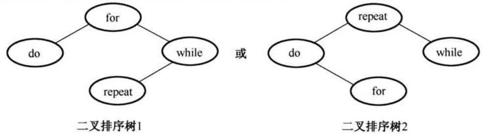

查找成功时的平均查找长度 $= 0 . 1 5 { \times } 1 + 0 . 3 5 { \times } 2 + 0 . 3 5 { \times } 2 + 0 . 1 5 { \times } 3 = 2 . 0$ 。

【1)、2）的评分说明】 $\textcircled{1}$ 若考以实际元素表“降序排列”，同样给分。

$\textcircled{2}$ 若考正确求出与其查找方法对应的查找成功时的平均查找长度，给2分；若计算过程正确，但结果错误，给1分。

$\textcircled{3}$ 考给出其他更效的查找法且正确，可参照评分标准给分。

43.解答：

1）CPU的时钟周期是主频的倒数，即 $1 / 8 0 0 \mathrm { M H z } = 1 . 2 5 \mathrm { n s }$ 总线的时钟周期是总线频率的倒数，即 $1 / 2 0 0 \mathrm { M H z } = 5 \mathrm { n s }$ 。

总线宽度为32位，故总线带宽为 $4 \mathrm { B } { \times } 2 0 0 \mathrm { M H z } = 8 0 0 \mathrm { M B } / \mathrm { s }$ 或 $4 \mathrm { B } / 5 \mathrm { n s } = 8 0 0 \mathrm { M B } / \mathrm { s }$

2)Cache块是32B，因此Cache缺失时需要个读突发传送总线事务读取个主存

3）次读突发传送总线事务包括次地址传送和32B数据传送：1个总线时钟周期传输地址；每隔 $4 0 \mathrm { n s } / 8 = 5 \mathrm { n s }$ 启动个体作（各进1次存取），第个体读数据花费 $4 0 \mathrm { n s }$ ，之

计算机专业基础综合考试真题思路分析

后数据存取与数据传输重叠；用8个总线时钟周期传输数据。读突发传送总线事务时间：5ns $^ +$ $4 0 \mathrm { n s } + 8 \times 5 \mathrm { n s } = 8 5 \mathrm { n s }$

4）BP的CPU执行时间包括Cache命中时的指令执行时间和Cache缺失时带来的额外开销。命中时的指令执时间： $1 0 0 { \times } 4 { \times } 1 . 2 5 \mathrm { n s } = 5 0 0 \mathrm { n s }$ 。指令执过程中Cache缺失时的额外开销： $1 . 2 \times 1 0 0 \times 5 \% \times 8 5 \mathrm { n s } = 5 1 0 \mathrm { n s }$ 。BP的CPU执时间： $5 0 0 \mathrm { n s } + 5 1 0 \mathrm { n s } = 1 0 1 0 \mathrm { n s }$ 。

【评分说明】 $\textcircled{1}$ 执时间采如下公式计算时，可酌情给分。执行时间 $=$ 指令条数 $\times \mathrm { C P l } \times$ 时钟周期 $\times$ 命中率 $^ +$ 访存次数 $\times$ 缺失率 $\times$ 缺失损失$\textcircled{2}$ 计算公式正确但运算结果不正确时，可酌情给分。

44.解答：

1）因为指令长度为16位，且下条指令地址为 $( \mathrm { P C } ) + 2$ ，故编址单位是字节。

偏移量OFFSET为8位补码，范围为 $- 1 2 8 \sim 1 2 7$ ，故相对于当前条件转移指令，向后最多可跳转127条指令。

【评分说明】若正确给出OFFSET的取值范围，则酌情给分。

2）指令中 $C = 0$ , $Z = 1$ , $N = 1$ ，故应根据ZF和NF的值来判断是否转移。当 $\mathrm { C F } = 0$ , $\boldsymbol { Z } \boldsymbol { \mathrm { F } } = \boldsymbol { 0 }$ ,$\mathrm { N F } = 1$ 时，需转移。已知指令中偏移量为 $1 1 1 0 0 0 1 1 \mathrm { B } = \mathrm { E } 3 \mathrm { H }$ ，符号扩展后为FFE3H，左移一位（乘2）后为FFC6H，故PC的值（即转移目标地址）为 $2 0 0 \mathrm { C H } + 2 + \mathrm { F F C 6 H } = 1 \mathrm { F D } 4 \mathrm { H }$ 。当 $\mathrm { C F = }$ 1， $\mathrm { Z F } = 0$ , $\mathrm { N F } = 0$ 时不转移。PC的值为 $2 0 0 \mathrm { C H } + 2 = 2 0 0 \mathrm { E H }$ 。

3）指令中的 $C$ 、 $Z$ 和 $N$ 应分别设置为 $C = Z = 1$ , $N = 0$ ，进行数之间的大小比较通常是对两个数进减法，而因为是无符号数较于等于时转移，即两个数相减结果为0或者负数都应该转移，若是0，则ZF标志应当为1，所以是负数，则借位标志应该为1，符号数并不涉及符号标志NF。

4）部件 $\textcircled{1}$ 于存放当前指令，不难得出为指令寄存器；多路选择器根据符号标志CIZ/N来决定下一条指令的地址是 $\mathrm { P C } + 2$ 还是 $\operatorname { P C } + 2 + 2 \times$ OFFSET，故多路选择器左边线上的结果应该是 $\mathbf { P C } + 2 + 2 { \times } \mathbf { O F F S E T }$ 。根据运算的先后顺序以及与 $\mathrm { P C } + 2$ 的连接，部件 $\textcircled{2}$ 于左移位实现乘2，为移位寄存器。部件 $\textcircled{3}$ 用于 $\mathrm { P C } + 2$ 和 $2 \times$ OFFSET相加，为加法器。

部件 $\textcircled{2}$ ：移位寄存器（于左移位）；部件 $\textcircled{3}$ ：加法器（地址相加）。

【评分说明】合理给出部件名称或功能说明均给分。

45.解答：

出次仅允许个通过，设置互斥信号量mutex，初值为1。博物馆最多可同时容纳500人，故设置信号量empty，初值为500。

Semaphore empty $= 5 0 0$ ; //博物馆可以容纳的最多人数  
Semaphore mutex $^ { = 1 }$ ; //用于出入口资源的控制  
cobegin  
参观者进程i：  
{  
P(empty);P(mutex);进门;V(mutex);参观;P(mutex);出门;V(mutex);V(empty);…  
}  
coend

【评分说明】 $\textcircled{1}$ 信号量初值给1分，说明含义给1分，两个信号量的初值和含义共4分。

$\textcircled{2}$ 对mutex的P、V操作正确给2分。  
$\textcircled{3}$ 对empty的P、V操作正确给1分。  
$\textcircled{4}$ 其他答案，参照 $\textcircled{1} \sim \textcircled{3}$ 的标准给分。

46.解答：

1）因为主存按字节编制，页内偏移量是12位，所以页为 $2 ^ { 1 2 } \mathrm { B } = 4 \mathrm { K B }$ 。(1分)

2）页目录号可表示为：(unsigned int)(LA)) $1 > > 2 2$ )& $0 \times 3 \mathrm { F F }$ 。(1分) 页表索引可表示为：(unsigned int)(LA)) $1 > > 1 2$ )& $0 \mathrm { x } 3 \mathrm { F F }$ 。(1分)

【评分说明】 $\textcircled{1}$ 页目录号也可以写成(unsigned int)(LA)) $> > 2 2$ ；如果两个表达式没有对LA进行类型转换，同样给分。

$\textcircled{2}$ 如果除法和其他开销很的运算法，但对基本原理是理解的，同样给分。

$\textcircled{3}$ 参考答案给出的是C语的描述，其他语（包括然语）正确地表述了，同样给分。

3）代码页1的逻辑地址为 $0 0 0 0 ~ 8 0 0 0 \mathrm { H }$ ，表明其位于第8个页处，对应页表中的第8个页表项，所以第8个页表项的物理地址 $=$ 页表起始地址 $+ 8 \times$ 页表项的字节数 $= 0 0 2 0 0 0 0 0 0 +$ $8 { \times } 4 = 0 0 2 0 0 0 2 0 \mathrm { H }$ 。由此可得如下图所的答案。(3分)

页表00901000H 代码页面2  
00200024H 00901H  
00200020H 00900H - 00900000H 代码页面1

【评分说明】共5个答数。物理地址1和物理地址2共1分；页框号1和页框号2共1分；物理地址3给1分。

47.解答：

1）要求R2的路由表能到达图中所有的，且路由项尽可能的少，则应对每个路由接的进聚合。在AS1中，153.14.5.0/25 和153.14.5.128/25可以聚合为153.14.5.0/24；在AS2中，194.17.20.0/25和194.17.21.0/24可以聚合为194.17.20.0/23；子网194.17.20.128/25单独连接到R2的接口E0。（6分）

于是可以得到R2的路由表如下：

<table><tr><td rowspan=1 colspan=1>目的网络</td><td rowspan=1 colspan=1>下一跳</td><td rowspan=1 colspan=1>接口</td></tr><tr><td rowspan=1 colspan=1>153.14.5.0/24</td><td rowspan=1 colspan=1>153.14.3.2</td><td rowspan=1 colspan=1>S0</td></tr><tr><td rowspan=1 colspan=1>194.17.20.0/23</td><td rowspan=1 colspan=1>194.17.24.2</td><td rowspan=1 colspan=1>S1</td></tr><tr><td rowspan=1 colspan=1>194.17.20.128/25</td><td rowspan=1 colspan=1>-</td><td rowspan=1 colspan=1>E0</td></tr></table>

【评分说明】 $\textcircled{1}$ 每正确解答1个路由项，给2分，共6分。每条路由项正确解答的络IP地址但前缀长度，给0.5分，正确解答前缀长度给0.5分，正确解答下跳IP地址给0.5分，正确解答接口给0.5分。

计算机专业基础综合考试真题思路分析$\textcircled{2}$ 路由项解答部分正确或路由项多于3条，可酌情给分。

2）该IP分组的目的IP地址194.17.20.200与路由表中194.17.20.0/23和194.17.20.128/25两个路由表项均匹配，根据最长匹配原则，R2将通过E0接口转发该IP分组。（1分）

3）R1和R2属于不同的自治系统，故应使用边界网关协议BGP（或BGP4）交换路由信息（1分）BGP是应用层协议，它的报文被封装到TCP协议段中进行传输。（1分）

【评分说明】若考解答为EGP协议，且正确解答EGP采IP协议进通信，亦给分。