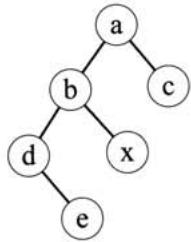
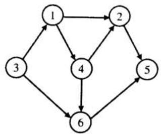
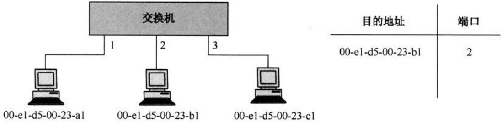
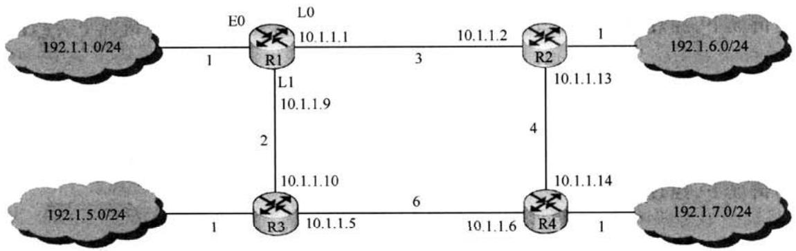

# 2014年全国硕研究学统考试计算机科学与技术学科联考计算机学科专业基础综合试题

# 一、单项选择题（第 $1 { \sim } 4 0$ 题，每题2分，共80分。下列每题给出的四个选项中，只有一个选项最符合试题要求）

1.下列程序段的时间复杂度是 。

count ${ \tt = } 0$ ; for( $k = 1$ ; $k < = \mathtt { n }$ ; $k ^ { \star } = 2$ ) for $( j = 1 ; j < = n ; j + + )$ count $^ { + + }$ ;

A. $O ( \log _ { 2 } n )$ B. $O ( n )$ C. $O ( n \mathrm { l o g } _ { 2 } n )$ D. $O ( n ^ { 2 } )$

2.假设栈初始为空，将中缀表达式 $\mathbf { a } / \mathbf { b } { + } ( \mathbf { c } ^ { * } \mathbf { d } { - } \mathbf { e } ^ { * } \mathbf { f } ) / \mathbf { g }$ 转换为等价的后缀表达式的过程中，当扫描到f时，栈中的元素依次是 。

A. $+ ( ^ { * } -$ B. $+ ( - ^ { * }$ (id:) $\mathrm { C } . ~ / + ( { ^ * - ^ { * } } \mathrm { D } . ~ / + - ^ { * }$

3.循环队列放在一维数组 $\mathbf { A } [ 0 ^ { \ldots } M ^ { - } 1 ]$ 中，end1指向队头元素，end2指向队尾元素的后个位置。假设队列两端均可进行入队和出队操作，队列中最多能容纳 $M ^ { - 1 }$ 个元素。初始时为空。下列判断队空和队满的条件中，正确的是 。

A.队空：end1 $= =$ end2; 队满： $\mathrm { e n d 1 } = = ( \mathrm { e n d 2 } + 1 )$ mod $M$ B.队空：end1 $= =$ end2; 队满：end2 $=$ (end1 $^ { + 1 }$ )mod $( M ^ { - } 1 )$ i C.队空：end2 $= = ( { \mathrm { e n d } } 1 + 1 )$ mod $M$ ; 队满：end1 $\mathbf { \delta } = ( \mathbf { e n d } 2 + 1 )$ mod $M$ D.队空：end1 $= = ( \mathrm { e n d } 2 + 1 )$ mod $M _ { i }$ ; 队满：end2 $=$ (end1 $+ 1$ )mod $( M ^ { - } 1 )$

4.若对如下的二叉树进中序线索化，则结点 $\mathbf { x }$ 的左、右线索指向的结点分别是 。

A.e、c B.e、a C.d、c D. b、a

5.将森林F转换为对应的二叉树T，F中叶结点的个数等于 。

A.T中叶结点的个数 B.T中度为1的结点个数C.T中左孩子指针为空的结点个数 D.T中右孩子指针为空的结点个数

6.5个字符有如下4种编码案，不是前缀编码的是 。

A. 01,0000,0001,001,1 B.011,000,001,010,1   
C.000,001,010,011,100 D. 0,100,110,1110,1100

7．对如下所的有向图进拓扑排序，得到的拓扑序列可能是 。

计算机专业基础综合考试真题思路分析

A. 3,1,2,4,5,6 B. 3, 1,2, 4,6,5 C. 3,1,4,2,5,6 D. 3, 1,4,2,6,5

8．哈希（散列）法处理冲突（碰撞）时可能出现堆积（聚集）现象。下列选项中，会受堆积现象直接影响的是

A.存储效率 B.散列函数C.装填（装载）因子 D.平均查找长度

9.在棵具有15个关键字的4阶B树中，含关键字的结点个数最多是 。

A.5 B.6 C. 10 D.15

10.用希尔排序方法对个数据序列进行排序时，若第1趟排序结果为9,1,4,13,7,8,20,23,15，则该趟排序采的增量（间隔）可能是 。

A.2 B.3 C.4 D.:

11．下列选项中，不可能是快速排序第2趟排序结果的是 。

A. 2,3,5,4,6,7,9 B.2,7,5,6,4,3,9 C.3,2,5,4,7,6,9 D. 4,2,3,5,7,6,9

12．程序P在机器M上的执时间是20秒，编译优化后，P执的指令数减少到原来的$70 \%$ ，而CPI增加到原来的1.2倍，则 $\mathrm { \bf P }$ 在M上的执行时间是 。

A.8.4秒 B.11.7秒 C.14秒 D.16.8秒

13.若 $\mathbf { x } = 1 0 3 , \mathbf { y } = - 2 5$ ,则下列表达式采8位定点补码运算实现时，会发溢出的是

A. $\mathbf { x } + \mathbf { y }$ (id:) B. $- \mathbf { x } + \mathbf { y }$ C.x-y D. $- \mathbf { x } - \mathbf { y }$

14．float型数据常IEEE754单精度浮点格式表。假设两个float型变量 $\mathbf { x }$ 和y分别存放在32位寄存器fi和 $\mathbf { f } _ { 2 }$ 中，若 $( \mathrm { f _ { 1 } } ) { = } \mathrm { C C 9 0 0 0 0 0 0 0 H } , ( \mathrm { f _ { 2 } } ) { = } \mathrm { B 0 } \mathrm { C 0 0 0 0 0 0 H }$ ，则 $\mathbf { x }$ 和y之间的关系为 。

A. $\mathbf { x } < \mathbf { y }$ 且符号相同 B. $\mathbf { x } < \mathbf { y }$ 且符号不同C. $\mathbf { x } > \mathbf { y }$ 且符号相同 D. $\mathbf { x } > \mathbf { y }$ 且符号不同

15．某容量为256MB的存储器由若 $4 \mathbf { M } \times 8$ 位的DRAM芯构成，该DRAM芯的地址引脚和数据引脚总数是 。

A.19 B.22 C.30 D.36

16．采指令Cache与数据Cache分离的主要的是

A.降低Cache的缺失损失 B.提高Cache的命中率C.降低CPU平均访存时间 D.减少指令流线资源冲突

17．某计算机有16个通寄存器，采32位定长指令字，操作码字段（含寻址式位) 为8位，Store指令的源操作数和的操作数分别采寄存器直接寻址和基址寻址式。若基址 寄存器可使任通寄存器，且偏移量补码表，则Store指令中偏移量的取值范围 是 0

A. $- 3 2 7 6 8 \sim + 3 2 7 6 7$ B. $- 3 2 7 6 7 \sim + 3 2 7 6 8$   
C. $- 6 5 5 3 6 \sim + 6 5 5 3 5$ D. $- 6 5 5 3 5 { \sim } + 6 5 5 3 6$

18.某计算机采微程序控制器，共有32条指令，公共的取指令微程序包含2条微指令，各指令对应的微程序平均由4条微指令组成，采断定法（下地址字段法）确定下条微指令地址，则微指令中下地址字段的位数至少是 。

A.5 B.6 C.8 D.9

19.某同步总线采数据线和地址线复式，其中地址/数据线有32根，总线时钟频率为66MHz，每个时钟周期传送两次数据（上升沿和下降沿各传送一次数据），该总线的最大数据传输率（总线带宽）是 。

A. 132MB/s B.264MB/s C.528MB/s D.1056MB/s

20.一次总线事务中，主设备只需给出一个地址，从设备就能从地址开始的若干连续单元读出或写多个数据。这种总线事务式称为 。

A.并行传输 B.串传输 C.突发传输 D．同步传输

21．下列有关I/O接口的叙述中，错误的是

A.状态端口和控制端口可以合用同一个寄存器B.I/O接口中CPU可访问的寄存器称为I/O端口C.采独编址式时，I/O端地址和主存地址可能相同D．采统编址式时，CPU不能访存指令访问I/O端

22.若某设备中断请求的响应和处理时间为 $1 0 0 \mathrm { n s }$ ，每 $4 0 0 \mathrm { n s }$ 发出一次中断请求，中断响应所允许的最长延迟时间为 $5 0 \mathrm { n s }$ ，则在该设备持续作过程中，CPU于该设备的I/O时间占整个CPU时间的百分少是 。

A. $1 2 . 5 \%$ B. $2 5 \%$ C. $3 7 . 5 \%$ D. $5 0 \%$

23．下列调度算法中，不可能导致饥饿现象的是 。

A.时间轮转 B.静态优先数调度C.非抢占式短作业优先 D.抢占式短作业优先

24.某系统有 $_ n$ 台互斥使用的同类设备，三个并发进程分别需要3、4、5台设备，可确保系统不发生死锁的设备数 $n$ 最小为 。

A.9 B.10 C.11 D.12

25．下列指令中，不能在户态执的是 。

A.trap指令 B.跳转指令 C.压栈指令 D.关中断指令

26.个进程的读磁盘操作完成后，操作系统针对该进程必做的是 。

A．修改进程状态为就绪态 B.降低进程优先级C.给进程分配用户内存空间 D.增加进程时间片大小

27.现有个容量为10GB的磁盘分区，磁盘空间以簇（Cluster）为单位进分配，簇的大小为4KB，若采用位图法管理该分区的空闲空间，即用一位（bit）标识一个簇是否被分配，则存放该位图所需簇的个数为 。

A.80 B.320 C.80K D.320K

28.下列措施中，能加快虚实地址转换的是 。

I.增大块表（TLB）容量 ⅡI.让页表常驻内存 III.增交换区（swap)

A.仅I B.仅II C.仅I、ⅡI D.仅IⅡ、III

29.在一个件被用户进程次打开的过程中，操作系统需要做的是 。

A.将文件内容读到内存中 B.将文件控制块读到内存中C.修改文件控制块中的读写权限 D.将件的数据缓冲区指针

30．在页式虚拟存储管理系统中，采某些页面置换算法，会出现Belady异常现象，即进程的缺页次数会随着分配给该进程的页框个数的增加而增加。下列算法中，可能出现Belady异

计算机专业基础综合考试真题思路分析常现象的是 。

I. LRU算法 II.FIFO算法 III.OPT算法.仅ⅡI B.仅I、ⅡI C.仅I、I D.仅II、III

31．下列关于管道（Pipe）通信的叙述中，正确的是) 。

A.个管道可实现双向数据传输  
B.管道的容量仅受磁盘容量大小限制  
C.进程对管道进读操作和写操作都可能被阻塞  
D．个管道只能有个读进程或个写进程对其操作

32．下列选项中，属于多级页表优点的是 。

A.加快地址变换速度 B.减少缺页中断次数C.减少页表项所占字节数 D.减少页表所占的连续内存空间

33．在OSI参考模型中，直接为会话层提供服务的是 。

A.应用层 B.表示层 C.传输层 D.网络层

34．某以太拓扑及交换机当前转发表如下图所，主机00-e1-d5-00-23-a1向主机00-e1-d5-00-23-c1发送1个数据帧，主机00-e1-d5-00-23-c1收到该帧后，向主机00-e1-d5-00-23-a1发送1个确认帧，交换机对这两个帧的转发端分别是 。

A.{3}和{1} B. {2,3}和{1} C.{2,3}和{1,2}D.{1,2，3}和{1}

35．下列因素中，不会影响信道数据传输速率的是 。

1.信噪比 B.频率宽带 C.调制速率 D.信号传播速度

36.主机甲与主机乙之间使后退 $N$ 帧协议（GBN）传输数据，甲的发送窗口尺寸为1000，数据帧长为1000字节，信道带宽为 $1 0 0 \mathbf { M } \mathbf { b } / \mathbf { s }$ ，乙每收到个数据帧即利个短帧（忽略其传输延迟）进确认，若甲、乙之间的单向传播延迟是 ${ 5 0 } \mathrm { m s }$ ，则甲可以达到的最平均数据传输速率约为 。

A. $1 0 \mathrm { { M b / s } }$ B.20Mb/s C. 80Mb/s D. 100Mb/s

37．站点A、B、C通过CDMA共享链路，A、B、C的码序列（chipping sequence）分别是(1,1,1, 1)、 $( 1 , - 1 , 1 , - 1 )$ 和 $( 1 , 1 , - 1 , - 1 )$ 。若C从链路上收到的序列是 $( 2 , 0 , 2 , 0 , 0 , - 2 , 0 , - 2 , 0 ,$ ,2,0,2)，则C收到A发送的数据是

A.000 B.101 C.110 D. 111

38．主机甲和主机已建了TCP连接，甲始终以 $\mathbf { M S S } = 1 \mathbf { K B }$ 大小的段发送数据，并一直有数据发送；乙每收到个数据段都会发出个接收窗为10KB的确认段。若甲在 $t$ 时刻发生超时时拥塞窗为8KB，则从 $t$ 时刻起，不再发超时的情况下，经过10个RTT后，甲的发送窗口是 。

A.10KB B.12KB C.14KB D.15KB

39．下列关于UDP协议的叙述中，正确的是 。

1.提供无连接服务

2014年全国硕研究生入学统考试计算机科学与技术学科联考计算机学科专业基础综合试题

II.提供复用/分用服务

III.通过差错校验，保障可靠数据传输

A.仅I B.仅I、II C.仅II、I D.I、I、III

40．使用浏览器访问某大学Web网站主页时，不可能使用到的协议是 。

A.PPP B.ARP C.UDP D. SMTP

# 二、综合应用题（第 $4 1 \sim 4 7$ 题，共70分)

41．（13分）二叉树的带权路径长度（WPL）是二叉树中所有叶结点的带权路径长度之和。给定一棵二叉树T，采用二叉链表存储，结点结构如下：

<table><tr><td>left</td><td>weight</td><td>right</td></tr></table>

其中叶结点的weight域保存该结点的非负权值。设root为指向T的根结点的指针，请设计求T的WPL的算法，要求：

1）给出算法的基本设计思想。  
2）使用C或 ${ { \mathrm { C } } { + + } }$ 语，给出二叉树结点的数据类型定义。  
3）根据设计思想，采C或 $\mathrm { C } { + } { + }$ 语描述算法，关键之处给出注释。

42.（10分）某网络中的路由器运行OSPF路由协议，题42表是路由器R1维护的主要链路状态信息（LSI），题42图是根据题42表及R1的接口名构造出来的网络拓扑。

题42表 R1所维护的LSI  

<table><tr><td rowspan=1 colspan=2></td><td rowspan=1 colspan=1>R1的LSI</td><td rowspan=1 colspan=1>R2的LSI</td><td rowspan=1 colspan=1>R3的LSI</td><td rowspan=1 colspan=1>R4的LSI</td><td rowspan=1 colspan=1>备注</td></tr><tr><td rowspan=1 colspan=2>Router ID</td><td rowspan=1 colspan=1>10.1.1.1</td><td rowspan=1 colspan=1>10.1.1.2</td><td rowspan=1 colspan=1>10.1.1.5</td><td rowspan=1 colspan=1>10.1.1.6</td><td rowspan=1 colspan=1>标识路由器的IP地址</td></tr><tr><td rowspan=3 colspan=1>Link1</td><td rowspan=1 colspan=1>ID</td><td rowspan=1 colspan=1>10.1.1.2</td><td rowspan=1 colspan=1>10.1.1.1</td><td rowspan=1 colspan=1>10.1.1.6</td><td rowspan=1 colspan=1>10.1.1.5</td><td rowspan=1 colspan=1>所连路由器的Router ID</td></tr><tr><td rowspan=1 colspan=1>IP</td><td rowspan=1 colspan=1>10.1.1.1</td><td rowspan=1 colspan=1>10.1.1.2</td><td rowspan=1 colspan=1>10.1.1.5</td><td rowspan=1 colspan=1>10.1.1.6</td><td rowspan=1 colspan=1>Link1的本地IP地址</td></tr><tr><td rowspan=1 colspan=1>Metric</td><td rowspan=1 colspan=1>3</td><td rowspan=1 colspan=1>3</td><td rowspan=1 colspan=1>6</td><td rowspan=1 colspan=1>6</td><td rowspan=1 colspan=1>Linkl的费用</td></tr><tr><td rowspan=3 colspan=1>Link2</td><td rowspan=1 colspan=1>ID</td><td rowspan=1 colspan=1>10.1.1.5</td><td rowspan=1 colspan=1>10.1.1.6</td><td rowspan=1 colspan=1>10.1.1.1</td><td rowspan=1 colspan=1>10.1.1.2</td><td rowspan=1 colspan=1>所连路由器的Router ID</td></tr><tr><td rowspan=1 colspan=1>IP</td><td rowspan=1 colspan=1>10.1.1.9</td><td rowspan=1 colspan=1>10.1.1.13</td><td rowspan=1 colspan=1>10.1.1.10</td><td rowspan=1 colspan=1>10.1.1.14</td><td rowspan=1 colspan=1>Link2的本地IP地址</td></tr><tr><td rowspan=1 colspan=1>Metric</td><td rowspan=1 colspan=1>2</td><td rowspan=1 colspan=1>4</td><td rowspan=1 colspan=1>2</td><td rowspan=1 colspan=1>4</td><td rowspan=1 colspan=1>Link2的费用</td></tr><tr><td rowspan=2 colspan=1>Net1</td><td rowspan=1 colspan=1>Prefix</td><td rowspan=1 colspan=1>192.1.1.0/24</td><td rowspan=1 colspan=1>192.1.6.0/24</td><td rowspan=1 colspan=1>192.1.5.0/24</td><td rowspan=1 colspan=1>192.1.7.0/24</td><td rowspan=1 colspan=1>直连网络Netl的网络前缀</td></tr><tr><td rowspan=1 colspan=1>Metric</td><td rowspan=1 colspan=1>1</td><td rowspan=1 colspan=1>1</td><td rowspan=1 colspan=1>1</td><td rowspan=1 colspan=1>1</td><td rowspan=1 colspan=1>到达直连网络Netl的费用</td></tr></table>

  
题42图 R1构造的络拓扑

请回答下列问题。

1）本题中的络可抽象为数据结构中的哪种逻辑结构?

2）针对题42表中的内容，设计合理的链式存储结构，以保存题42表中的链路状态信息

计算机专业基础综合考试真题思路分析

(LSI)。要求给出链式存储结构的数据类型定义，并画出对应题42表的链式存储结构意图(意图中可仅以ID标识结点）。

3）按照迪杰斯特拉（Dijkstra）算法的策略，依次给出R1到达题42图中192.1.x.x的最短路径及费用。

43．(9分）请根据题42描述的络，继续回答下列问题。

1）假设路由表结构如下表所，请给出题42图中R1的路由表，要求包括到达题42图中子网192.1.x.x的路由，且路由表中的路由项尽可能少。

<table><tr><td>目的网络</td><td>下一跳</td><td>接口</td></tr></table>

2）当主机192.1.1.130向主机192.1.7.211发送个 $\mathrm { T T L } = 6 4 $ 的IP分组时，R1通过哪个接转发该IP分组？主机192.1.7.211收到的IP分组TTL是多少？

3）若R1增加条Metric为10的链路连接Internet，则题42表中R1的LSI需要增加哪些信息？

44．（12分）某程序中有如下循环代码段P：“for(int $\dot { 1 } = 0$ ; $\mathrm { i } < \mathrm { N }$ ; $\mathrm { i } { + } { + }$ )sum $+ { = }$ A[i];”。假设编译时变量sum和i分别分配在寄存器R1和R2中。常量 $\mathbf { N }$ 在寄存器R6中，数组A的地址在寄存器R3中。程序段P起始地址为 $0 8 0 4 8 1 0 0 \mathrm { H }$ ，对应的汇编代码和机器代码如下表所。

<table><tr><td rowspan=1 colspan=1>编号</td><td rowspan=1 colspan=1>地址</td><td rowspan=1 colspan=1>机器代码</td><td rowspan=1 colspan=1>汇编代码</td><td rowspan=1 colspan=1>注释</td></tr><tr><td rowspan=1 colspan=1>1</td><td rowspan=1 colspan=1>08048100H</td><td rowspan=1 colspan=1>00022080H</td><td rowspan=1 colspan=1>loop: sll R4, R2, 2</td><td rowspan=1 colspan=1>(R2)&lt;&lt;2→R4</td></tr><tr><td rowspan=1 colspan=1>2</td><td rowspan=1 colspan=1>08048104H</td><td rowspan=1 colspan=1>00083020H</td><td rowspan=1 colspan=1>addR4, R4, R3</td><td rowspan=1 colspan=1>(R4) + (R3)→R4</td></tr><tr><td rowspan=1 colspan=1>3</td><td rowspan=1 colspan=1>08048108H</td><td rowspan=1 colspan=1>8C850000H</td><td rowspan=1 colspan=1>load R5, 0(R4)</td><td rowspan=1 colspan=1>(R4) + 0)→R5</td></tr><tr><td rowspan=1 colspan=1>4</td><td rowspan=1 colspan=1>0804810CH</td><td rowspan=1 colspan=1>00250820H</td><td rowspan=1 colspan=1>add R1, R1, R5</td><td rowspan=1 colspan=1>(R1) +(R5) →R1</td></tr><tr><td rowspan=1 colspan=1>5</td><td rowspan=1 colspan=1>08048110H</td><td rowspan=1 colspan=1>20420001H</td><td rowspan=1 colspan=1>add R2, R2, 1</td><td rowspan=1 colspan=1>(R2) + 1→R2</td></tr><tr><td rowspan=1 colspan=1>6</td><td rowspan=1 colspan=1>08048114H</td><td rowspan=1 colspan=1>1446FFFAH</td><td rowspan=1 colspan=1>bne R2, R6, loop</td><td rowspan=1 colspan=1>if(R2)!=(R6) goto loop</td></tr></table>

执上述代码的计算机M采32位定长指令字，其中分指令bne采如下格式：

<table><tr><td rowspan=1 colspan=1>31     26</td><td rowspan=1 colspan=1>25     21</td><td rowspan=1 colspan=1>20     16</td><td rowspan=1 colspan=1>15                        0</td></tr><tr><td rowspan=1 colspan=1>OP</td><td rowspan=1 colspan=1>Rs</td><td rowspan=1 colspan=1>Rd</td><td rowspan=1 colspan=1>OFFSET</td></tr></table>

OP为操作码；Rs和Rd为寄存器编号；OFFSET为偏移量，补码表。请回答下列问题，并说明理由。

1）M的存储器编址单位是什么？

2）知sll指令实现左移功能，数组A中每个元素占多少位？

3）表中bne指令的OFFSET字段的值是多少？已知bne指令采相对寻址式，当前PC内容为bne指令地址，通过分析表中指令地址和bne指令内容，推断出bne指令的转移标地址计算公式。

4）若M采如下“按序发射、按序完成”的5级指令流线：IF（取值）、ID（译码及取数）、EXE（执）、MEM（访存）、WB（写回寄存器），且硬件不采取任何转发措施，分指令的执均引起3个时钟周期的阻塞，则 $\mathbf { P }$ 中哪些指令的执会由于数据相关发流线阻塞？哪条指令的执会发控制冒险？为什么指令1的执不会因为与指令5的数据相关发生阻塞？

45.假设对于44题中的计算机M和程序P的机器代码，M采用页式虚拟存储管理；P开始执行时， $( { \bf R } 1 ) = ( { \bf R } 2 ) = 0$ , $( \mathrm { R 6 } ) = 1 0 0 0$ ，其机器代码已调主存但不在Cache中；数组A未调入主存，且所有数组元素在同页，并存储在磁盘同个扇区。请回答下列问题并说明理由。

1）P执行结束时，R2的内容是多少？

2）M的指令Cache和数据Cache分离。若指令Cache共有16，Cache和主存交换的块大小为32字节，则其数据区的容量是多少？若仅考虑程序段P的执行，则指令Cache的命中率为多少？

3）P在执行过程中，哪条指令的执行可能发生溢出异常？哪条指令的执行可能产生缺页异常？对于数组A的访问，需要读磁盘和TLB至少各多少次？

46.件F由200条记录组成，记录从1开始编号。户打开件后，欲将内存中的条记录插到件F中，作为其第30条记录。请回答下列问题，并说明理由。

1）若件系统采连续分配式，每个磁盘块存放条记录，件F存储区域前后均有足够的空闲磁盘空间，则完成上述插入操作最少需要访问多少次磁盘块？F的文件控制块内容会发生哪些改变？

2）若件系统采链接分配式，每个磁盘块存放条记录和个链接指针，则完成上述插操作需要访问多少次磁盘块？若每个存储块为1KB，其中4字节存放链接指针，则该文件系统支持的文件最大长度是多少？

47.系统中有多个产者进程和多个消费者进程，共享个能存放1000件产品的环形缓冲区（初始为空)。当缓冲区未满时，产者进程可以放入其产的件产品，否则等待；当缓冲区未空时，消费者进程可以从缓冲区取走一件产品，否则等待。要求一个消费者进程从缓冲区连续取出10件产品后，其他消费者进程才可以取产品。请使信号量P，V（或wait()，signal))操作实现进程间的互斥与同步，要求写出完整的过程，并说明所用信号量的含义和初值。

# 2014年计算机学科专业基础综合试题参考答案

# 一、单项选择题

1 \$ 2. B 31 42 D 5. c\$ 6. D 7. D 8. D   
10. 13. 15. 16. D   
A 18. 19. 20. 21. D 22. B 23. A 24. B   
25. D 26. A 27. A 28. 29. B 30. A 31. 32. D   
33. C 34. B 35. D 36. C 37. B 38. A 39. B 40. D

1.解析：

内层循环条件 $\scriptstyle \mathbf { j } < = \mathbf { n }$ 与外层循环的变量关，每次循环j增1，每次内层循环都执 $\mathbf { n }$ 次。外层循环条件为 $\mathbf { k } < = \mathbf { n }$ ，增量定义为 $\mathbf { k } ^ { * } { = } 2$ ，可知循环次数为 $2 ^ { \mathrm { k } } < = \mathrm { n }$ ，即 $\scriptstyle \mathbf { k } < = \log _ { 2 } n$ 。所以内层循环的时间复杂度是 $O ( n )$ ，外层循环的时间复杂度是 $O ( \log _ { 2 } n )$ 。对于嵌套循环，根据乘法规则可知，该段程序的时间复杂度 $T ( n ) = T _ { 1 } ( n ) T _ { 2 } ( n ) = O ( n ) O ( \log _ { 2 } n ) = O ( n \log _ { 2 } n )$ ，选C。

# 2.解析：

将中缀表达式转换为后缀表达式的算法思想如下：

从左向右开始扫描中缀表达式；

遇到数字时，加入后缀表达式；

遇到运算符时：

a.若为('，入栈；

b.若为），则依次把栈中的运算符加入后缀表达式中，直到出现“（'，从栈中删除(；

c.若为除括号外的其他运算符，当其优先级高于除（'以外的栈顶运算符时，直接入栈；否则从栈顶开始，依次弹出当前处理的运算符优先级和优先级相等的运算符，直到个它优先级低的或者遇到了一个左括号为止。

当扫描的中缀表达式结束时，栈中的所有运算符依次出栈加后缀表达式。

<table><tr><td rowspan=1 colspan=1>待处理序列</td><td rowspan=1 colspan=1>栈</td><td rowspan=1 colspan=1>后缀表达式</td><td rowspan=1 colspan=1>当前扫描元素</td><td rowspan=1 colspan=1>动作</td></tr><tr><td rowspan=1 colspan=1>a/b+(c*d-e*f)/g</td><td rowspan=1 colspan=1></td><td rowspan=1 colspan=1></td><td rowspan=1 colspan=1>a</td><td rowspan=1 colspan=1>a加入后缀表达式</td></tr><tr><td rowspan=1 colspan=1>/b+(c*d-e*f)/g</td><td rowspan=1 colspan=1></td><td rowspan=1 colspan=1>a</td><td rowspan=1 colspan=1>/</td><td rowspan=1 colspan=1>/入栈</td></tr><tr><td rowspan=1 colspan=1>b+(c*d-e*f)/g</td><td rowspan=1 colspan=1>/</td><td rowspan=1 colspan=1>a</td><td rowspan=1 colspan=1>b</td><td rowspan=1 colspan=1>b加入后缀表达式</td></tr><tr><td rowspan=1 colspan=1>+(c*d-e*f)/g</td><td rowspan=1 colspan=1>/</td><td rowspan=1 colspan=1>ab</td><td rowspan=1 colspan=1>+</td><td rowspan=1 colspan=1>+优先级低于栈顶的/，弹出/</td></tr><tr><td rowspan=1 colspan=1>+(c*d-e*f)/g</td><td rowspan=1 colspan=1></td><td rowspan=1 colspan=1>ab/</td><td rowspan=1 colspan=1>+</td><td rowspan=1 colspan=1>+入栈</td></tr><tr><td rowspan=1 colspan=1>(c*d-e*f)/g</td><td rowspan=1 colspan=1>+</td><td rowspan=1 colspan=1>ab/</td><td rowspan=1 colspan=1>(</td><td rowspan=1 colspan=1>(入栈</td></tr><tr><td rowspan=1 colspan=1>c*d-e*f)/g</td><td rowspan=1 colspan=1>+(</td><td rowspan=1 colspan=1>ab/</td><td rowspan=1 colspan=1>c</td><td rowspan=1 colspan=1>c加入后缀表达式</td></tr><tr><td rowspan=1 colspan=1>*d-e*f)/g</td><td rowspan=1 colspan=1>+(</td><td rowspan=1 colspan=1>ab/c</td><td rowspan=1 colspan=1>*</td><td rowspan=1 colspan=1>栈顶为(，*入栈</td></tr><tr><td rowspan=1 colspan=1>d-e*f)/g</td><td rowspan=1 colspan=1>+(*</td><td rowspan=1 colspan=1>ab/c</td><td rowspan=1 colspan=1>d</td><td rowspan=1 colspan=1>d加入后缀表达式</td></tr><tr><td rowspan=1 colspan=1>-e*)/g</td><td rowspan=1 colspan=1>+(*</td><td rowspan=1 colspan=1>ab/cd</td><td rowspan=1 colspan=1>二</td><td rowspan=1 colspan=1>-优先级低于栈顶的*，弹出*</td></tr><tr><td rowspan=1 colspan=1>-e*f)/g</td><td rowspan=1 colspan=1>+(</td><td rowspan=1 colspan=1>ab/cd*</td><td rowspan=1 colspan=1>-</td><td rowspan=1 colspan=1>栈顶为(，-入栈</td></tr></table>

# 关注“计算机考研408”公众号获取更多学习资料

（续表）

<table><tr><td rowspan=1 colspan=1>待处理序列</td><td rowspan=1 colspan=1>栈</td><td rowspan=1 colspan=1>后缀表达式</td><td rowspan=1 colspan=1>当前扫描元素</td><td rowspan=1 colspan=1>动作</td></tr><tr><td rowspan=1 colspan=1>e*f)/g</td><td rowspan=1 colspan=1>+(-</td><td rowspan=1 colspan=1>ab/cd*</td><td rowspan=1 colspan=1>e</td><td rowspan=1 colspan=1>e加入后缀表达式</td></tr><tr><td rowspan=1 colspan=1>*)/g</td><td rowspan=1 colspan=1>+(-</td><td rowspan=1 colspan=1>ab/cd*e</td><td rowspan=1 colspan=1>*</td><td rowspan=1 colspan=1>*优先级高于栈顶的-，*入栈</td></tr><tr><td rowspan=1 colspan=1>f)/g</td><td rowspan=1 colspan=1>+(-*</td><td rowspan=1 colspan=1>ab/cd*e</td><td rowspan=1 colspan=1>f</td><td rowspan=1 colspan=1>f加入后缀表达式</td></tr><tr><td rowspan=1 colspan=1>)/g</td><td rowspan=1 colspan=1>+(-*</td><td rowspan=1 colspan=1>ab/cd*ef</td><td rowspan=1 colspan=1>)</td><td rowspan=1 colspan=1>把栈中（之前的符号加入表达式</td></tr><tr><td rowspan=1 colspan=1>1g</td><td rowspan=1 colspan=1>+</td><td rowspan=1 colspan=1>ab/cd*ef*-</td><td rowspan=1 colspan=1>1</td><td rowspan=1 colspan=1>/优先级高于栈顶的+，/入栈</td></tr><tr><td rowspan=1 colspan=1>g</td><td rowspan=1 colspan=1>+1</td><td rowspan=1 colspan=1>ab/cd*ef*-</td><td rowspan=1 colspan=1>g</td><td rowspan=1 colspan=1>g加入后缀表达式</td></tr><tr><td rowspan=1 colspan=1></td><td rowspan=1 colspan=1>+1</td><td rowspan=1 colspan=1>ab/cd*ef*-g</td><td rowspan=1 colspan=1></td><td rowspan=1 colspan=1>扫描完毕，运算符依次退栈加入表达式</td></tr><tr><td rowspan=1 colspan=1></td><td rowspan=1 colspan=1></td><td rowspan=1 colspan=1>ab/cd*ef*-g/+</td><td rowspan=1 colspan=1></td><td rowspan=1 colspan=1>完成</td></tr></table>

由此可知，当扫描到f的时候，栈中的元素依次是 $+ ( - ^ { * }$ ，选B。

在此，再给出中缀表达式转换为前缀或后缀表达式的做法，以上给出的中缀表达式为例：

第一步：按照运算符的优先级对所有的运算单位加括号。  
式子变成 $( ( \mathbf { a } / \mathbf { b } ) { + } ( ( ( \mathbf { c } ^ { * } \mathbf { d } ) { - } ( \mathbf { e } ^ { * } \mathbf { f } ) ) / \mathbf { g } ) )$ 第步：转换为前缀或后缀表达式。  
前缀：把运算符号移动到对应的括号前面，则变成+(/(ab)/(-(\*(cd)\*(ef))g)。  
把括号去掉： $+ / { \mathsf { a b } } / { - } ^ { * } { \mathsf { c d } } ^ { * } { \mathsf { e f g } }$ 前缀式出现。  
后缀：把运算符号移动到对应的括号后面，则变成(ab)/((cd)\*(ef)\*)g))+。  
把括号去掉： $\mathbf { a b } / \mathbf { c d } ^ { * } \mathbf { e f } ^ { * } \mathbf { - g } / +$ 后缀式出现。  
当题要求直接求前缀或后缀表达式时，这种法会上种快捷得多。

3.解析：

end1指向队头元素，那么可知出队的操作是先从A[end1]读数，然后end1再加1。end2指向队尾元素的后个位置，那么可知队操作是先存数到A[end2]，然后end2再加1。若把A[0]储存第个元素，当队列初始时，队操作是先把数据放到A[0]，然后end2增，即可知end2初值为0；end1指向的是队头元素，队头元素的在数组A中的下标为0，所以得知end1初值也为0，可知队空条件为end1 $=$ end2。然后考虑队列满时，因为队列最多能容纳 $M - 1$ 个元素，假设队列存储在下标为0到下标为 $M - 2$ 的 $M - 1$ 个区域，队头为A[0]，队尾为 $\mathrm { A } [ M ^ { - } 2 ]$ ，此时队列满，考虑在这种情况下end1和end2的状态，end1指向队头元素，可知end1 $= 0$ ，end2指向队尾元素的后个位置，可知 $\mathrm { e n d } 2 = M - 2 + 1 = M - 1$ ，所以可知队满的条件为end1 $=$ (end2 $^ { + 1 }$ )mod $M$ ，选A。

注意：考虑这类具体问题时，用一些特殊情况判断往往比直接思考问题能更快地得到答案，并可以画出简单的草图以方便解题。

4.解析：

线索叉树的线索实际上指向的是相应遍历序列特定结点的前驱结点和后继结点，所以先写出叉树的中序遍历序列debxac，中序遍历中在 $\mathbf { X }$ 左边和右边的字符，就是它在中序线索化的左、右线索，即b、a，选D。

# 5.解析：

将森林转化为叉树即相当于孩兄弟表示法表森林。在变化过程中，原森林某结点的第个孩结点作为它的左树，它的兄弟作为它的右树。那么森林中的叶结点由于没有孩结点，那么转化为叉树时，该结点就没有左结点，所以F中叶结点的个数就等于T中左孩指针为空的结点个数，选C。此题还可以通过些特例来排除A、B、D选项。

计算机专业基础综合考试真题思路分析

# 6.解析：

前缀编码的定义是在个字符集中，任何一个字符的编码都不是另个字符编码的前缀。选项D中编码110是编码1100的前缀，违反了前缀编码的规则，所以D不是前缀编码。

# 7.解析：

按照拓扑排序的算法，每次都选择入度为0的结点从图中删去，此图中一开始只有结点3的入度为0；删掉结点3后，只有结点1的入度为0；删掉结点1后，只有结点4的入度为0；删掉结点4后，结点2和结点6的入度都为0，此时选择删去不同的结点，会得出不同的拓扑序列，分别处理完毕后可知可能的拓扑序列为3,1,4,2,6,5和3，1,4,6,2,5，选D。

# 8.解析：

产堆积现象，即产了冲突，它对存储效率、散列函数和装填因均不会有影响，平均查找长度会因为堆积现象而增大，选D。

# 9.解析：

关键字数量不变，要求结点数量最多，那么即每个结点中含关键字的数量最少。根据4阶B树的定义，根结点最少含1个关键字，非根结点中最少含 $\left\lceil 4 / 2 \right\rceil - 1 = 1$ 个关键字，所以每个结点中，关键字数量最少都为1个，即每个结点都有2个分，类似于排序叉树，而15个结点正好可以构造一个4层的4阶B树，使得叶结点全在第四层，符合B树定义，因此选D。

# 10.解析：

先，第个元素为1，是整个序列中的最元素，所以可知该希尔排序为从到排序。然后考虑增量问题，若增量为2，第 $1 + 2$ 个元素4明显比第1个元素9要，A排除；若增量为3，第i、 $i + 3 , i + 6$ 个元素都为有序序列 $i = 1 , 2 , 3 ,$ ，符合希尔排序的定义；若增量为4，第1个元素9比第 $1 + 4$ 个元素7要，C排除；若增量为5，第1个元素9第1+5个元素8要，D排除，选B。

11.解析：

快排的阶段性排序结果的特点是，第 $i$ 趟完成时，会有 $i$ 个以上的数出现在它最终将要出现的位置，即它左边的数都比它小，它右边的数都比它大。题目问第二趟排序的结果，即要找不存在两个这样的数的选项。A选项中2、3、6、7、9均符合，所以A排除；B选项中，2、9均符合，所以B排除；D选项中5、9均符合，所以D选项排除；最后看C选项，只有9个数符合，所以C不可能是快速排序第二趟的结果。

12.解析：

不妨设原来指令条数为 $x$ ，那么原CPI就为 $2 0 / x$ ，经过编译优化后，指令条数减少到原来的 $7 0 \%$ ，即指令条数为 $0 . 7 x$ ，而CPI增加到原来的1.2倍，即 $2 4 / x$ ，那么现在 $\mathrm { \bf P }$ 在M上的执行时间就为指令条数 $\times \mathrm { C P I } = 0 . 7 x \times 2 4 / x = 2 4 { \times } 0 . 7 = 1 6 . 8 \mathrm { s }$ ，选 $\mathrm { D }$

# 13.解析：

8位定点补码表示的数据范围为 $- 1 2 8 \sim 1 2 7$ ，若运算结果超出这个范围则会溢出，A选项 $x +$ $y = 1 0 3 - 2 5 = 7 8$ ，符合范围，A排除；B选项 $- x + y = - 1 0 3 - 2 5 = - 1 2 8$ ，符合范围，B排除；D选项 $- x - y = - 1 0 3 + 2 5 = - 7 8$ ，符合范围，D排除；C选项 $x - y = 1 0 3 + 2 5 = 1 2 8$ ，超过了127，选C。

该题也可按照进制写出两个数进运算，观察运算的进位信息得到结果，不过这种法更为麻烦和耗时，在实际考试中并不推荐。

# 14.解析：

(f1)和(f2)对应的二进制分别是 $( 1 1 0 0 1 1 0 0 1 0 0 1 \cdots ) _ { 2 }$ 和 $( 1 0 1 1 0 0 0 0 1 1 0 0 \cdots ) _ { 2 }$ ，根据IEEE754浮点数标准，可知(f1)的数符为1，阶码为10011001，尾数为1.001，而(f2)的数符为1，阶码为01100001，尾数为1.1，则可知两数均为负数，符号相同，B、D排除。(f1)的绝对值为 $1 . 0 0 1 \times 2 ^ { 2 6 }$ ，(f2)的绝对值为 $1 . 1 \times 2 ^ { - 3 0 }$ ，则(f1)的绝对值(f2)的绝对值，符号为负，真值相反，即(f1)的真值比(f2)的真值小，即 $x < y$ ，选A。

此题还有更为简便的算法，(f1)与(f2)的前4位为1100与1011，可以看出两数均为负数，而阶码移码表示，两数的阶码头三位分别为100和011，可知(f1)的阶码于(f2)的阶码，又因为是IEEE754规格化的数，尾数部分均为1.xxx，则阶码的数，真值的绝对值必然，可知(f1)真值的绝对值于(f2)真值的绝对值，因为都为负数，则 $( \mathrm { f l } ) { < } ( \mathrm { f } 2 )$ ，即 $x < y$ 。

# 15.解析：

$4 \mathbf { M } \times 8$ 位的芯数据线应为8根，地址线应为 $\log _ { 2 } 4 \mathbf { M } = 2 2$ 根，而DRAM采用地址复用技术，地址线是原来的 $1 / 2$ ，且地址信号分、列两次传送。地址线数为 $2 2 / 2 = 1 1$ 根，所以地址引脚与数据引脚的总数为 $1 1 + 8 = 1 9$ 根，选A。

此题需要注意的是DRAM是采传两次地址的策略，所以地址线为正常的半，这是很多考容易忽略的地方。

# 16.解析：

把指令Cache与数据Cache分离后，取指和取数分别到不同的Cache中寻找，那么指令流线中取指部分和取数部分就可以很好地避免冲突，即减少了指令流线的冲突，选D。

# 17.解析：

采32位定长指令字，其中操作码为8位，两个地址码共占 $3 2 \div 8 = 2 4$ 位，而Store指令的源操作数和的操作数分别采寄存器直接寻址和基址寻址，机器中共有16个通寄存器，则寻址一个寄存器需要 $\log _ { 2 } 1 6 = 4$ 位，源操作数中的寄存器直接寻址掉4位，的操作数采基址寻址也要指定个寄存器，同样掉4位，则留给偏移址的位数为 $2 4 - 4 - 4 = 1 6$ 位，偏移址补码表，16位补码的表示范围为 $- 3 2 7 6 8 \sim + 3 2 7 6 7$ ，选A。

# 18.解析：

计算机共有32条指令，各个指令对应的微程序平均为4条，则指令对应的微指令为 $3 2 \times 4 =$ 128条，公共微指令还有2条，整个系统中微指令的条数共为 $1 2 8 + 2 = 1 3 0$ 条，所以需要$\log _ { 2 } 1 3 0 = 8$ 位才能寻址到130条微指令，答案选C。

# 19.解析：

数据线有32根，也就是次可以传送 $3 2 \mathrm { b i t } / 8 = 4 \mathrm { B }$ 的数据，66MHz意味着有66M个时钟周期，而每个时钟周期传送两次数据，可知总线每秒传送的最数据量为 $6 6 \mathbf { M } \times 2 \times 4 \mathbf { B } = 5 2 8 \mathbf { M } \mathbf { B }$ ,所以总线的最大数据传输率为528MB/s，选C。

# 20.解析：

猝发（突发）传输是在个总线周期中，可以传输多个存储地址连续的数据，即次传输个地址和批地址连续的数据，并传输是在传输中有多个数据位同时在设备之间进的传输，串传输是指数据的进制代码在条物理信道上以位为单位按时间顺序逐位传输的式，同步传输是指传输过程由统一的时钟控制，选C。

# 21.解析：

采统编址时，CPU访存和访问I/O端的是样的指令，所以访存指令可以访问I/O端口，D选项错误，其他三个选项均为正确陈述，选D。

# 22.解析：

每 $4 0 0 \mathrm { n s }$ 发出次中断请求，而响应和处理时间为 $1 0 0 \mathrm { n s }$ ，其中允许的延迟为扰信息，因为在50ns内，论怎么延迟，每 $4 0 0 \mathrm { n s }$ 还是要花费 $1 0 0 \mathrm { n s }$ 处理中断的，所以该设备的I/O时

计算机专业基础综合考试真题思路分析

间占整个CPU时间的百分为 $1 0 0 \mathrm { n s } / 4 0 0 \mathrm { n s } = 2 5 \%$ ，选B。

# 23.解析：

采静态优先级调度时，当系统总是出现优先级的任务时，优先级低的任务会总是得不到处理机而产饥饿现象；短任务优先调度不管是抢占式或是非抢占的，当系统总是出现新来的短任务时，长任务会总是得不到处理机，产生饥饿现象，因此B、C、D都错误，选A。

# 24.解析：

三个并发进程分别需要3、4、5台设备，当系统只有 $( 3 - 1 ) + ( 4 - 1 ) + ( 5 - 1 ) = 9$ 台设备时，第一个进程分配2台，第二个进程分配3台，第三个进程分配4台。这种情况下，三个进程均法继续执下去，发死锁。当系统中再增加1台设备，也就是总共10台设备时，这最后1台设备分配给任意一个进程都可以顺利执行完成，因此保证系统不发生死锁的最小设备数为10。

# 25.解析：

trap指令、跳转指令和压栈指令均可以在户态执，其中trap指令负责由户态转换成为内核态，关中断指令为特权指令，必须在核态才能执，选D。

# 26.解析：

进程申请读磁盘操作的时候，因为要等待IO操作完成，会把自身阻塞，此时进程就变为了阻塞状态，当I/O操作完成后，进程得到了想要的资源，就会从阻塞态转换到就绪态（这是操作系统的为）。而降低进程优先级、分配户内存空间和增加进程的时间都不定会发生，选A。

# 27.解析：

簇的总数为 $1 0 \mathrm { G B } / 4 \mathrm { K B } = 2 . 5 \mathrm { M }$ ，用一位标识簇是否被分配，则整个磁盘共需要2.5M位，即需要 $2 . 5 \mathrm { M } / 8 = 3 2 0 \mathrm { K B }$ ，因此共需要 $3 2 0 \mathrm { K B } / 4 \mathrm { K B } = 8 0$ 个簇，选A。

# 28.解析：

虚实地址转换是指逻辑地址和物理地址的转换。增大快表容量能把更多的表项装入快表中，会加快虚实地址转换的平均速率；让页表常驻内存可以省去一些不在内存中的页表从磁盘上调入的过程，也能加快虚实地址转换；增大交换区对虚实地址转换速度无影响，因此I、II正确，选C。

# 29.解析：

个件被户进程次打开即被执了Open操作，会把件的FCB调内存，不会把文件内容读到内存中，只有进程希望获取文件内容的时候才会读入文件内容；C、D明显错误，选B。

# 30.解析：

只有FIFO算法才会导致Belady异常，选A。

31.解析：

管道实际上是一种固定大小的缓冲区，管道对于管道两端的进程而言，就是一个文件，但它不是普通的件，它不属于某种件系统，是门户，单独构成种件系统，并且只存在于内存中。它类似于通信中半双工信道的进程通信机制，一个管道可以实现双向的数据传输，而同一个时刻只能最多有一个向的传输，不能两个向同时进。管道的容量通常为内存上的一页，它的大小并不是受磁盘容量大小的限制。当管道满时，进程在写管道会被阻塞，而当管道空时，进程在读管道会被阻塞，因此选C。

32.解析：

多级页表不仅不会加快地址的变换速度，而且会因为增加更多的查表过程，使地址变换速度减慢；也不会减少缺页中断的次数，反而如果访问过程中多级的页表都不在内存中，会大大增加缺页的次数，也并不会减少页表项所占的字节数，而多级页表能够减少页表所占的连续内存空间，即当页表太大时，将页表再分级，可以把每张页表控制在一页之内，减少页表所占的连续内存空间，因此选D。

# 33.解析：

直接为会话层提供服务的是会话层的下层，即传输层，选C。

34.解析：

主机00-e1-d5-00-23-a1向00-e1-d5-00-23-c1 发送数据帧时，交换机转发表中没有00-e1-d5-00-23-c1这项，所以向除1接口外的所有接口播这帧，即2、3端口会转发这帧，同时因为转发表中并没有00-e1-d5-00-23-a1这项，所以转发表会把（目的地址00-e1-d5-00-23-a1，端口1）这项加入转发表。当00-e1-d5-00-23-c1向00-e1-d5-00-23-a1发送确认帧时，由于转发表已经有00-e1-d5-00-23-a1这项，所以交换机只向1端口转发，选B。

# 35.解析：

由香农定理可知，信噪比和频率带宽都可以限制信道的极限传输速率，所以信噪比和频率带宽对信道的数据传输速率是有影响的，A、B错误；信道的传输速率实际上就是信号的发送速率，而调制速度也会直接限制数据的传输速率，C错误；信号的传播速度是信号在信道上传播的速度，与信道的发送速率无关，选D。

# 36.解析：

考虑制约甲的数据传输速率的因素，首先，信道带宽能直接制约数据的传输速率，传输速率一定是小于等于信道带宽的；其次，主机甲、乙之间采用后退 $N$ 帧协议，那么因为甲、乙主机之间采用后退 $N$ 帧协议传输数据，要考虑发送个数据到接收到它的确认之前，最多能发送多少数据，甲的最大传输速率受这两个条件的约束，所以甲的最大传输速率是这两个值中小的那个。甲的发送窗的尺寸为1000，即收到第个数据的确认之前，最多能发送1000个数据帧，也就是发送 $1 0 0 0 { \times } 1 0 0 0 \mathbf { B } = 1 \mathbf { M } \mathbf { B }$ 的内容，而从发送第一个帧到接收到它的确认的时间是个往返时延，也就是 $5 0 + 5 0 = 1 0 0 \mathrm { { m s } = 0 . 1 s }$ ，即在 $1 0 0 \mathrm { m s }$ 中，最多能传输1MB的数据，因此，此时的最大传输速率为 $1 \mathbf { M B } / 0 . 1 \mathbf { s } \ = \ 1 0 \mathbf { M B } / \mathbf { s } \ = \ 8 0 \mathbf { M } \mathbf { b } / \mathbf { s }$ 。信道带宽为 $1 0 0 \mathrm { M b / s }$ ，所以答案为$\operatorname* { m i n } { \{ 8 0 \mathbf { M } \mathbf { b } / \mathbf { s } , 1 0 0 \mathbf { M } \mathbf { b } / \mathbf { s } \} } = 8 0 \mathbf { M } \mathbf { b } / \mathbf { s }$ ，选C。

# 37.解析：

把收到的序列分成每4个数字一组，即为 $( 2 , 0 , 2 , 0 )$ 、(0,-2,0,-2)、(0,2,0,2)，因为题目求的是A发送的数据，因此把这三组数据与A站的码序列 $( 1 , 1 , 1 , 1 )$ 做内积运算，结果分别是(2,$0 , 2 , 0 ) \cdot ( 1 , 1 , 1 , 1 ) / 4 = 1$ 、 $( 0 , - 2 , 0 , - 2 ) \cdot ( 1 , 1 , 1 , 1 ) / 4 = - 1$ 、 $( 0 , 2 , 0 , 2 ) \cdot ( 1 , 1 , 1 , 1 ) / 4 = 1$ ，所以C接收到的A发送的数据是101，选B。

# 38.解析：

当t时刻发超时时，把ssthresh设为8的一半，即为4，且拥塞窗口设为1KB。然后经历10个RTT后，拥塞窗口的大小依次为2,4,5,6,7,8,9,10,11,12，而发送窗口取当时的拥塞窗和接收窗的最值，而接收窗口始终为10KB，所以此时的发送窗为10KB，选A。

实际上该题接收窗口一直为10KB，可知不管何时，发送窗口一定小于等于10KB，选项中只有A选项满条件，故选A。

计算机专业基础综合考试真题思路分析

39.解析：

UDP提供的是无连接的服务，I正确；同时UDP也提供复/分服务，II正确；UDP虽然有差错校验机制，但是UDP的差错校验只是检查数据在传输的过程中有没有出错，出错的数据直接丢弃，并没有重传等机制，不能保证可靠传输，使UDP协议时，可靠传输必须由应层实现，I错误。答案选B。

40.解析：

当接入网络时可能会用到PPP协议，A可能用到；当计算机不知道某主机的MAC地址时，IP地址查询相应的MAC地址时会到ARP协议，B可能到；当访问Web站时，若DNS缓冲没有存储相应域名的IP地址，用域名查询相应的IP地址时要使用DNS协议，DNS是基于UDP协议的，所以C可能到；SMTP只有使邮件客户端发送邮件，或是邮件服务器向别的邮件服务器发送邮件时才会用到，单纯的访问Web网页不可能用到，选D。

# 二、综合应用题

41.解答：

1）算法的基本设计思想：

$\textcircled{1}$ 基于先序递归遍历的算法思想是个static变量记录wpl，把每个结点的深度作为递归函数的一个参数传递，算法步骤如下：

若该结点是叶结点，则变量wpl加上该结点的深度与权值之积；

若该结点叶结点，则若左树不为空，对左树调递归算法，若右树不为空，对右树调递归算法，深度参数均为本结点的深度参数加1；

最后返回计算出的wpl即可。

$\textcircled{2}$ 基于层次遍历的算法思想是使队列进层次遍历，并记录当前的层数，

当遍历到叶结点时，累计wpl;  
当遍历到叶结点时，把该结点的树加入队列；  
当某结点为该层的最后个结点时，层数自增1；  
队列空时遍历结束，返回wpl。

2）二叉树结点的数据类型定义如下：typedef struct BiTNode{int weight;struct BiTNode \*lchild,\*rchild;}BiTNode,\*BiTree;

3）算法代码如下：

$\textcircled{1}$ 基于先序遍历的算法： int wPL(BiTree root){ return wpl_Preorder(root, 0); int wpl_Preorder (BiTree root, int deep){ static int wpl $\qquad = \ 0$ ; //定义一个static变量存储wpl if(root->lchild $= =$ NULL && root->rchild $= =$ NULL) //若为叶子结点，累积wpl wpl $+ =$ deep\*root->weight; if(root->lchild $! =$ NULL) //若左子树不空，对左子树递归遍历 wpl_Preorder(root->lchild, deep $+ 1$ ); if(root->rchild $=$ NULL) //若右子树不空，对右子树递归遍历 wpl_Preorder(root->rchild, deep $^ { + 1 }$ );

return wpl;

$\textcircled{2}$ 基于层次遍历的算法：

#define MaxSize 100 //设置队列的最大容量  
int wpl_LevelOrder(BiTree root){BiTree q[MaxSize]; //声明队列，end1为头指针，end2为尾指针int endl, end2; //队列最多容纳MaxSize-1个元素endi $\qquad = \quad \in \boldsymbol { \Pi }$ d2 $\qquad = \ 0$ ; //头指针指向队头元素，尾指针指向队尾的后一个元素int $\mathsf { w p l } = \mathsf { 0 }$ ,deep $\qquad = \ 0$ ; //初始化wpl和深度BiTree lastNode; //lastNode 用来记录当前层的最后一个结点BiTree newlastNode; //newlastNode用来记录下一层的最后一个结点lastNode $=$ root; //1astNode 初始化为根结点newlastNode $=$ NULL; //newlastNode 初始化为空qlend2 $^ { + + }$ ] $=$ root; //根结点入队while(end1! $=$ end2){ //层次遍历，若队列不空则循环Bitree $t \ = \ g [ \in \ n \mathrm { { d } } 1 + + ]$ ;//拿出队列中的头一个元素if(t->lchild $= =$ NULL & t->lchild $= =$ NULL){wpl $+ =$ deep\*t->weight;} //若为叶子结点，统计wplif(t->lchild! $=$ NULL){//若非叶子结点把左结点入队qlend2 $^ { + + }$ ] $=$ t- $>$ lchild;newlastNode $=$ t->lchild;//并设下一层的最后一个结点为该结点的左结点if(t->rchild! $\mid =$ NULL){//处理叶结点qlend2 $^ { + + }$ $+ \begin{array} { r l } { ] } & { { } = } \\ { + \operatorname { J } } & { { } = } \end{array} .$ t->rchild;newlastNode $=$ t->rchild;}if $t = =$ lastNode){ //若该结点为本层最后一个结点，更新lastNodelastNode $=$ newlastNode;deep $+ = ~ 1$ ; //层数加1}} //whilereturn wpl; //返回wpl

【评分说明】

$\textcircled{1}$ 若考生给出能够满足题目要求的其他算法且正确，可同样给分。$\textcircled{2}$ 考生答案无论使用C或者 $\mathrm { C } { + + }$ 语，只要答案正确同样给分。$\textcircled{3}$ 若对算法的基本设计思想和主要数据结构描述不十分准确，但在算法实现中能够清晰  
反映出算法思想且正确，参照 $\textcircled{1}$ 的标准给分。$\textcircled{4}$ 若考生给出的二叉树结点的数据类型定义和算法实现中，使用的是除整型之外的其他  
数值，可视同使用整型类型。$\textcircled{5}$ 若考给出的答案中算法主要设计思想或算法中部分正确，可酌情给分。

注意：上述两个算法一个为递归的先序遍历，一个为非递归的层次遍历，读者应当选取自己最擅长的书写方式。直观看去，先序遍历代码行数少，不用运用其他工具，书写也更容易，希望读者能掌握。

在先序遍历的算法中，static是一个静态变量，只在次调函数时声明wpl并赋值为0，以后的递归调并不会使得wpl为0，具体法请参考相关资料中的关键字static说明，也可以在函数之外预先设置一个全局变量，并初始化。不过考虑到历年真题算法答案通常都直接仅由

计算机专业基础综合考试真题思路分析

个函数构成，所以参考答案使static。若对static不熟悉的同学可以使以下形式的递归：

int wpl_Preorder(BiTree root,int deep){int lwpl,rwpl; //用于存储左子树和右子树的产生的wp11wp1 rwpl ${ } = 0$ ;if(root->lchild $= =$ NULL&&root->lchild $= =$ NULL)//若为叶结点，计算当前叶结点的wplreturn deep\*root->weight;if(root->lchild! $\ c =$ NULL) //若左子树不空，对左子树递归遍历1wpl $=$ wpl_Preorder(root->lchild, deep $^ { + 1 }$ );if(root->rchild! $\mathop {  }$ NULL) //若右子树不空，对右子树递归遍历rwp1 $=$ wpl_Preorder(root->rchild,deep $^ { + 1 }$ );return lwpl+rwpl;  
}

$\mathrm { C / C } { + + }$ 语基础好的同学可以使以下更简便的形式：

int wpl_PreOrder(BiTree root,int deep){ if(root->lchild $= =$ NULL&&root->lchild $\mathrel { = } =$ NULL）//若为叶子结点，累积wpl return deep\*root->weight; return (root->lchild! $\ c =$ NULL ? wpl_Preorder(root- $>$ lchild, deep $+ 1$ ):0) $^ +$ (root->rchild! $\mathop { \bf { \equiv } }$ NULL ? wpl_Preorder(root->rchild, deep $^ { + 1 }$ ): 0);   
}

这个形式只是上法的简化已，本质是样的，这个形式的代码更短，在时间有限的情况下更具优势，相写层次遍历能节约很多时间，所以读者应当在保证代码正确的情况下，尽量写些较短的算法，为解答其他题赢得更多的时间。但是，对于基础不扎实的考，还是建议使把握更的法，否则可能会得不偿失。例如在上的代码中，考容易忘记三元式(x?y:z)两端的括号，若不加括号，则答案就会是错误的。

在层次遍历的算法中，读者要理解lastNode和newlastNode的区别，lastNode指的是当前遍历层的最后个结点，newlastNode指的是下层的最后个结点，是动态变化的，直到遍历到本层的最后个结点，才能确认下层真正的最后个结点是哪个结点，函数中队操作并没有判断队满，若考试时用到，读者最好加上队满条件，这里队列的队满条件为end1==(end2+1)mod $M _ { ☉ }$ ，同时，考也可以尝试使记录每层的第个结点来进层次遍历的算法，这不再给出代码，请考生行练习。

# 42.解答：

很多考乍看之下以为是络的题，其实该题本并没有涉及太多的络知识点，只是应用了网络的模型，实际上考查的还是数据结构的内容。

(1）图（1分)

题中给出的是个简单的络拓扑图，可以抽象为向图。

# 【评分说明】

只要考的答案中给出与图含义相似的描述，例如，“状结构”“线性结构”等，同样给分。

(2）链式存储结构的如下图所。

弧结点的两种基本形态  

<table><tr><td rowspan=1 colspan=1>Flag=1</td><td rowspan=1 colspan=1>Next</td><td rowspan=1 colspan=1></td><td rowspan=1 colspan=1></td><td rowspan=1 colspan=1>Flag=2</td><td rowspan=1 colspan=1>Next</td><td rowspan=4 colspan=1>RouterID表头结点LN_link结构示意Next</td></tr><tr><td rowspan=1 colspan=2>ID</td><td rowspan=1 colspan=1></td><td rowspan=1 colspan=1></td><td rowspan=1 colspan=2>Prefix</td><td rowspan=1 colspan=1>RouterID</td></tr><tr><td rowspan=1 colspan=2>IP</td><td rowspan=1 colspan=1></td><td rowspan=1 colspan=1></td><td rowspan=1 colspan=2>Mask</td><td rowspan=1 colspan=1>LN_link</td></tr><tr><td rowspan=1 colspan=2>Metric</td><td rowspan=1 colspan=1></td><td></td><td rowspan=1 colspan=2>Metric</td><td rowspan=1 colspan=1>Next</td></tr></table>

其数据类型定义如下：（3分）

typedef structl unsigned int ID, IP;   
}LinkNode; //Link的结构   
typedef struct{ unsigned int Prefix, Mask;   
}NetNode; //Net的结构   
typedef struct Node{ int Flag; //Flag $= 1$ 为Link;Flag $^ { \circ 2 }$ 为net union{ LinkNode Lnode; NetNode Nnode }LinkORNet; unsigned int Metric; struct Node \*next;   
}Arcnode; //弧结点   
typedef struct HNode{ unsigned int RouterID; ArcNode \*LN_link; struct HNode \*next;   
}HNODE; //表头结点

对应上述链式存储结构的意图如下。(2分)

10.1.1.1 Flag=1 Flag=1 Flag=2 10.1.1.2 10.1.1.5 192.1.1.0 10.1.1.1 10.1.1.9 255.255.255.0 3 2 1   
10.1.1.2 Flag=1 Flag=1 Flag=2 10.1.1.1 10.1.1.6 192.1.6.0 10.1.1.2 10.1.1.13 255.255.255.0 3 4 1   
10.1.1.5 Flag=1 Flag=1 Flag=2 10.1.1.6 10.1.1.1 192.1.5.0 10.1.1.5 10.1.1.10 255.255.255.0 6 2 1   
10.1.1.6 Flag=1 Flag=1 1ag2 10.1.1.5 10.1.1.2 192.1.7.0 10.1.1.6 10.1.1.14 255.255.255.0 6 4 1

【评分说明】

$\textcircled{1}$ 若考给出的答案是将链表中的表头结点保存在一个一维数组中（即采邻接表形式），同样给分。

$\textcircled{2}$ 若考给出的答案中，弧结点没有使union定义，而是采两种不同的结构分别表示Link和Net，同时在表头结点中定义了两个指针，分别指向由这两种类型的结点构成的两个链表，同样给分。

计算机专业基础综合考试真题思路分析

$\textcircled{3}$ 考生所给答案的弧结点中，可以在单独定义的域中保存各直连网络IP地址的前缀长度，也可以与网络地址保存在同个域中。

$\textcircled{4}$ 数据类型定义中，只要采了可的链式存储结构，并保存了题中所给的LSI信息，如将网络抽象为类结点，写出含8个表头结点的链式存储结构，均可参照 $\textcircled{1} \sim \textcircled { 3 }$ 的标准给分。

$\textcircled{5}$ 若考给出的答案中，图部分与其数据类型定义部分致，图只要能够体现链式存储结构和网络连接关系（可以不给出结点内细节信息），即可给分。

$\textcircled{6}$ 若解答不完全正确，酌情给分。

(3）计算结果如下表所示。(4分)

<table><tr><td rowspan=1 colspan=1></td><td rowspan=1 colspan=1>目的网络</td><td rowspan=1 colspan=1>路径</td><td rowspan=1 colspan=1>代价（费用）</td></tr><tr><td rowspan=1 colspan=1>步骤1</td><td rowspan=1 colspan=1>192.1.1.0/24</td><td rowspan=1 colspan=1>直接到达</td><td rowspan=1 colspan=1>1</td></tr><tr><td rowspan=1 colspan=1>步骤2</td><td rowspan=1 colspan=1>192.1.5.0/24</td><td rowspan=1 colspan=1>R1→R3→192.1.5.0/24</td><td rowspan=1 colspan=1>3</td></tr><tr><td rowspan=1 colspan=1>步骤3</td><td rowspan=1 colspan=1>192.1.6.0/24</td><td rowspan=1 colspan=1>R1→R2→192.1.6.0/24</td><td rowspan=1 colspan=1>4</td></tr><tr><td rowspan=1 colspan=1>步骤4</td><td rowspan=1 colspan=1>192.1.7.0/24</td><td rowspan=1 colspan=1>R1→R2→R4-192.1.7.0/24</td><td rowspan=1 colspan=1>8</td></tr></table>

【评分说明】

$\textcircled{1}$ 若考生给出的各条最短路径的结果部分正确，可酌情给分。

$\textcircled{2}$ 若考给出的从R1到达192.1.x.x的最短路径及代价正确，但不完全符合代价不减的次序，可酌情给分。

43.解答：

（1）因为题目要求路由表中的路由项尽可能少，所以这里可以把子网192.1.6.0/24和192.1.7.0/24聚合为子网 $1 9 2 . 1 . 6 . 0 / 2 3$ 。其他网络照常，可得到路由表如下：（6分）

<table><tr><td rowspan=1 colspan=1>目的网络</td><td rowspan=1 colspan=1>下一条</td><td rowspan=1 colspan=1>接口</td></tr><tr><td rowspan=1 colspan=1>192.1.1.0/24</td><td rowspan=1 colspan=1>二</td><td rowspan=1 colspan=1>E0</td></tr><tr><td rowspan=1 colspan=1>192.1.6.0/23</td><td rowspan=1 colspan=1>10.1.1.2</td><td rowspan=1 colspan=1>L0</td></tr><tr><td rowspan=1 colspan=1>192.1.5.0/24</td><td rowspan=1 colspan=1>10.1.1.10</td><td rowspan=1 colspan=1>L1</td></tr></table>

【评分说明】

$\textcircled{1}$ 每正确解答一个路由项，给2分，共6分。

$\textcircled{2}$ 路由项解答不完全正确，或路由项多于3条，可酌情给分。

（2）通过查路由表可知：R1通过L0接转发该IP分组。（1分）因为该分组要经过3个路由器（R1，R2,R4），所以主机192.1.7.211收到的IP分组的TTL是 $6 4 - 3 = 6 1$ 。(1分）

（3）R1的LSI需要增加条特殊的直连络，络前缀Prefix为“ $0 . 0 . 0 . 0 / 0 ^ { 9 }$ ，Metric为10。（1分）

【评分说明】

考只要回答：增加前缀Prefix为“ $0 . 0 . 0 . 0 / 0 ^ { 3 }$ ，Metric为10，同样给分。

44.解答：

该题涉及指令系统、存储管理以及CPU三个部分内容，考生应注意各章节内容之间的联系，才能更好地把握当前考试的趋势。

1）已知计算机M采32位定长指令字，即条指令占4B，观察表中各指令的地址可知，每条指令的地址差为4个地址单位，即4个地址单位代表4B，个地址单位就代表了1B，所以该计算机是按字节编址的。（2分）

2）在进制中某数左移两位相当于乘以4，由该条件可知，数组间的数据间隔为4个地址单位，计算机按字节编址，所以数组A中每个元素占4B。(2分）

3）由表可知，bne指令的机器代码为1446FFFAH，根据题目给出的指令格式，后2B的内容为OFFSET字段，所以该指令的OFFSET字段为FFFAH，用补码表示，值为-6（1分）。当系统执行到bne指令时，PC自动加4，PC的内容就为08048118H，而跳转的目标是 $0 8 0 4 8 1 0 0 \mathrm { H }$ ,两者相差了18H，即24个单位的地址间隔，所以偏移址的一位即是真实跳转地址的 $- 2 4 / - 6 = 4$ 位（1分）。可知bne指令的转移目标地址计算公式为 $( \mathrm { P C } ) + 4 + { \mathrm { O F F S E T } } { \times } 4$ （1分）。

4）由于数据相关而发生阻塞的指令为第2、3、4、6条，因为第2、3、4、6条指令都与各前条指令发生数据相关。（3分）

第6条指令会发控制冒险。(1分)

当前循环的第五条指令与下次循环的第条指令虽然有数据相关，但由于第6条指令后有个时钟周期的阻塞，因而消除了该数据相关。（1分）

# 【评分说明】

对于第1问，若考生回答：因为指令1和2、2和3、3和4、5和6发生数据相关，因而发生阻塞的指令为第2、3、4、6条，同样给3分。答对3个以上给3分，部分正确酌情给分。

45.解答：

1）R2里装的是 $i$ 的值，循环条件是 $i < N$ （1000），即当 $i$ 自增到不满足这个条件时跳出循环，程序结束，所以此时 $i$ 的值为1000。（1分）

2）Cache共有16块，每块32字节，所以Cache数据区的容量为 $1 6 \times 3 2 \mathrm { B } = 5 1 2 \mathrm { B }$ 。（1分）

P共有6条指令，占24字节，小于主存块大小（32B），其起始地址为 $0 8 0 4 ~ 8 1 0 0 \mathrm { H }$ ,对应一块的开始位置，由此可知所有指令都在一个主存块内。读取第一条指令时会发生Cache缺失，故将P所在的主存块调入Cache某一块，以后每次读取指令时，都能在指令Cache中命中。因此在1000次循环中，只会发1次指令访问缺失，所以指令Cache的命中率为 $( 1 0 0 0 { \times } 6 - 1 ) / ( 1 0 0 0 { \times } 6 ) =$ $9 9 . 9 8 \%$ 。（2分）

【评分说明】若考生给出正确的命中率，而未说明原因和过程，给1分。若命中率计算错误，但解题思路正确，可酌情给分。

3）指令4为加法指令，即对应 $\mathbf { s u m + = A } [ \mathrm { i } ]$ ，当数组A中元素的值过大时，则会导致这条加法指令发生溢出异常；而指令2、5虽然都是加法指令，但它们分别为数组地址的计算指令和存储变量i的寄存器进行自增的指令，而i最大到达1000，所以它们都不会产生溢出异常。（2分）

只有访存指令可能产缺页异常，即指令3可能产缺页异常。（1分）

因为数组A在磁盘的一页上，而一开始数组并不在主存中，第一次访问数组时会导致访盘，把A调入内存，而以后数组A的元素都在内存中，则不会导致访盘，所以该程序一共访盘一次。（2分）

每访问一次内存数据就会查TLB一次，共访问数组1000次，所以此时又访问TLB1000次，还要考虑到第一次访问数组A，即访问A[O]时，会多访问一次TLB（第一次访问A[0]会先查一次TLB，然后产生缺页，处理完缺页中断后，会重新访问A[O]，此时又查TLB），所以访问TLB的次数一共是1001次。（2分）

【评分说明】

$\textcircled{1}$ 对于第1问，若答案中除指令4外还包含其他运算类指令（即指令1、2、5），则给1分，其他情况，则给0分。

$\textcircled{2}$ 对于第2问，只要回答“load指令”，即可得分。

$\textcircled{3}$ 对于第3问，若答案中给出的读TLB的次数为1002，同样给分。若直接给出正确的

计算机专业基础综合考试真题思路分析

TLB及磁盘的访问次数，未说明原因，给3分。若给出的TLB及磁盘访问次数不正确，但解题思路正确，可酌情给分。

46.解答：

1）系统采顺序分配式时，插记录需要移动其他的记录块，整个件共有200条记录，要插新记录作为第30条，存储区前后均有够的磁盘空间，且要求最少的访问存储块数，则要把件前29条记录前移，若算访盘次数移动条记录读出和存回磁盘各是次访盘，29条记录共访盘58次，存回第30条记录访盘1次，共访盘59次。(1分)

F的件控制区的起始块号和件长度的内容会因此改变。(1分)

2）文件系统采用链接分配方式时，插入记录并不用移动其他记录，只需找到相应的记录，修改指针即可。插的记录为其第30条记录，那么需要找到件系统的第29块，共需要访盘29次，然后把第29块的下块地址部分赋给新块，把新块存回内存会访盘1次，然后修改内存中第29块的下块地址字段，再存回磁盘（1分），共访盘31次。(1分)

4字节共32位，可以寻址23²=4G块存储块，每块的为1KB，即1024B，其中下块地址部分占4B，数据部分占1020B，那么该系统的件最长度是4G×1020B=4080GB。（2分）

【评分说明】

$\textcircled{1}$ 第1）题的第2问，若答案中不包含件的起始地址和件，则不给分。

$\textcircled{2}$ 若按 $1 0 2 4 \times 2 ^ { 3 2 } \mathrm { B } = 4 0 9 6 \mathrm { G B }$ 计算最度，给1分。

47.解答：

这是典型的产者和消费者问题，只对典型问题加了个条件，只需在标准模型上新加个信号量，即可完成指定要求。

设置四个变量mutex1、mutex2、empty和full，mutex1于个控制个消费者进程个周期（10次）内对于缓冲区的控制，初值为1；mutex2于进程单次互斥的访问缓冲区，初值为1；empty代表缓冲区的空位数，初值为0；full代表缓冲区的产品数，初值为1000，具体进程的描述如下：

semaphore mutex $\iota = 1$ ;   
semaphore mute $\mathbf { x } 2 = 1$ ;   
semaphore empty $= \mathsf { n }$ ;   
semaphore $\mathtt { f u l 1 } = 0$ ;   
producer(){ while(1) { 生产一个产品； P(empty); //判断缓冲区是否有空位 P(mutex2); //互斥访问缓冲区 把产品放入缓冲区； V(mutex2); //互斥访问缓冲区 V(ful1); //产品的数量加1

consumer() { while(1) { P(mutex1) //连续取10次 for(int $\mathrm { ~ i ~ } = \mathrm { ~ 0 ~ }$ ;i<10; $+ + \dot { 2 }$ ){ P(full); //判断缓冲区是否有产品 P(mutex2); //互斥访问缓冲区

# 2014年计算机学科专业基础综合试题参考答案

从缓冲区取出一件产品；V(mutex2); //互斥访问缓冲区v(empty); //腾出一个空位消费这件产品；}V(mutex1)

【评分说明】

$\textcircled{1}$ 信号量的初值和含义都正确给2分。

$\textcircled{2}$ 产者之间的互斥操作正确给1分；产者与消费者之间的同步操作正确给2分；消费者之间互斥操作正确给1分。

$\textcircled{3}$ 控制消费者连续取产品数量正确给2分。

$\textcircled{4}$ 仅给出经典产者消费者问题的信号量定义和伪代码描述最多给3分。

$\textcircled{5}$ 若考将题意理解成缓冲区至少有10件产品，消费者才能开始取，其他均正确，得6分。

$\textcircled{6}$ 部分完全正确，酌情给分。